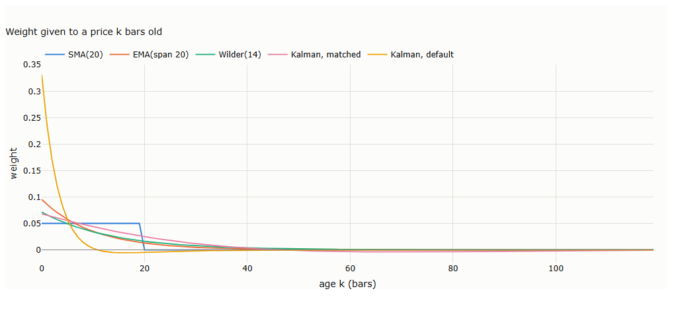
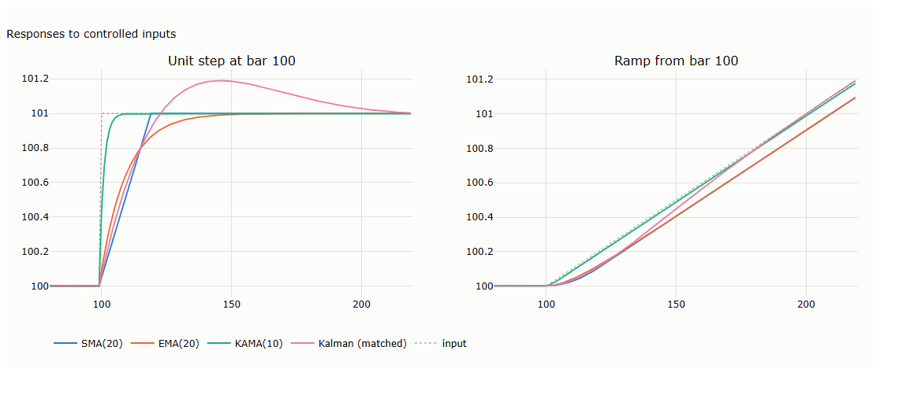
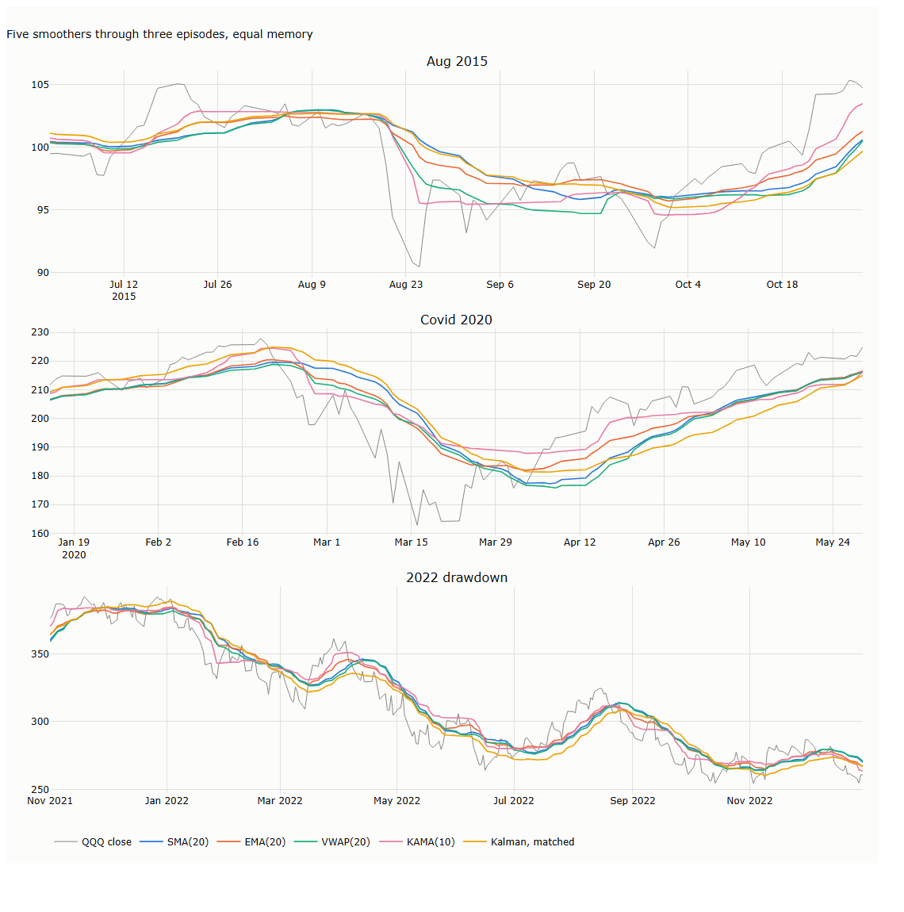
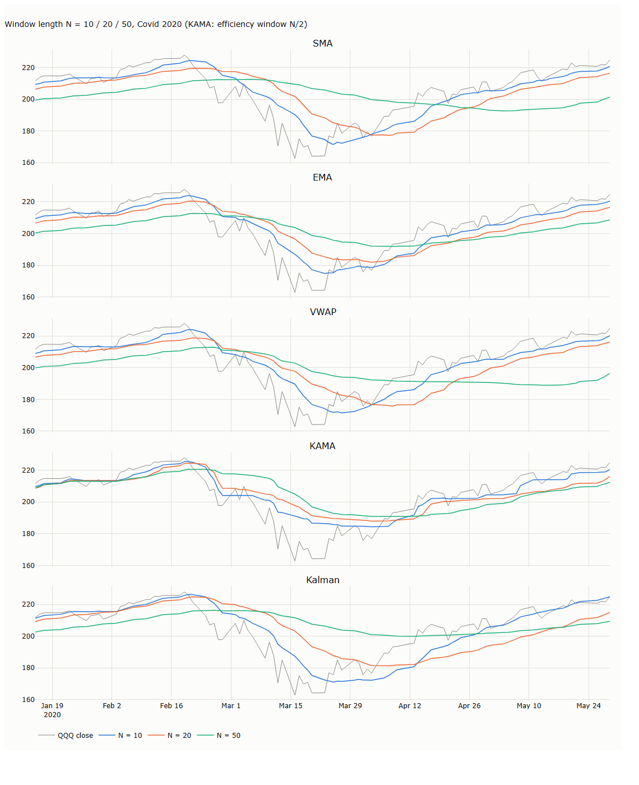

# Lecture 2: OHLCV and Moving Averages

*Systematic Trading: Lecture Notes (MSc) · Oct 10, 2026 · Max Gnesi*

A bar compresses a stream of trades into five numbers; a moving average filters many bars into one estimate of the price level. This lecture covers both, and tests every method on real QQQ data from 1999 to 2026. Companion notebook: [11_price_aggregation_methods.ipynb](11_price_aggregation_methods.ipynb).

## 1. OHLCV: what a bar actually is

A price series is not a sequence of prices. Underneath it is a stream of individual trades, each with its own timestamp, price and size. An OHLCV bar compresses that stream into five numbers for a fixed window (a minute, an hour, a day): the price the window **O**pened at, the **H**igh and **L**ow it touched, the price it **C**losed at, and the total **V**olume traded.

### 1.1 A bar as a lossy summary of the tape

Compression throws information away on purpose. A daily bar cannot tell you whether the high came before the low, how many trades built the volume, or whether buyers or sellers dominated inside the window. It only says that price was somewhere in [L, H] and ended at C. Five numbers per period are enough for almost every signal and risk calculation in this course, at a tiny fraction of the storage cost of every trade.

### 1.2 The five fields

| Field | What it captures | What it does not capture |
|---|---|---|
| Open (O) | The first traded price in the window | Anything before the window started |
| High (H) | The highest traded price in the window | When it happened, or how long price stayed there |
| Low (L) | The lowest traded price in the window | Same as High |
| Close (C) | The last traded price in the window | Everything earlier in the window |
| Volume (V) | Total size traded in the window | The buyer/seller split (most feeds omit it; some crypto venues report "taker buy volume") |

Two bars with identical O, H, L, C can come from completely different paths: one spikes to the high at once and drifts down, the other does the reverse. Any technique built only from OHLCV inherits this blind spot.

H and L are also only the highest and lowest **trades**, not the highest and lowest prices the market passed through between trades. [Lecture 3, §4.4](../03-same-bars-different-questions/lecture.md#44-why-every-range-estimate-is-biased-down-discrete-sampling) shows that this makes every range-based volatility estimate slightly too low.

### 1.3 The window itself is a choice

A fixed time window is the default and a good starting point: simple, universally available, and enough for a wide range of strategies. It is not the only option. A bar can instead close when cumulative volume, dollar volume or realised variance crosses a threshold, giving short bars in busy markets and long bars in quiet ones. That is a design decision about the data layer itself, covered in a later lecture on tick data.

### 1.4 Adjusted prices

The real data in this lecture are adjusted for splits and distributions. Early dollar levels in an adjusted series are therefore prices that never traded, while ratios within one day (H/L, C/O) are unaffected. This is one more reason to work in returns and ratios rather than dollar levels.

## 2. From a bar to a single price

Every technique in Sections 4–5 needs one number per bar, not four. C is the default, but it is only one of several reasonable ways to collapse (O, H, L, C), and the choice changes what the number emphasises.

### 2.1 Why one number is not automatically the close

The close is simply the last trade. That is exactly right when you need a mark-to-market price, and wrong when a single late print is noisy or unrepresentative of where most of the day's volume traded.

### 2.2 Seven constructions

| Name | Formula | Emphasises |
|---|---|---|
| Close | C | Where trading ended |
| Open | O | Where trading began |
| Median Price (HL2) | (H + L) / 2 | The midpoint of the range; ignores the body |
| Typical Price (HLC3) | (H + L + C) / 3 | The range, leaning toward where the bar settled |
| Weighted Close (HLCC4) | (H + L + 2C) / 4 | As Typical Price, but the close counts twice |
| OHLC4 (Average Price) | (O + H + L + C) / 4 | All four equally; the close of a Heikin-Ashi candle |
| Body Midpoint | (O + C) / 2 | The body only; ignores the wicks |

### 2.3 Worked on real data: QQQ, 3 January 2001

The constructions differ by an amount proportional to the bar's own range, so the differences are largest on the widest bar. Across QQQ's 6,940 daily bars since March 1999, the widest relative to its close is 3 January 2001, the day of a surprise Fed rate cut: O = 43.93, H = 54.92, L = 43.90, C = 52.56, a range of 21% of the close.

| Construction | Value |
|---|---|
| Close | 52.56 |
| Weighted Close | 50.99 |
| Typical Price: (54.92 + 43.90 + 52.56) / 3 | 50.46 |
| Median Price | 49.41 |
| OHLC4 | 48.83 |
| Body Midpoint | 48.24 |
| Open | 43.93 |

On this one bar the seven "prices" span 43.93 to 52.56, a spread of 16%. Median Price and Body Midpoint, the two opposite extremes, differ by 1.17, or 2.2% of the close.

### 2.4 Choosing among them

None is more correct; each encodes a different judgement about what a bar is evidence of. Median Price and Body Midpoint are opposite answers to one question (wicks only vs body only). Typical Price and Weighted Close sit between them. On an ordinary day for a liquid index the choice barely matters. On a day like 3 January 2001, or for a thinly traded instrument whose wicks can be one outsized print, it matters a lot.

## 3. Why aggregate across bars at all

A single bar's price, whichever construction is chosen, is still one noisy observation. Section 2 answers "what number represents this bar"; it says nothing about the slower-moving level or trend the market is converging toward, net of bar-to-bar jitter.

### 3.1 Compression and filtering are different operations

- **Section 1 is compression.** A trade stream becomes five numbers per bar. The data shrinks, and specific information is thrown away on purpose.
- **This section is filtering.** One input bar still produces one output number; the data does not shrink. The goal is to treat each price as a noisy observation of a slower quantity and recover an estimate of it:

```math
p_t = \underbrace{\text{slower-moving level}}_{\text{signal}} + \underbrace{\text{bar-specific noise}}_{\text{noise}}
```

One $p_t$ cannot separate the two terms. Combining several bars can, if the noise is less persistent than the level, which is the working assumption behind every method below. This is where the word "filter" comes from in signal processing: separating a persistent signal from transient noise.

### 3.2 The general form

Every technique here is a function of a trailing window of past prices, producing one new number at each $t$:

```math
\hat p_t = g\big(p_{t-N+1},\, \dots,\, p_t;\; \theta\big)
```

This is a special case of Lecture 1's $w_t = f(\mathcal I_t;\theta)$. It is **causal**: it uses only information available at $t$. It sits at the data → signal boundary of the pipeline (Lecture 1, §2.1): $\hat p_t$ is not yet a forecast or a position, but it is usually the first derived quantity a forecast is built from.

Causal also means the value is not known until the bar closes. A signal from bar $t$ can be traded at the close of bar $t$ at the earliest, and only if the computation runs in the final moments of the session; otherwise at the next bar.

### 3.3 The real design choice

Given that template, the one real degree of freedom is: **how much should each past bar count?** A weighting rule can treat every bar the same, favour recent bars, favour high-volume bars, favour bars with large moves, or adapt between these based on recent behaviour. Each is a named, legitimate technique.

This family is generically called a **moving average** or, more precisely, a **low-pass filter**: it lets the slow component through and suppresses the fast one. In this course's code it is called a **Baseline**: a raw trend estimate on its own scale, kept separate from the later step (an *Envelope*) that turns it into a sized position.

### 3.4 A map of what else aggregation can target

The same causal template works for targets other than price. [Lecture 3](../03-same-bars-different-questions/lecture.md) takes each in turn.

| Target | What it represents | Example statistics |
|---|---|---|
| Price level (this lecture) | Where price is heading, net of noise | SMA, EMA, VWAP, KAMA, Kalman |
| Volatility | How much price is moving | ATR, Parkinson, Garman–Klass, Yang–Zhang |
| Trend strength | How one-sided the recent path is, not its direction | Efficiency ratio, ADX |
| Flow | Buying vs selling pressure | OBV, order imbalance |
| Relationship | Co-movement between assets | Rolling correlation, rolling beta |
| Distribution shape | Tail risk and asymmetry | Rolling skewness, kurtosis |

Confusing these is a real failure mode: feeding a trend-strength number into a sizing rule that expects volatility gives a well-defined number that means the wrong thing.

## 4. A taxonomy of weighting schemes

| Method | Weighted by | Needs | Memory |
|---|---|---|---|
| SMA | Equal weight | Price | Rolling (last N bars) |
| EMA / EWMA | Recency, exponential decay | Price | Expanding (recursive) |
| VWAP | Trading activity (volume) | Price and volume | Rolling (last N bars) |
| KAMA | Trend efficiency, adaptive | Price | Hybrid (rolling diagnostic, expanding recursion) |

Read the **Memory** column first. *Rolling* means a literal buffer of the last N bars, each dropped the instant it ages past N. *Expanding* means a recursive running number that folds in the entire history, with old bars fading smoothly rather than being cut off. Sections 6 and 7 both turn on this distinction.

### 4.1 SMA: equal weight

```math
\mathrm{SMA}_t = \frac{1}{N}\sum_{k=0}^{N-1} p_{t-k}
```

Every bar inside the window counts the same; every bar outside counts zero. That hard edge causes a predictable artefact: a bar's influence does not fade, it disappears all at once N periods later (§7.2).

### 4.2 EMA / EWMA: recency

"EMA" and "EWMA" name the same construction. Weight decays geometrically with age and never reaches zero:

```math
\mathrm{EMA}_t = \alpha p_t + (1-\alpha)\,\mathrm{EMA}_{t-1}, \qquad \alpha = \frac{2}{N+1}
```

A bar $k$ periods old carries weight $\alpha(1-\alpha)^k$. $N$ enters only through the convention $\alpha = 2/(N+1)$; §6 shows this convention is not arbitrary.

**An implementation trap.** pandas' `ewm` defaults to `adjust=True`, which re-normalises the weights during warm-up and so does not follow the recursion above for the first few dozen bars. `adjust=False` is the textbook recursion. On QQQ with N = 20 the two differ by up to 0.49% in the first 50 bars and by 6×10⁻¹⁰ after bar 200. Mixing them matters for any backtest that starts near the beginning of the data.

### 4.3 VWAP: trading activity

```math
\mathrm{VWAP}_t = \frac{\sum_{k=0}^{N-1} p_{t-k}\,v_{t-k}}{\sum_{k=0}^{N-1} v_{t-k}}
```

A heavily traded bar counts more, whatever its age. $p$ is conventionally Typical Price. True intraday VWAP resets at each session open; the trailing fixed-N version is the usual adaptation for daily bars. Volume must be split-adjusted consistently with price, or a split silently reweights the window.

### 4.4 KAMA: trend efficiency, adaptively

Kaufman's Adaptive Moving Average keeps the EMA recursion but changes the decay rate every bar, based on how efficient the last $n$ bars have been: net progress relative to total movement.

```math
\mathrm{ER}_t = \frac{\lvert p_t - p_{t-n}\rvert}{\sum_{k=0}^{n-1}\lvert p_{t-k}-p_{t-k-1}\rvert} \in [0,1]
```

```math
\mathrm{sc}_t = \big(\mathrm{ER}_t(\alpha_f-\alpha_s)+\alpha_s\big)^2, \qquad \mathrm{KAMA}_t = \mathrm{KAMA}_{t-1} + \mathrm{sc}_t\,(p_t - \mathrm{KAMA}_{t-1})
```

with Kaufman's $\alpha_f = 2/3$ and $\alpha_s = 2/31$ (a 2-bar and a 30-bar EMA) and $n = 10$. ER → 1 for a straight run; ER → 0 for a path that doubles back as much as it progresses. KAMA tracks price tightly in clean trends and goes nearly flat in chop.

Its memory is a hybrid: ER is read from a strict rolling n-bar window, while the KAMA recursion itself is expanding, like EMA.

## 5. A different kind of estimator: the Kalman filter

SMA, EMA, VWAP and KAMA all pick weights for past bars and take a weighted average. **The Kalman filter does not.** It keeps a running belief about the current level and trend, a mean and an uncertainty, and updates that belief with each new bar. It never re-reads $p_{t-5}$ or $p_{t-50}$; its memory is compressed entirely into its current state. There is no N to set. Like EMA, it is expanding: every past bar keeps some influence and none is cut off at a fixed age.

### 5.1 The recursion

A local-linear-trend filter tracks two unobserved states of log price, a level $\ell_t$ and a trend $\tau_t$:

```math
\begin{pmatrix}\ell_t\\ \tau_t\end{pmatrix} = \begin{pmatrix}1 & 1\\0 & 1\end{pmatrix}\begin{pmatrix}\ell_{t-1}\\ \tau_{t-1}\end{pmatrix} + \eta_t, \quad \eta_t \sim \mathcal N(0, Q), \qquad \log p_t = \ell_t + \varepsilon_t, \quad \varepsilon_t \sim \mathcal N(0, R)
```

Each bar it **predicts** ($\hat\ell = \ell_{t-1} + \tau_{t-1}$), then **corrects** toward the new observation by the innovation (observed minus predicted) times the **Kalman gain**. The gain is set by Q against R: a large R relative to Q means "trust the model, barely move"; a small R means the opposite.

### 5.2 What its weights look like

In steady state the gain settles to a constant and the filter becomes a fixed linear smoother. For a level-only model that smoother is exactly an EMA. For the local linear trend it is Holt's linear exponential smoothing (Harvey, 1989), and its implied weights on old observations turn slightly **negative**. Those negative weights let it extrapolate the trend, so it tracks a straight-line trend with **zero average lag**, whatever Q and R are. The price is overshoot after a jump: it reads part of a one-off jump as the start of a trend (§8.1).

### 5.3 Noise settings are a memory choice

Because there is no N, Q and R are the memory dial, and default values can hide a very short memory. The default noise settings in this course's `trading_models` package (level variance 10⁻⁴, trend variance 10⁻⁶, observation variance 10⁻³) smooth about as much as a **4.5-bar** moving average. Comparing that filter to SMA(20) compares a short memory with a long one. Section 6 shows how to match them properly.

## 6. Matching memory before comparing

A comparison of "SMA(20) against a Kalman filter" means nothing unless both carry the same amount of memory. Otherwise the one that looks better may simply be smoothing less.

### 6.1 Two measures of memory

Write any linear smoother as weights on past prices, $\hat p_t = \sum_k w_k p_{t-k}$ with $\sum_k w_k = 1$. Two standard summaries:

```math
\text{average age} = \sum_{k\ge 0} k\,w_k, \qquad \text{variance reduction factor} = \sum_{k\ge 0} w_k^2
```

- **Average age** (centre of mass): on a price rising along a straight line, exactly how many bars the smoother trails behind.
- **Variance reduction factor**: if prices were independent noise around a constant, the smoother's variance would be this fraction of the noise variance. Its reciprocal is a "noise-equivalent N".

### 6.2 Why α = 2/(N+1): Brown's convention

An SMA(N) has average age (N−1)/2. An EMA has average age (1−α)/α. Setting them equal gives α = 2/(N+1). Brown (1963) chose the convention for exactly this reason. It also makes the variance reduction factors equal: the EMA's is α/(2−α), which at α = 2/(N+1) is 1/N, the same as the SMA's.

### 6.3 Wilder's period is not a window length

Wilder's smoothing, used in ATR and ADX, is an EMA with α = 1/n. Its average age is n−1. Matching that to a rolling window's (N−1)/2 gives

```math
N = 2n - 1
```

so **ATR(14) carries the memory of a 27-bar average, not a 14-bar one**. Lecture 3 uses this rule to choose window lengths for indicators read side by side.

### 6.4 The Kalman filter needs the other measure

The local-linear-trend filter has zero average age by construction (§5.2), so average age cannot calibrate it. Its variance reduction factor can. Solving for the observation variance that gives a variance reduction of 1/20 yields R = 0.20.

| Smoother | Average age (bars) | Variance reduction | Noise-equivalent N |
|---|---|---|---|
| SMA(20) | 9.5 | 0.050 | 20 |
| EMA(span 20) | 9.5 | 0.050 | 20 |
| Wilder(14) | 13.0 | 0.037 | 27 |
| Kalman, matched (R = 0.20) | 0.0 | 0.050 | 20 |
| Kalman, package default (R = 10⁻³) | 0.0 | 0.224 | 4.5 |

From here on, "Kalman, matched" is the fair comparison with SMA(20) and EMA(20). The weight profiles are plotted in [chart A.1](#a1-weight-given-to-a-price-k-bars-old-6).

**Example: comparing cars at equal weight.** Saying one car accelerates faster than another means little if one carries four passengers and the other none. Matching memory is loading both cars the same way before timing them.

## 7. Worked illustration

First a toy series, where every number can be checked by hand; then the same five methods on a real day.

### 7.1 Toy series: one spike on heavy volume

Ten gently rising bars, one +7% bar on about 4–5× normal volume, then a calm uptrend. N = 5 throughout. SMA and VWAP need a full window (first value at t = 4), KAMA one more bar; EMA and Kalman, both expanding, start at t = 0.

| t | Price | Volume | SMA(5) | EMA(5) | VWAP(5) | KAMA(5) | Kalman |
|---|---|---|---|---|---|---|---|
| 0 | 100.0 | 1000 | — | 100.00 | — | — | 100.00 |
| 1 | 100.3 | 1020 | — | 100.10 | — | — | 100.30 |
| 2 | 100.5 | 980 | — | 100.23 | — | — | 100.52 |
| 3 | 100.8 | 1010 | — | 100.42 | — | — | 100.79 |
| 4 | 101.0 | 1040 | 100.52 | 100.61 | 100.52 | — | 101.02 |
| 5 | 101.3 | 990 | 100.78 | 100.84 | 100.78 | 101.30 | 101.29 |
| 6 | 101.5 | 1030 | 101.02 | 101.06 | 101.02 | 101.39 | 101.52 |
| **7** | **108.5** | **4800** | 102.62 | 103.54 | **105.13** | 104.55 | 104.88 |
| 8 | 102.5 | 1700 | 102.96 | 103.19 | 105.12 | 104.51 | 104.30 |
| 9 | 102.8 | 1150 | 103.32 | 103.06 | 105.28 | 104.47 | 104.02 |
| 10 | 103.0 | 1080 | 103.66 | 103.04 | 105.44 | 104.45 | 103.90 |
| 11 | 103.3 | 1030 | 104.02 | 103.13 | 105.63 | 104.42 | 103.91 |
| **12** | 103.5 | 1010 | **103.02** | 103.25 | **102.96** | 104.20 | 103.97 |
| 13 | 103.8 | 1040 | 103.28 | 103.43 | 103.27 | 104.02 | 104.11 |

**The t = 7 numbers by hand.** The window is bars 3–7: prices 100.8, 101.0, 101.3, 101.5, 108.5; volumes 1010, 1040, 990, 1030, 4800.

- **SMA:** 513.1 / 5 = 102.62.
- **EMA:** α = 2/6 = 0.3333; 0.3333 × 108.5 + 0.6667 × 101.06 = 103.54.
- **VWAP:** Σ p·v = 932,480; Σ v = 8,870; ratio 105.13. The spike bar alone is 520,800 / 932,480 = 56% of the numerator.
- **KAMA:** net move |108.5 − 100.5| = 8.0; path 0.3 + 0.2 + 0.3 + 0.2 + 7.0 = 8.0; so ER = 1.0 exactly and sc = α_f² = 0.4444, KAMA's fastest possible setting. 101.39 + 0.4444 × (108.5 − 101.39) = 104.55.
- **Kalman** (log space): predicted level 4.6228, observed log(108.5) = 4.6868, innovation 0.0640, gain 0.470; 4.6228 + 0.470 × 0.0640 = 4.6528, and exp(4.6528) = 104.88.

### 7.2 What the toy table shows

- **t = 7:** VWAP reacts hardest, because the spike also carries the most volume. KAMA does **not** react least: with ER = 1 it moves more than EMA (104.55 vs 103.54). ER cannot tell a clean trend from a clean trend plus one spike in the same direction.
- **t = 8:** the window now holds the spike and the reversal. ER collapses to 1.7 / 13.7 = 0.124 and sc to 0.0194, about 1/23 of the previous bar. KAMA freezes near 104.5 while price is back at 102.5–103.3.
- **t = 8–11:** price is calm, but SMA and VWAP keep rising, because the spike is still inside their window.
- **t = 12:** the spike leaves the window and SMA (104.02 → 103.02) and VWAP (105.63 → 102.96) drop with no move in price. This is the rolling-window cliff.
- **EMA and Kalman** show no cliff but never fully forget: replacing the spike with a normal 102.0 gives EMA₁₃ = 103.24 instead of 103.43.

### 7.3 The same five methods on a real day: QQQ, 24 August 2015

The flash-crash open, N = 20. Each hand result was asserted equal to the library value in the notebook.

| Method | Calculation | Value |
|---|---|---|
| Close | — | 90.77 |
| SMA(20) | 2,024.57 / 20 | 101.23 |
| EMA(20) | 0.0952 × 90.77 + 0.9048 × 101.136 | 100.15 |
| VWAP(20) | 76.77bn / 780.05m shares | 98.42 |
| KAMA(10) | ER = 12.09 / 14.80 = 0.817, sc = 0.3095; 100.862 + 0.3095 × (90.77 − 100.862) | 97.74 |
| Kalman (package default) | innovation −0.0800 × gain 0.332 in log space | 95.75 |

The real day repeats the toy lessons. VWAP sits well below SMA because 24 August itself carried 19.3% of the window's volume, one of twenty bars. KAMA moved fast because the preceding ten days had fallen almost in a straight line (ER = 0.82). The Kalman filter at default settings followed price most closely, but §6 showed that is a 4.5-bar memory, not a better method.

## 8. Evidence on real data

At matched memory, EMA beats SMA on every test, the Kalman filter trades zero trend lag for overshoot, and the window length matters more than the method.

### 8.1 Lag, measured on controlled inputs

Lag is easiest to measure where the right answer is known: a price that jumps once (a unit step at bar 100) and a price that starts rising at a constant rate (a ramp). [Chart A.2](#a2-responses-to-a-step-and-a-ramp-81) plots both.

| Method | Bars to cover 50% of a step | Overshoot after the step | Lag behind a ramp (bars) |
|---|---|---|---|
| SMA(20) | 9 | 0% | 9.5 |
| EMA(20) | 6 | 0% | 9.5 |
| KAMA(10) | 1 | 0% | 1.3 |
| Kalman, matched | 8 | 19% | −0.1 |

SMA and EMA have the same ramp lag, as §6 requires, but EMA covers half a step three bars sooner because its newest weights are largest. The Kalman filter has no lag on the ramp but overshoots a step by 19%: it reads part of the jump as a new trend. KAMA's near-instant response is flattered by noise-free inputs, which drive ER to 1; on real data it is much slower.

### 8.2 Smoothness against tracking, on QQQ

Two scale-free measures, on log prices so a 1999 bar and a 2026 bar count equally:

- **Roughness:** standard deviation of the smoother's daily change divided by that of price (1 = no smoothing, 0 = flat).
- **Tracking gap:** root-mean-square distance between smoother and price, in %.

| Method | Roughness, full sample | Roughness, Aug 2015 | Tracking gap, full sample (%) | Tracking gap, Covid 2020 (%) | Tracking gap, 2022 (%) |
|---|---|---|---|---|---|
| SMA(20) | 0.198 | 0.175 | 3.74 | 6.75 | 4.27 |
| EMA(20) | 0.198 | 0.194 | 3.25 | 5.58 | 3.66 |
| VWAP(20) | 0.206 | 0.286 | 3.70 | 6.43 | 4.15 |
| KAMA(10) | 0.279 | 0.396 | 2.98 | 5.59 | 3.60 |
| Kalman, matched | 0.199 | 0.171 | 3.84 | 7.45 | 4.47 |
| Kalman, default | 0.438 | 0.496 | 1.42 | 2.28 | 1.66 |

Reading the two measures together:

- SMA, EMA and matched Kalman are equally rough (about 0.18–0.20 in every period), as the matching intends. Among them **EMA tracks price closest in every period**, so its edge over SMA is real, not a by-product of smoothing less.
- Matched Kalman tracks **worst** of the three despite zero ramp lag. Real prices jump, and the overshoot costs more than the zero lag saves.
- KAMA and default Kalman track closest of all, but they are much rougher. They follow price because they smooth less; that is not a like-for-like advantage.
- VWAP's roughness jumps in August 2015 (0.29 vs 0.18 for SMA): one heavy-volume bar takes a large share of the weights (§7.3).

The three episodes are plotted in [chart A.3](#a3-the-five-methods-through-three-qqq-episodes-82).

### 8.3 Window length matters more than method

Re-running each method at N = 10, 20 and 50 through the 2020 crash (the Kalman filter re-matched to each N) moves the results far more than switching method at a fixed N. Short windows follow the crash and the rebound sooner and are noisier in calm periods; long windows are the reverse. The defaults 20, 50 and 200 are conventions, not results. See [chart A.4](#a4-window-length-through-the-2020-crash-83).

## 9. Side by side, and practical notes

| Method | Memory | Needs volume | Decay shape | What breaks it | Common mistake |
|---|---|---|---|---|---|
| SMA | Rolling, hard edge at N | No | Flat, then a cliff | A bar's influence vanishes at once N bars later, moving the level with no price move | Reading "SMA(20)" and "ATR(14)" as comparable lengths |
| EMA | Expanding | No | Smooth geometric | Reacts to every move by the same fixed proportion | Mixing `adjust=True` with the textbook recursion |
| VWAP | Rolling, hard edge at N | Yes | Flat, weighted by size | One heavy bar dominates, then drops off the same cliff | Split-unadjusted volume with adjusted prices |
| KAMA | Rolling ER, expanding recursion | No | Adaptive | A spike in the trend's direction makes it fastest, the reversal then freezes it | Judging its speed on clean examples |
| Kalman | Expanding, set by Q and R | No | Smooth, negative weights on old bars | Overshoot after jumps; fixed Q, R in a changing volatility regime | Comparing default noise settings with a 20-bar average |

None of these values exists before the bar closes. Warm-up also differs: SMA and VWAP need N bars, EMA formally none but in practice several N, KAMA its ER window plus several bars, Kalman until its gain settles.

## 10. Summary, exercises and reading

### 10.1 Five takeaways

1. Building a bar is **compression** (data shrinks); aggregating bars is **filtering** (data does not shrink, signal is separated from noise).
2. A bar's single price and the aggregation across bars are two separate design choices; on a wide bar the first alone can move "the price" by 16%.
3. The methods differ only in how much each past bar counts, and in whether memory is rolling (SMA, VWAP), expanding (EMA, Kalman) or hybrid (KAMA).
4. **Compare only at equal memory.** α = 2/(N+1) matches EMA to SMA; Wilder's n equals a 2n−1 bar window; the Kalman filter must be matched on variance reduction. At equal memory EMA beats SMA on QQQ in every period tested.
5. Window length moves results more than the choice of method.

### 10.2 Exercises

- [ ] For a single bar, construct an example where Median Price and Body Midpoint differ by more than 1% of the close. What kind of session produces it? Find three such days in QQQ.
- [ ] Reproduce the toy table in §7.1 and extend it to N = 10. Does the SMA/VWAP cliff at t = 12 disappear, move, or shrink?
- [ ] Prove that an EMA with α = 2/(N+1) has the same average age and the same variance reduction factor as SMA(N).
- [ ] Show that Wilder's smoothing with period n has average age n−1, and hence that ATR(14) matches a 27-bar window.
- [ ] Construct a 5-bar window with one large reversal and find its ER. Can you make it arbitrarily close to 0? To 1?
- [ ] Re-run the step test of §8.1 with Gaussian noise added to the input. How much slower does KAMA become?
- [ ] Describe a market condition where one method from §4 gives a worse estimate of the "true" level than plain SMA.

### 10.3 Reading list

- Brown, R.G. (1963). *Smoothing, Forecasting and Prediction of Discrete Time Series.* Prentice-Hall. — the α = 2/(N+1) convention.
- Holt, C.C. (1957, reprinted 2004). Forecasting seasonals and trends by exponentially weighted moving averages. *International Journal of Forecasting.*
- Harvey, A. (1989). *Forecasting, Structural Time Series Models and the Kalman Filter.* Cambridge University Press.
- Kaufman, P. (2013). *Trading Systems and Methods* (5th ed.). Wiley. — KAMA.
- Wilder, J.W. (1978). *New Concepts in Technical Trading Systems.* Trend Research.
- Ehlers, J. (2001). *Rocket Science for Traders.* Wiley.
- Chan, E. (2013). *Algorithmic Trading.* Wiley. — Kalman filters for hedge ratios.
- Berkowitz, S., Logue, D. and Noser, E. (1988). The total cost of transactions on the NYSE. *Journal of Finance.* — VWAP as an execution benchmark.

*References are given from memory and should be checked against the originals before circulation.*

## Appendix: main charts

From the companion notebook, [11_price_aggregation_methods.ipynb](11_price_aggregation_methods.ipynb), where every real-data number in this lecture is computed and each formula is checked against the library on a real date.

### A.1 Weight given to a price k bars old (§6)



SMA is flat then cuts off at 20. EMA and Wilder(14) decay smoothly, Wilder more slowly (27-bar memory). The matched Kalman filter's weights dip slightly below zero for old bars, which is how it removes trend lag. The default Kalman filter puts a third of its weight on today.

### A.2 Responses to a step and a ramp (§8.1)



Left: after a one-off jump, the Kalman filter overshoots by 19% before settling. Right: on a steady trend, SMA and EMA trail by 9.5 bars while Kalman and KAMA track it.

### A.3 The five methods through three QQQ episodes (§8.2)



August 2015, the Covid crash of 2020 and the 2022 drawdown, all methods at matched memory.

### A.4 Window length through the 2020 crash (§8.3)


