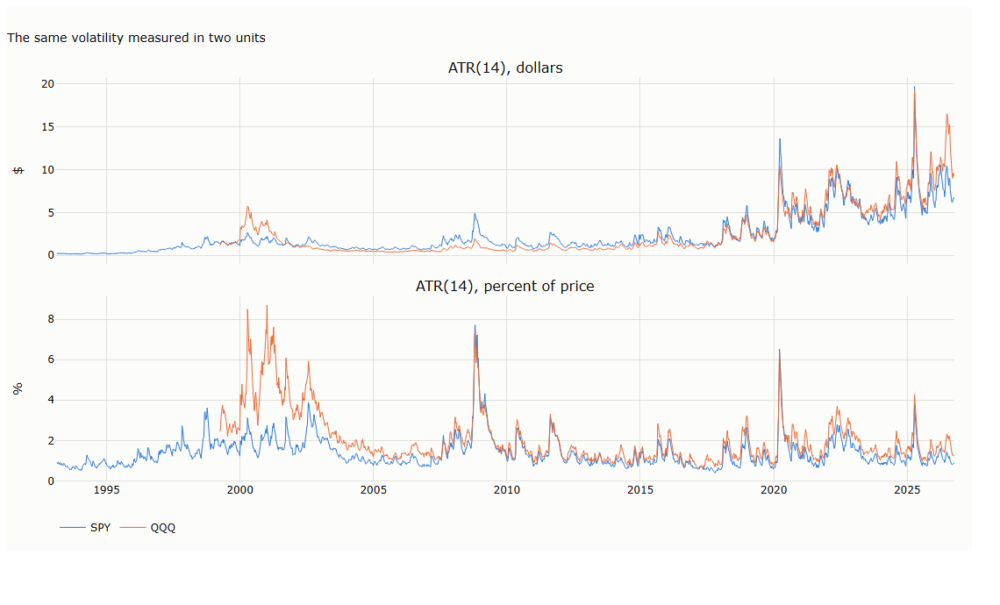
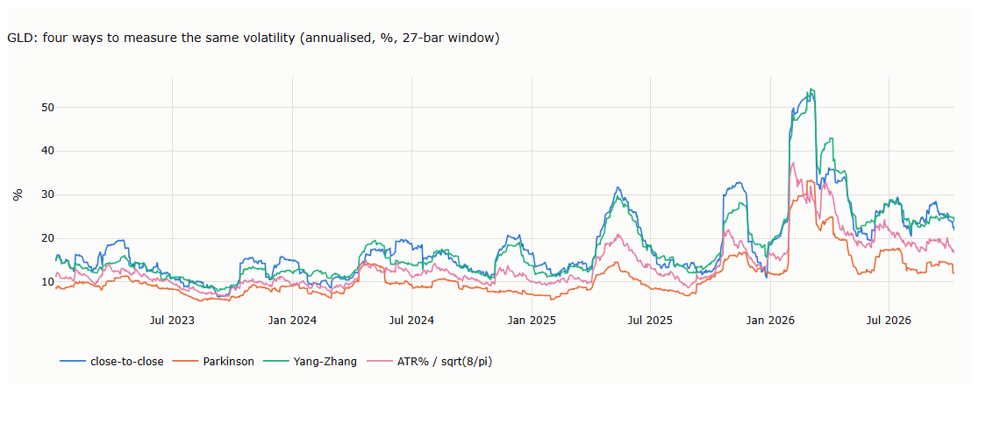
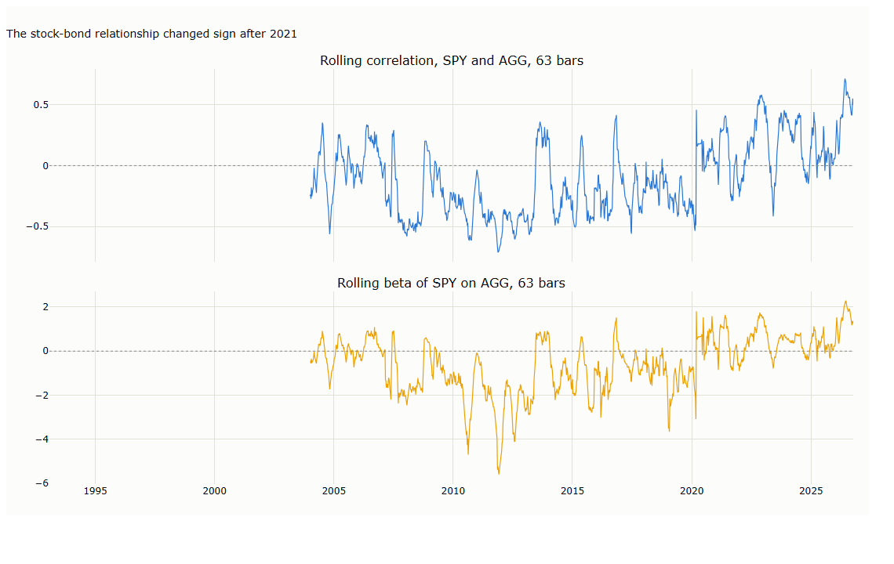
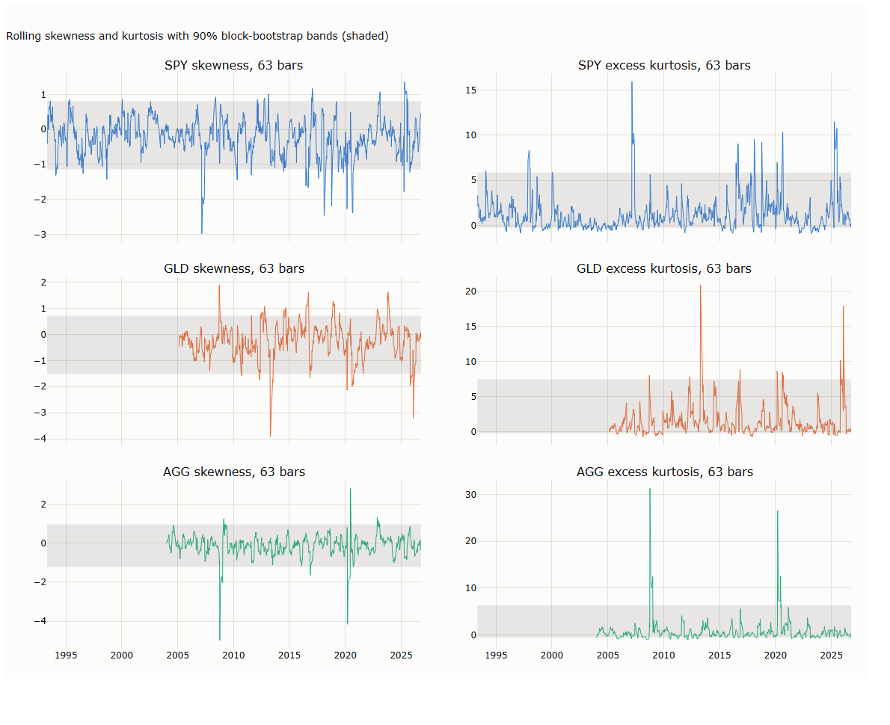
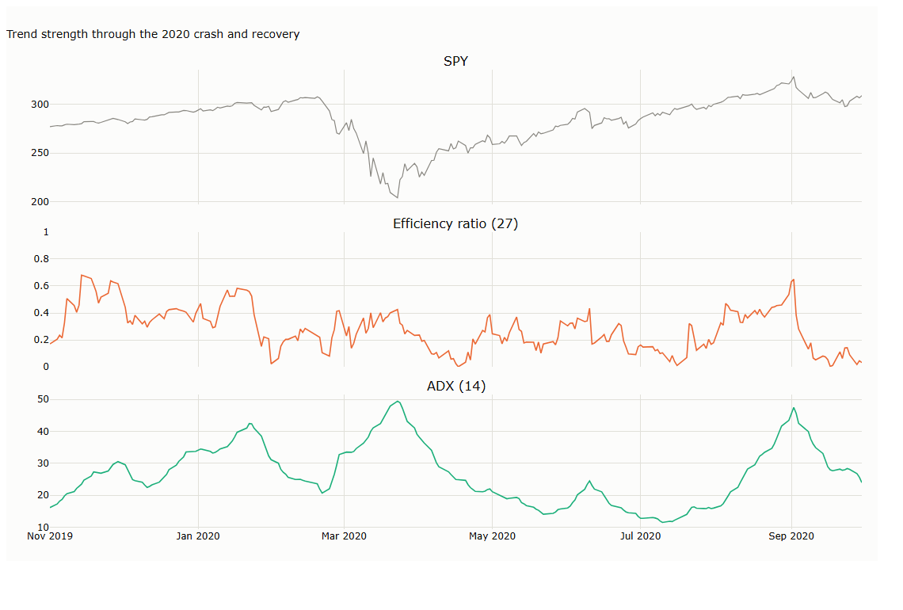
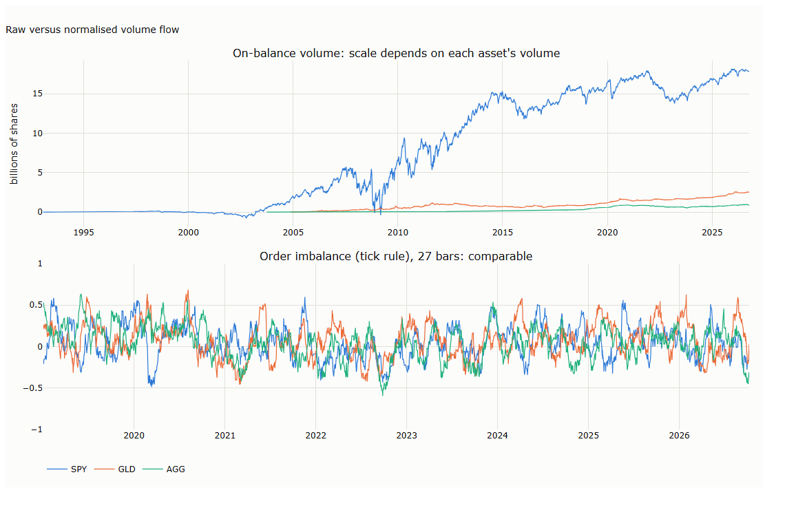

# Lecture 3: Same Bars, Different Questions

*Systematic Trading: Lecture Notes (MSc) · Oct 10, 2026 · Max Gnesi*

Volatility, flow, correlation and tails. The same bars and the same causal window that smooth price can also estimate volatility, trend strength, order flow, co-movement and distribution shape. This lecture works through each on a toy series and on 30 years of SPY, QQQ, GLD and AGG. Companion notebook: [12_other_aggregation_targets.ipynb](12_other_aggregation_targets.ipynb).

## 1. Recap: same bars, different questions

[Lecture 2](../02-ohlcv-and-moving-averages/lecture.md) built one family, SMA, EMA, VWAP, KAMA and the Kalman filter, all answering *where is price heading, net of noise?* This lecture keeps the same causal template, $\hat x_t = g(x_{t-N+1}, \dots, x_t;\theta)$, but $\hat x$ is no longer a price. A volatility estimator turns price into dispersion; a correlation estimator turns two price series into one relationship number. Reading one as if it were another gives a well-defined number that answers the wrong question.

The input never changes: the same OHLCV bars, run through a trailing window. What changes is the transformation, and with it the question being answered.

| Transformation of the bars | Question it answers | Where |
|---|---|---|
| Weighted average of prices | Where is price heading? | [Lecture 2](../02-ohlcv-and-moving-averages/lecture.md) |
| Ranges and squared returns | How much is it moving? | [§3](#3-volatility-true-range-and-wilders-atr)–[4](#4-from-a-range-to-a-volatility) |
| Net move versus total path | How one-sided is the move? | [§6](#6-trend-strength-how-one-sided-is-the-recent-path) |
| Signed volume | Who is pushing it? | [§7](#7-order-flow-who-is-doing-the-buying) |
| Products of two return series | Does it move with something else? | [§8](#8-relationship-between-series-do-two-assets-still-move-together) |
| Third and fourth powers of returns | Is the path lopsided or fat-tailed? | [§9](#9-distribution-shape-is-the-recent-path-lopsided-or-fat-tailed)–[10](#10-signal-or-noise-bootstrap-bands-and-what-they-reveal) |

Flow is the one place volume does real work, and correlation needs a second asset; otherwise it is the same data every time.

### 1.1 Three checks for every statistic

1. **Units.** Is the number comparable across assets and across decades, or only within one series?
2. **Memory.** Do indicators that will be read together look back over comparable spans?
3. **Precision.** How much of the statistic's movement is real, and how much is sampling noise?

### 1.2 Two datasets

**A toy series**, extended from Lecture 2 §7 with highs and lows, plus a calmer second asset B for the relationship section. $N = 5$ throughout.

| $t$ | $H$ / $L$, asset A | Close A | Volume A | Close B |
|---|---|---|---|---|
| 0 | 100.2 / 99.8 | 100.0 | 1000 | 50.00 |
| 1 | 100.5 / 100.1 | 100.3 | 1020 | 50.20 |
| 2 | 100.7 / 100.3 | 100.5 | 980 | 50.10 |
| 3 | 101.0 / 100.6 | 100.8 | 1010 | 50.35 |
| 4 | 101.2 / 100.8 | 101.0 | 1040 | 50.25 |
| 5 | 101.5 / 101.1 | 101.3 | 990 | 50.50 |
| 6 | 101.7 / 101.3 | 101.5 | 1030 | 50.40 |
| **7** | **109.0 / 102.0** | **108.5** | **4800** | 50.65 |
| 8 | 103.3 / 101.6 | 102.5 | 1700 | 50.55 |
| 9 | 103.0 / 102.5 | 102.8 | 1150 | 50.80 |
| 10 | 103.2 / 102.8 | 103.0 | 1080 | 50.70 |
| 11 | 103.5 / 103.1 | 103.3 | 1030 | 50.95 |
| 12 | 103.7 / 103.3 | 103.5 | 1010 | 50.85 |
| 13 | 104.0 / 103.6 | 103.8 | 1040 | 51.10 |

**Real data:** daily adjusted OHLC and volume for four assets with very different behaviour: SPY (broad equity, 8,482 bars from 1993), QQQ (technology, 6,940 bars from 1999), GLD (gold, 5,507 bars from 2004) and AGG (investment-grade bonds, 5,795 bars from 2003), all to 9 October 2026.

## 2. Units: why a dollar figure cannot be compared

A dollar volatility measure rises with the price level even when risk has not changed, and it can point the wrong way. Dividing by price fixes it.

Wilder's Average True Range (ATR, §3) is measured in price units. A market trading at 1,000 moves ten times more dollars per day than the same market at 100 with exactly the same risk. ATR divided by the close, often called *normalised ATR* (NATR), removes the scale.

| Asset | First full year | ATR(14), first year (USD) | ATR(14), 2026 (USD) | Ratio | ATR % of price, first year | ATR % of price, 2026 | Ratio |
|---|---|---|---|---|---|---|---|
| SPY | 1994 | 0.22 | 7.88 | 35.3× | 0.85% | 1.10% | 1.3× |
| QQQ | 2000 | 3.50 | 10.45 | 3.0× | 4.56% | 1.65% | 0.36× |
| GLD | 2005 | 0.41 | 7.98 | 19.7× | 0.94% | 2.01% | 2.1× |
| AGG | 2004 | 0.20 | 0.32 | 1.6× | 0.40% | 0.33% | 0.83× |

In dollars, SPY's ATR has grown 35-fold since 1994; as a percentage of price it is almost unchanged. QQQ is the sharper case. In dollars it looks three times **more** volatile today than in 2000; as a percentage it was nearly three times more volatile **in 2000**, during the collapse of the technology bubble. The dollar measure does not just exaggerate, it gets the direction wrong. [Chart B.1](#b1-the-same-volatility-in-two-units-2) plots both.

**Example: salaries across decades.** A USD 50,000 salary in 1994 and in 2026 are not the same pay. Nobody compares them without adjusting for prices. A dollar ATR needs the same adjustment, and the "price level" here is the asset's own price.

## 3. Volatility: true range and Wilder's ATR

### 3.1 Definitions

Close-to-close change understates a bar's movement whenever price travels and comes back within the bar, and the high-low range misses a gap from the previous close. The **true range** takes the largest of the three distances:

```math
\mathrm{TR}_t = \max\big(H_t - L_t,\ \lvert H_t - C_{t-1}\rvert,\ \lvert L_t - C_{t-1}\rvert\big)
```

The **Average True Range** (Wilder, 1978) smooths it with Wilder's recursion:

```math
\mathrm{ATR}_t = \mathrm{ATR}_{t-1} + \frac{1}{n}\big(\mathrm{TR}_t - \mathrm{ATR}_{t-1}\big)
```

This is an EMA with $\alpha = 1/n$, so ATR is **expanding**, not a window of recent ranges, even though "period" looks like a window size. Lecture 2 §6.3 showed ATR(14) has the memory of a 27-bar average.

### 3.2 Toy series ($n = 5$)

$\mathrm{ATR}_4$ is seeded with the simple average of the first five true ranges, (0.40 + 0.50 + 0.40 + 0.50 + 0.40) / 5 = 0.440. At the spike, $\mathrm{ATR}_7 = 0.442 + (7.50 - 0.442)/5 = 1.853$.

| $t$ | 4 | 5 | 6 | **7** | 8 | 9 | 10 | 11 | 12 | 13 |
|---|---|---|---|---|---|---|---|---|---|---|
| TR | 0.40 | 0.50 | 0.40 | **7.50** | 6.90 | 0.50 | 0.40 | 0.50 | 0.40 | 0.50 |
| ATR(5) | 0.440 | 0.452 | 0.442 | **1.853** | 2.863 | 2.390 | 1.992 | 1.694 | 1.435 | 1.248 |

ATR keeps rising one bar after the spike because bar 8's true range is also large (6.90, the gap down from 108.5). Then it decays slowly. A sizing rule reading ATR would keep positions small for several bars after price is already calm.

### 3.3 Real day: SPY, 16 March 2020

The largest one-day fall in SPY since 1987. $H = 233.59$, $L = 215.82$, previous close 244.88.

| Candidate | Value |
|---|---|
| $H - L$ | 17.77 |
| $\lvert H - C_{\text{prev}}\rvert$ | 11.29 |
| $\lvert L - C_{\text{prev}}\rvert$ | **29.06** |

The gap from the previous close dominates: the true range is 29.06, 64% more than the day's own high-low range. One step of Wilder's recursion ($n = 14$): 11.23 + (29.06 − 11.23) / 14 = 12.51, matching the library value.

## 4. From a range to a volatility

ATR is a range, not a standard deviation. A classical result converts one into the other: divide by $\sqrt{8/\pi} \approx 1.596$. The constant is not a rule of thumb; it follows from the mathematics of Brownian motion.

### 4.1 Where $\sqrt{8/\pi}$ comes from

Assume log price follows a driftless Brownian motion with volatility $\sigma$ over a period of length $T$. The **reflection principle** says the running maximum $M_T$ of a Brownian path has the same distribution as $|W_T|$, the absolute value of where the path ends. For a normal variable with standard deviation $\sigma\sqrt T$, $\mathbb E|W_T| = \sigma\sqrt{2T/\pi}$. By symmetry the running minimum has the mirror-image expectation. So:

```math
\mathbb E[H - L] = \mathbb E[M_T] - \mathbb E[m_T] = 2\,\sigma\sqrt{\frac{2T}{\pi}} = \sigma\sqrt{\frac{8T}{\pi}} \approx 1.596\,\sigma\sqrt{T}
```

The result is due to Feller (1951). Over one day ($T = 1$) the expected high-low range is about 1.6 daily standard deviations, so dividing an average range by $\sqrt{8/\pi}$ gives $\sigma$.

Parkinson (1980) built his estimator on the same model but uses the **squared** range, $\mathbb E[(H-L)^2] = 4\ln 2\cdot\sigma^2 T$. That is why $4\ln 2$ appears in his formula rather than $8/\pi$: the mean of a square is not the square of a mean.

**Example: a dog on a lead.** Walk a dog for an hour and note how far it ranged left and right of the path. A dog that wanders more has a wider range, and on average the range is a fixed multiple of how jittery the dog is. Feller's constant is that multiple for a random walk.

### 4.2 Range-based volatility estimators

With $h = \ln(H/L)$, $c = \ln(C/O)$ and the overnight gap $o = \ln(O_t / C_{t-1})$:

| Estimator | Daily variance estimate | Uses |
|---|---|---|
| Close-to-close | variance of $\ln(C_t/C_{t-1})$ | Closes only |
| Parkinson (1980) | $h^2/(4\ln 2)$ | High and low |
| Garman–Klass (1980) | $\frac{1}{2}h^2 - (2\ln 2 - 1)\,c^2$ | Open, high, low, close |
| Rogers–Satchell (1991) | $\ln(H/C)\ln(H/O) + \ln(L/C)\ln(L/O)$ | Same, robust to drift |
| Yang–Zhang (2000) | $\sigma_o^2 + k\,\sigma_c^2 + (1 - k)\,\sigma_{\mathrm{RS}}^2$, with $k = 0.34/(1.34 + (n+1)/(n-1))$ | Adds the overnight gap |
| ATR% / $\sqrt{8/\pi}$ | $(\mathrm{ATR}/C)/1.596$, squared | True range, Feller's constant |

Range estimators use more of each bar than the close alone, so they are far more **efficient**: Parkinson's estimator needs roughly one-fifth as many days as close-to-close for the same precision under the Brownian model.

### 4.3 Results on real data

Annualised volatility, median over each asset's full history, 27-bar window (§5 explains the 27):

| Estimator | SPY | GLD | AGG | SPY vs close-to-close | GLD vs close-to-close | AGG vs close-to-close |
|---|---|---|---|---|---|---|
| Close-to-close | 13.3% | 14.7% | 3.6% | 1.00 | 1.00 | 1.00 |
| Parkinson | 11.3% | 9.9% | 2.9% | 0.85 | 0.67 | 0.81 |
| Garman–Klass | 11.4% | 10.0% | 2.9% | 0.86 | 0.68 | 0.82 |
| Rogers–Satchell | 11.4% | 10.0% | 3.0% | 0.86 | 0.68 | 0.83 |
| Yang–Zhang | 13.8% | 14.8% | 3.9% | 1.04 | 1.00 | 1.10 |
| ATR% / $\sqrt{8/\pi}$ | 11.7% | 11.9% | 3.3% | 0.88 | 0.81 | 0.91 |

The session-only estimators report 67–86% of close-to-close volatility; Yang–Zhang, which adds the overnight gap back, reports 100–110%. The median share of Yang–Zhang variance from the overnight gap is 28% for SPY, 45% for AGG and **53% for GLD**: gold trades around the clock, GLD only in US hours, so half its variance arrives while GLD is closed. ATR% / $\sqrt{8/\pi}$ lands between the two groups because true range catches part of the gap through the previous close, but not all of it. [Chart B.2](#b2-four-ways-to-measure-glds-volatility-43) shows the four main estimators on GLD.

### 4.4 Why every range estimate is biased down: discrete sampling

The formula assumes you see the whole path, but you only see the trades. $\sqrt{8/\pi}\,\sigma$ is the expected range of a **continuous** path, its true highest and lowest points. A bar's recorded high and low come from trades at discrete moments, and between two trades the "true" price can move a little higher or lower without anyone trading there. So, always:

- observed high ≤ true high
- observed low ≥ true low
- **observed range ≤ true range**

The observed range can never be wider than the true one, and on average it is narrower. Dividing a range that is too small by the same constant gives a $\sigma$ that is too small.

**How big?** For a random walk sampled at $n$ evenly spaced points, the expected maximum falls short of the continuous maximum by about

```math
\beta\,\sigma\sqrt{T/n}, \qquad \beta = -\frac{\zeta(1/2)}{\sqrt{2\pi}} \approx 0.5826
```

on each side (the Broadie–Glasserman–Kou correction, an asymptotic result for large $n$). The range loses about twice that. Relative to the full expected range of $1.596\,\sigma\sqrt{T}$, the shortfall is about **$0.73/\sqrt{n}$**:

| Samples per bar ($n$) | Range understated by |
|---|---|
| 10 | ~23% |
| 100 | ~7% |
| 1,000 | ~2% |
| 10,000 | ~0.7% |

**A second effect pushes the other way.** Bid-ask bounce inflates the range: the high tends to print at the ask and the low at the bid, so part of the observed range is spread, not volatility. SPY, GLD and AGG trade thousands of times a day, so for these daily bars the two effects are small and roughly offset. They matter for illiquid assets and very short bars (1-minute bars with a few trades each), where discreteness pushes the estimate down and bounce pushes it up. Both biases are documented by Garman and Klass (1980) and Alizadeh, Brandt and Diebold (2002), and they affect Parkinson, Garman–Klass and Rogers–Satchell exactly as they affect ATR.

### 4.5 Using ATR as a volatility, without improvising

Two standard steps: divide by price (§2), then by $\sqrt{8/\pi}$. The result is in the units of a standard deviation and can be annualised with $\sqrt{252}$. Remaining caveats: true range includes part of the overnight gap, Wilder's smoothing is an EMA rather than a plain mean, and the Brownian model ignores drift and jumps. Here it reads 81–91% of close-to-close, so it is reliable for **comparing** volatility across assets and over time and for sizing positions in proportion to it, as in the Turtle rules (Faith, 2007). Where the **level** must be right, use Yang–Zhang.

## 5. Memory and precision: choosing windows for a reason

Windows in this lecture are set by two rules, not by convention: match memory for statistics read together, and match precision for statistics that are noisy.

### 5.1 Matching memory

Lecture 2 §6.3 showed that Wilder's period $n$ carries the memory of a $2n-1$ bar rolling window. ATR(14) and ADX(14) therefore look back like a **27-bar** window, so the volatility estimators, the efficiency ratio and the order imbalance below all use 27 bars. The common defaults 14 and 20 have no shared basis and should not be read together as if they did.

### 5.2 Matching precision

A statistic also needs enough observations to be estimated usefully, and that need differs by statistic. For independent normal returns the approximate standard errors are:

| Statistic | Standard error | $N = 27$ | $N = 63$ | $N = 252$ |
|---|---|---|---|---|
| Correlation (near 0) | $1/\sqrt{N}$ | 0.19 | 0.13 | 0.06 |
| Skewness | $\sqrt{6/N}$ | 0.47 | 0.31 | 0.15 |
| Excess kurtosis | $\sqrt{24/N}$ | 0.94 | 0.62 | 0.31 |

A 27-bar kurtosis has a standard error near 1 before fat tails make it worse, so correlation and the higher moments use **63 bars** (about one quarter). Each moment costs more data than the last: the $k$-th moment is dominated by the $k$-th power of the few largest returns.

**Example: polling.** A poll of 27 people can tell you roughly what share prefer tea to coffee. It cannot tell you how lopsided their opinions are, or how many hold extreme views. Those are higher moments, and they need a much bigger sample.

## 6. Trend strength: how one-sided is the recent path

Both statistics here measure how one-sided recent movement has been, not its direction. A high value says "one direction has dominated", which a single enormous bar can produce on its own.

### 6.1 Efficiency ratio, standalone

Lecture 2 used ER only as KAMA's internal dial. On its own:

```math
\mathrm{ER}_t = \frac{\lvert p_t - p_{t-N}\rvert}{\sum_{k=0}^{N-1}\lvert p_{t-k}-p_{t-k-1}\rvert} \in [0,1]
```

### 6.2 ADX

Wilder's Average Directional Index uses the range, not the close: is price making new highs, new lows, or neither?

```math
{+}\mathrm{DM}_t = \begin{cases}H_t-H_{t-1} & \text{if } H_t-H_{t-1} > L_{t-1}-L_t \text{ and } > 0\\ 0 & \text{otherwise}\end{cases}, \qquad {-}\mathrm{DM}_t \text{ symmetrically on new lows}
```

```math
{\pm}\mathrm{DI}_t = 100\,\frac{\overline{{\pm}\mathrm{DM}}_t}{\overline{\mathrm{TR}}_t}, \qquad \mathrm{DX}_t = 100\,\frac{\lvert{+}\mathrm{DI}_t - {-}\mathrm{DI}_t\rvert}{{+}\mathrm{DI}_t+{-}\mathrm{DI}_t}, \qquad \mathrm{ADX}_t = \text{Wilder-smoothed } \mathrm{DX}_t
```

where the bars denote Wilder smoothing. ADX lies in [0, 100] and carries no sign.

### 6.3 Toy series

| $t$ | 5 | 6 | **7** | **8** | 9 | 10 | 11 | 12 | 13 |
|---|---|---|---|---|---|---|---|---|---|
| ER(5) | 1.000 | 1.000 | **1.000** | **0.124** | 0.130 | 0.124 | 0.130 | 0.714 | 1.000 |

| $t$ | 1–6 | **7** | **8** | 9 | 10–13 |
|---|---|---|---|---|---|
| $+\mathrm{DM}$ | 0.20–0.30 | **7.30** | 0.00 | 0.00 | 0.20–0.30 |
| $-\mathrm{DM}$ | 0.00 | 0.00 | **0.40** | 0.00 | 0.00 |

| $t$ | 8 | 9 | 10 | 11 | 12 | 13 |
|---|---|---|---|---|---|---|
| ADX | 97.69 | 95.84 | 94.47 | 93.53 | 92.90 | 92.59 |

Bar 8's close falls sharply (108.5 → 102.5), yet $-\mathrm{DM}$ is only 0.40, the only nonzero $-\mathrm{DM}$ in the series. ADX registers a down-move only when the bar sets a **new low**, and bar 8's low (101.6) barely undercuts bar 7's (102.0). ADX stays near 95 throughout: a loud reversal in closing price is almost invisible to it, and the spike itself counts as a clean up-move however violent it was.

### 6.4 Real day: SPY, 16 March 2020

Up move 233.59 − 246.85 = −13.26; down move 225.97 − 215.82 = +10.15. So $+\mathrm{DM} = 0$ and $-\mathrm{DM} = 10.15$. After smoothing, $+\mathrm{DI} = 9.66$ and $-\mathrm{DI} = 38.82$, giving $\mathrm{DX} = 100 \times \lvert 9.66 - 38.82\rvert/(9.66 + 38.82) = 60.16$ and $\mathrm{ADX} = 41.10 + (60.16 - 41.10)/14 = 42.46$. The 27-bar efficiency ratio on the same day was 84.57 / 210.67 = 0.40: a large net fall, but along a path that swung hard both ways. Both values match the library. [Chart B.5](#b5-trend-strength-through-the-2020-crash-6) plots both through the 2020 crash.

## 7. Order flow: who is doing the buying

OBV's level is meaningless and cannot be compared across assets; its change over a window, divided by volume, is a standard order-imbalance measure that can.

### 7.1 On-balance volume

```math
\mathrm{OBV}_t = \mathrm{OBV}_{t-1} + \mathrm{sign}(C_t - C_{t-1})\, v_t
```

OBV (Granville, 1963) has **no decay at all**: not rolling, not expanding-with-decay, but a plain running sum. That is a third memory pattern beside Lecture 2's two: *cumulative*.

| $t$ | 6 | **7** | **8** | 9 | 10 | 11 | 12 | 13 |
|---|---|---|---|---|---|---|---|---|
| Close | 101.5 | **108.5** | **102.5** | 102.8 | 103.0 | 103.3 | 103.5 | 103.8 |
| OBV | 6,070 | **10,870** | **9,170** | 10,320 | 11,400 | 12,430 | 13,440 | 14,480 |

The spike adds its entire 4,800 because OBV reads only the sign of the move, never its size. Bar 8 subtracts 1,700 even though it was a partial recovery toward bar 6's level. OBV banks both legs permanently and never acknowledges that the episode was a small round trip.

### 7.2 From OBV to a comparable order imbalance

OBV's level depends on the start date and on each asset's typical volume, so only its changes carry information. The order-flow literature summarises buyer- and seller-initiated volume as **order imbalance**, $(V_{\text{buy}} - V_{\text{sell}})/(V_{\text{buy}} + V_{\text{sell}}) \in [-1, 1]$ (Chordia, Roll and Subrahmanyam, 2002). OBV's sign rule is a daily version of the **tick rule** used to classify trades as buys or sells (Lee and Ready, 1991). Applying it over a window turns the change in OBV into an order imbalance:

```math
\mathrm{OIB}^{\text{tick}}_t = \frac{\sum_{k=0}^{N-1}\mathrm{sign}(\Delta C_{t-k})\,v_{t-k}}{\sum_{k=0}^{N-1}v_{t-k}} = \frac{\mathrm{OBV}_t-\mathrm{OBV}_{t-N}}{\sum_{k=0}^{N-1}v_{t-k}}
```

On SPY over the 27 bars to 16 March 2020: signed volume −2.25bn / total 4.90bn = **−0.46**, the same number computed either way.

### 7.3 Bulk volume classification

The tick rule gives a bar's whole volume to one side. **Bulk volume classification** (Easley, López de Prado and O'Hara, 2012) splits it: the buyer-initiated fraction is $\Phi(\Delta p / \sigma_{\Delta p})$, where $\Phi$ is the standard normal distribution function. A small move splits volume almost evenly; only a large move assigns most of it to one side. Here $\sigma$ comes from the preceding 252 bars, so no future data is used.

On 16 March 2020 SPY's log return was −11.6% against a $\sigma$ of 1.45%: $z = -8.0$ and $\Phi(z) \approx 0$, so essentially all the day's volume is classified as selling. Over the full histories the two imbalance measures correlate at 0.84 (SPY), 0.89 (GLD) and 0.82 (AGG). [Chart B.6](#b6-from-obv-to-a-comparable-order-imbalance-7) compares OBV with the order imbalance across assets.

## 8. Relationship between series: do two assets still move together

Correlation and beta answer different questions and can move in opposite directions during the same event.

### 8.1 Rolling correlation and beta

Over a trailing window of $N$ **returns** (co-movement is about changes, not levels):

```math
\rho_t = \frac{\sum (x-\bar x)(y-\bar y)}{\sqrt{\sum (x-\bar x)^2\,\sum (y-\bar y)^2}}, \qquad \beta_t = \frac{\sum (x-\bar x)(y-\bar y)}{\sum (y-\bar y)^2}
```

They share a numerator. $\rho$ divides by both series' dispersion and asks *how clean is the co-movement*; $\beta$ divides by $y$'s alone and asks *how large is it*. Both are rolling, with the same hard-edge cliff as SMA.

### 8.2 Toy series ($N = 5$)

| $t$ | 5 | 6 | **7** | 8 | 9 | 10 | 11 | **12** | 13 |
|---|---|---|---|---|---|---|---|---|---|
| $r_A$ (%) | 0.297 | 0.197 | **6.897** | −5.530 | 0.293 | 0.195 | 0.291 | 0.194 | 0.290 |
| $r_B$ (%) | 0.498 | −0.198 | 0.496 | −0.197 | 0.495 | −0.197 | 0.493 | −0.196 | 0.492 |
| $\rho(5)$ | 0.992 | 1.000 | **0.421** | 0.659 | 0.642 | 0.661 | 0.644 | **0.426** | 1.000 |
| $\beta(5)$ | 0.148 | 0.143 | **3.288** | 7.626 | 7.437 | 7.670 | 7.481 | **2.910** | 0.141 |

When A spikes, correlation **falls** to 0.42 while beta **rises** to 3.3 and then above 7.6. A's 6.9% move is paired with an ordinary 0.5% move in B, so whatever co-movement is left gets scaled up by the ratio of move sizes. Correlation says the relationship got noisier; beta says that, to the extent it held, it held at a much larger scale. A hedge sized from this beta would be badly wrong, because the event was a one-off. Five bars later both numbers are back exactly where they started.

### 8.3 Real data: the stock–bond correlation changed sign

The correlation between SPY and AGG returns, over 63 bars (§5), is one of the most consequential numbers in portfolio construction: a negative value means bonds hedge equity sell-offs. On 16 March 2020 it was $0.002856/\sqrt{0.052762 	imes 0.002835}$ = **+0.23**.

| Period | Share of days with negative SPY–AGG correlation |
|---|---|
| 2004–2020 | 77% |
| 2022 onward | 18% |

The sign flipped with the inflation regime, as Campbell, Pflueger and Viceira (2020) document: when inflation shocks dominate, stocks and bonds fall together. [Chart B.3](#b3-the-stockbond-relationship-changed-sign-83) plots the full history.

**A caution.** When volatility rises, measured correlation rises with it even if the underlying dependence is unchanged (Forbes and Rigobon, 2002). A jump in rolling correlation during a sell-off is therefore not, on its own, evidence that the relationship has changed.

## 9. Distribution shape: is the recent path lopsided or fat-tailed

Sample skewness and kurtosis are biased in small windows and bounded by the window length. They need a bias adjustment and, as §10 shows, a noise benchmark before they can be read.

### 9.1 The plain estimators

From the window's central moments $m_k = \frac1n\sum (x-\bar x)^k$:

```math
g_1 = \frac{m_3}{m_2^{3/2}} \quad\text{(skewness)}, \qquad g_2 = \frac{m_4}{m_2^{2}} - 3 \quad\text{(excess kurtosis)}
```

Skewness is positive when a few large up-moves sit among many small down-moves. The $-3$ makes kurtosis *excess* kurtosis: zero for a normal distribution, positive for fatter tails.

### 9.2 Why they need adjusting

Two problems appear in small samples.

1. **Bias.** $g_1$ and $g_2$ divide by $n$ and use the sample mean, so they are systematically too small in magnitude for small $n$. The adjusted Fisher–Pearson skewness $G_1$ and the matching adjusted kurtosis $G_2$ correct this; $G_2$ is exactly unbiased for normal data (Joanes and Gill, 1998). They are what `pandas` and most statistics packages report.
2. **Bounds.** In a sample of $n$ points, skewness can never exceed $(n-2)/\sqrt{n-1}$, and $m_4/m_2^2$ can never exceed $(n^2-3n+3)/(n-1)$. The largest value in each case comes from one outlier among identical points.

```math
G_1 = g_1\,\frac{\sqrt{n(n-1)}}{n-2}, \qquad G_2 = \frac{(n-1)\big((n+1)\,g_2 + 6\big)}{(n-2)(n-3)}
```

### 9.3 Toy series: the numbers are pinned at their maximum

Plain estimators on A's returns, $N = 5$:

| $t$ | 5 | 6 | **7** | 8 | 9 | 10 | 11 | **12** | 13 |
|---|---|---|---|---|---|---|---|---|---|
| Skew $g_1$ | −0.407 | 0.408 | **1.499** | 0.206 | 0.192 | 0.207 | 0.193 | **−1.499** | −0.407 |
| Excess kurtosis $g_2$ | −1.832 | −1.832 | **0.249** | −0.488 | −0.489 | −0.488 | −0.489 | **0.248** | −1.832 |

The sign of skew correctly tracks the outlier: +1.5 when the window holds the up-spike, −1.5 when it holds the reversal. But for $n = 5$ the bounds in §9.2 are a skewness of 3/2 = 1.5 and an excess kurtosis of 13/4 − 3 = 0.25. **The spike drives both statistics to the largest values a 5-point sample can produce.** Kurtosis cannot report the spike as "fat-tailed" in any stronger way, however extreme the move. This is the sharpest form of the small-sample problem, and why §5 uses 63 bars.

### 9.4 Real data: SPY, 63 bars to 16 March 2020

| Statistic | Plain | Adjusted |
|---|---|---|
| Skewness | $g_1 = -1.277$ | $G_1 = -1.309$ |
| Excess kurtosis | $g_2 = +5.136$ | $G_2 = +5.670$ |

Even at $n = 63$ the adjustment moves kurtosis by about 10%. Both adjusted values match `pandas`.

## 10. Signal or noise: bootstrap bands and what they reveal

A rolling skewness or kurtosis wanders even when nothing about the market changes, because each window is a small sample. The bootstrap measures how far it would wander for that reason alone, and on the way it explains where the famous fat tails of daily returns come from.

### 10.1 The bootstrap idea

The standard errors in §5 assume independent normal returns, which real returns are not. The **bootstrap** (Efron, 1979) avoids that assumption by using the data itself as the population:

1. Treat the asset's full return history as the population.
2. Draw an artificial window of 63 returns from it, with replacement.
3. Compute the statistic on that window.
4. Repeat 3,000 times and keep the range holding the middle 90% of results.

A rolling value outside that band is unlikely to be sampling noise alone.

**Example: a bag of marbles.** You want to know how much the average of 63 marbles varies from handful to handful, but you only have one bag. So you draw handfuls from the bag, put them back, and draw again. The spread across handfuls is your answer. The bootstrap does this with returns.

### 10.2 How you draw matters: iid vs block

- **iid bootstrap:** draw returns one at a time. Every artificial window mixes calm days and crisis days.
- **Block bootstrap:** draw blocks of consecutive returns, here 21 days (Künsch, 1989; Politis and Romano, 1994). Each block keeps its own volatility together, as real windows do.

| 90% band, 63 bars | SPY | GLD | AGG |
|---|---|---|---|
| Skewness, iid | [−2.55, +1.88] | [−1.91, +0.96] | [−2.43, +2.38] |
| Skewness, block | [−1.15, +0.81] | [−1.52, +0.71] | [−1.21, +0.97] |
| Excess kurtosis, iid | [+0.27, +17.3] | [0.00, +11.2] | [−0.07, +20.3] |
| Excess kurtosis, block | [−0.27, +5.86] | [−0.22, +7.48] | [−0.54, +6.41] |
| Full-sample excess kurtosis | 11.4 | 6.6 | 54.0 |
| Median 63-bar excess kurtosis | 0.75 | 0.80 | 0.23 |

### 10.3 Where fat tails come from

Two facts in that table have one cause. The block band for kurtosis is much **narrower** than the iid band, and the typical 63-bar kurtosis is far **below** the full-sample value (SPY: 0.75 against 11.4; AGG: 0.23 against 54).

A sample that mixes low-volatility and high-volatility periods has fat tails even if each period on its own does not. This is the **mixture-of-distributions** explanation of fat tails (Clark, 1973). Much of the famous excess kurtosis of daily returns comes from volatility changing over time, not from each period being fat-tailed. The iid bootstrap manufactures that mixing inside every window, so it overstates how fat-tailed a 63-day window should look. Real windows keep their volatility together, so the **block band is the right benchmark** for a rolling statistic. [Chart B.4](#b4-rolling-skewness-and-kurtosis-against-block-bootstrap-bands-10) plots rolling skewness and kurtosis against their block bands.

### 10.4 Do the higher moments cluster?

Overlapping windows are autocorrelated by construction, so a rolling chart cannot show clustering. The test uses **non-overlapping** 63-day quarters: if a high-kurtosis quarter tends to be followed by another, the lag-1 autocorrelation across quarters is positive. Significance comes from 2,000 random reorderings of the same quarters (a **permutation test**).

| Asset | Quarters | Volatility autocorrelation | p-value | Kurtosis autocorrelation | p-value |
|---|---|---|---|---|---|
| SPY | 134 | 0.48 | 0.000 | 0.15 | 0.062 |
| GLD | 87 | 0.60 | 0.000 | 0.15 | 0.140 |
| AGG | 91 | 0.39 | 0.002 | 0.27 | 0.012 |

Volatility clusters strongly everywhere, the best-documented property of returns (Mandelbrot, 1963; Engle, 1982; Cont, 2001). Kurtosis clusters only weakly, and is distinguishable from chance only for AGG.

The highest-kurtosis quarters are revealing. For SPY they are **not** the crises: the top quarter ends on 5 February 2018 (a 4.3% fall, with no other day in the quarter beyond 2.2%), and the second contains 27 February 2007. In a prolonged crisis volatility is high throughout, so no single day stands out. AGG's top quarters, by contrast, are the 2008 and 2020 crises: in a calm bond market a few days of dislocation stand out sharply. **Rolling kurtosis measures surprise relative to recent volatility, not the level of danger.**

### 10.5 Robust alternatives

Classical moments are driven by the few most extreme returns. Quantile-based measures describe the typical return instead (Kim and White, 2004):

```math
\text{Bowley skewness} = \frac{Q_3 + Q_1 - 2Q_2}{Q_3 - Q_1}, \qquad \text{Moors kurtosis} = \frac{(E_7-E_5)+(E_3-E_1)}{E_6-E_2} - 1.233
```

with $Q_i$ the quartiles, $E_i$ the octiles and 1.233 the normal-distribution value.

| Largest one-day change, in units of its own typical daily change | Classical | Quantile-based |
|---|---|---|
| Skewness vs Bowley | 6.6 | 2.9 |
| Kurtosis vs Moors | 8.1 | 2.5 |

One day can move classical kurtosis by eight times its typical daily variation; on 27 February 2007 kurtosis moved by 8.1 of its typical daily changes while Moors moved by 0.02 of its own. The two families are almost uncorrelated (skewness with Bowley −0.02, kurtosis with Moors +0.13) because they answer different questions. For tail risk, use the classical moments read against the block band; for the asymmetry of ordinary days, the quantile measures are far more stable.

## 11. Side by side, and practical notes

| Quantity | Units | Comparable across assets | Memory | Window used, and why | Common mistake |
|---|---|---|---|---|---|
| ATR | Price | No | Expanding (Wilder) | Wilder 14 = 27-bar memory | Comparing dollar ATR across assets or decades |
| ATR% / $\sqrt{8/\pi}$ | Daily volatility | Yes | Expanding | Same | Treating it as an unbiased level (reads 10–20% low here) |
| Yang–Zhang | Volatility | Yes | Rolling | 27 bars, memory-matched | Session-only estimators on assets that move overnight |
| Efficiency ratio | Unitless, [0, 1] | Yes | Rolling | 27 bars, memory-matched | Pairing it with ADX at unmatched lengths |
| ADX | Unitless, [0, 100] | Yes | Expanding (Wilder) | 14 = 27-bar memory | Reading high ADX as a calm, orderly trend |
| OBV | Shares, cumulative | No | Cumulative, no decay | — | Reading its level |
| Order imbalance | Unitless, [−1, 1] | Yes | Rolling | 27 bars | Forgetting the tick rule gives a bar's whole volume to one side |
| Correlation, beta | Unitless | Yes | Rolling | 63 bars, by standard error | Reading a crisis jump as a change in dependence |
| Skewness, kurtosis | Unitless | Yes | Rolling | 63 bars, by standard error | Reading short-window values as precise; ignoring that one day dominates |

Implementations of Wilder's smoothing differ in how the first value is seeded: Wilder used the simple average of the first $n$ values, the `trading_models` package starts from the first value. The two converge after a few dozen bars.

## 12. Summary, exercises and reading

### 12.1 Six takeaways

1. **Units.** Dollar measures are not comparable across assets or time and can point the wrong way (QQQ). Divide by price.
2. **From range to volatility.** $\mathbb{E}[H - L] = \sigma\sqrt{8/\pi}$ follows from the reflection principle. Range estimators are efficient but session-only; Yang–Zhang adds the overnight gap. Discrete sampling biases every range down by about $0.73/\sqrt{n}$; bid-ask bounce biases it up.
3. **Memory.** Wilder's $n$ equals a $2n-1$ bar window; statistics read together should be memory-matched.
4. **Precision.** Each higher moment needs more data. With 5 points, skewness and kurtosis cannot exceed 1.5 and 0.25; adjusted estimators ($G_1$, $G_2$) correct small-sample bias.
5. **Signal or noise.** Judge rolling statistics against a **block**-bootstrap band. Fat tails come largely from volatility changing over time (mixture of distributions). Volatility clusters strongly; kurtosis barely does, and it measures surprise, not danger.
6. **Different questions.** ADX near 95 through a reversal, OBV never giving back a round trip, and correlation falling while beta rises are all correct answers to narrow questions, not bugs.

### 12.2 Exercises

- [ ] Using the reflection principle, show that $\mathbb{E}[\max_{0 \le s \le T} W_s] = \sigma\sqrt{2T/\pi}$, and hence $\mathbb{E}[H - L] = \sigma\sqrt{8T/\pi}$.
- [ ] Simulate a Brownian path on a fine grid, sample it at $n = 10$, 100 and 1,000 points per bar, and check the $0.73/\sqrt{n}$ range shortfall of §4.4. Then add a bid-ask spread and find the $n$ at which the two biases cancel.
- [ ] Compute ATR(5) for the toy series with bar 8's true range set to a normal 0.50. How much lower is the peak, and how fast does ATR decay?
- [ ] Construct a low for toy bar 8 that makes $-\mathrm{DM}_8$ exceed $+\mathrm{DM}_7$. What price action does that require?
- [ ] Prove that for $n$ points the sample skewness cannot exceed $(n-2)/\sqrt{n-1}$. Which configuration attains it?
- [ ] Re-run the bootstrap of §10.2 with block lengths of 5, 21 and 63 days. How does the kurtosis band change, and why?
- [ ] Construct a 5-bar window of two series where correlation and beta move in the **same** direction. What must be true of their relative move sizes?

### 12.3 Reading list

- Feller, W. (1951). The asymptotic distribution of the range of sums of independent random variables. *Annals of Mathematical Statistics.*
- Parkinson, M. (1980). The extreme value method for estimating the variance of the rate of return. *Journal of Business.*
- Garman, M. and Klass, M. (1980). On the estimation of security price volatilities from historical data. *Journal of Business.*
- Rogers, L. and Satchell, S. (1991). Estimating variance from high, low and closing prices. *Annals of Applied Probability.*
- Yang, D. and Zhang, Q. (2000). Drift-independent volatility estimation based on high, low, open, and close prices. *Journal of Business.*
- Alizadeh, S., Brandt, M. and Diebold, F. (2002). Range-based estimation of stochastic volatility models. *Journal of Finance.*
- Broadie, M., Glasserman, P. and Kou, S. (1997). A continuity correction for discrete barrier options. *Mathematical Finance.*
- Wilder, J.W. (1978). *New Concepts in Technical Trading Systems.* Trend Research.
- Granville, J. (1963). *Granville's New Key to Stock Market Profits.* Prentice-Hall.
- Lee, C. and Ready, M. (1991). Inferring trade direction from intraday data. *Journal of Finance.*
- Chordia, T., Roll, R. and Subrahmanyam, A. (2002). Order imbalance, liquidity, and market returns. *Journal of Financial Economics.*
- Easley, D., López de Prado, M. and O'Hara, M. (2012). Flow toxicity and liquidity in a high-frequency world. *Review of Financial Studies.*
- Forbes, K. and Rigobon, R. (2002). No contagion, only interdependence. *Journal of Finance.*
- Campbell, J., Pflueger, C. and Viceira, L. (2020). Macroeconomic drivers of bond and stock risks. *Journal of Political Economy.*
- Joanes, D. and Gill, C. (1998). Comparing measures of sample skewness and kurtosis. *The Statistician.*
- Efron, B. (1979). Bootstrap methods: another look at the jackknife. *Annals of Statistics.*
- Künsch, H. (1989). The jackknife and the bootstrap for general stationary observations. *Annals of Statistics.*
- Politis, D. and Romano, J. (1994). The stationary bootstrap. *Journal of the American Statistical Association.*
- Clark, P. (1973). A subordinated stochastic process model with finite variance for speculative prices. *Econometrica.*
- Mandelbrot, B. (1963). The variation of certain speculative prices. *Journal of Business.*
- Engle, R. (1982). Autoregressive conditional heteroscedasticity. *Econometrica.*
- Cont, R. (2001). Empirical properties of asset returns: stylized facts and statistical issues. *Quantitative Finance.*
- Kim, T.-H. and White, H. (2004). On more robust estimation of skewness and kurtosis. *Finance Research Letters.*
- Faith, C. (2007). *Way of the Turtle.* McGraw-Hill.

*References are given from memory and should be checked against the originals before circulation.*

## Appendix: main charts

From the companion notebook, [12_other_aggregation_targets.ipynb](12_other_aggregation_targets.ipynb), where every real-data number in this lecture is computed and each formula is checked against the library on a real date.

### B.1 The same volatility in two units (§2)



In dollars (top), QQQ's 2000–02 bust looks smaller than recent years. As a percent of price (bottom), it is the most volatile period in the sample.

### B.2 Four ways to measure GLD's volatility (§4.3)



Parkinson, which sees only the US session, runs far below close-to-close because about half of gold's variance arrives while GLD is closed. Yang–Zhang adds the overnight gap and tracks close-to-close. ATR%/$\sqrt{8/\pi}$ sits in between.

### B.3 The stock–bond relationship changed sign (§8.3)



Mostly negative from 2004 to 2020, mostly positive since 2022. The 2020 jump is also a reminder of Forbes and Rigobon's caution: correlation rises with volatility.

### B.4 Rolling skewness and kurtosis against block-bootstrap bands (§10)



Shaded: the 90% block-bootstrap band. Most of the wandering sits inside it. The excursions above it are calm quarters interrupted by one large move (SPY 2007, 2018) or, for AGG, the 2008 and 2020 dislocations.

### B.5 Trend strength through the 2020 crash (§6)



### B.6 From OBV to a comparable order imbalance (§7)


