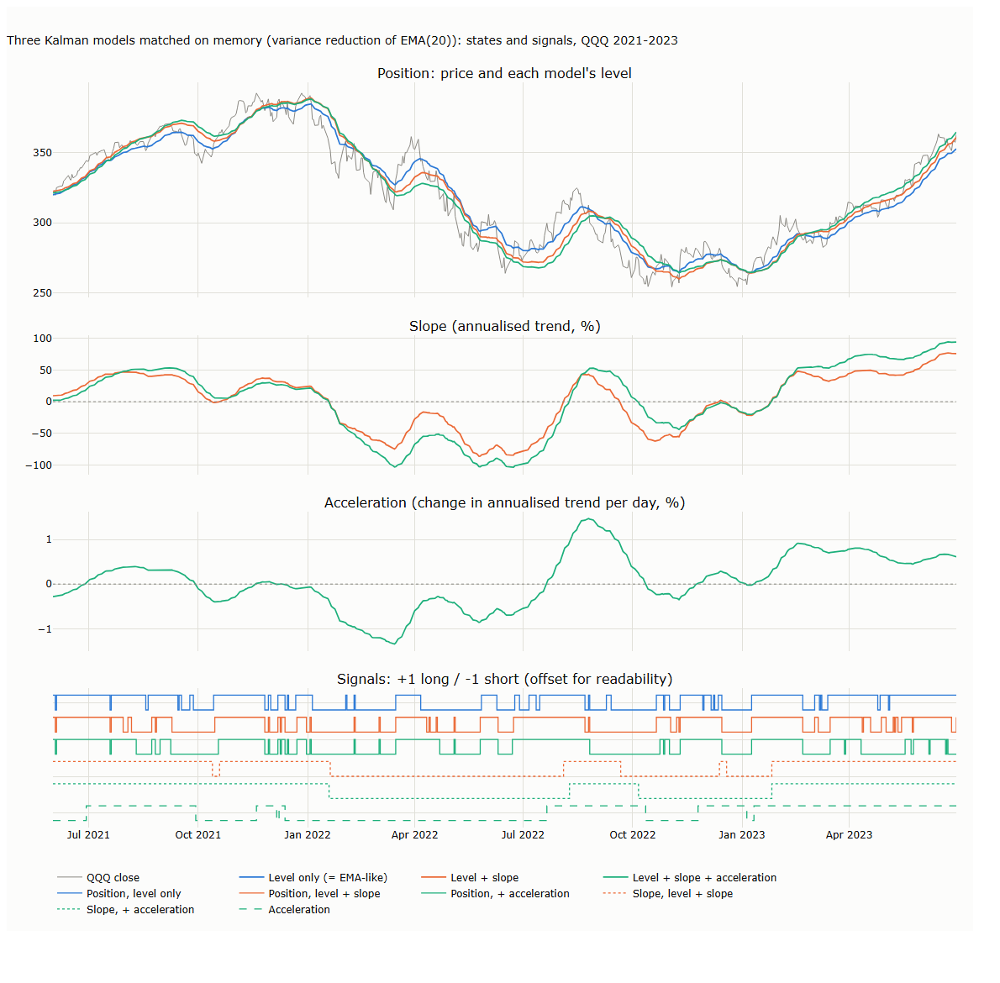
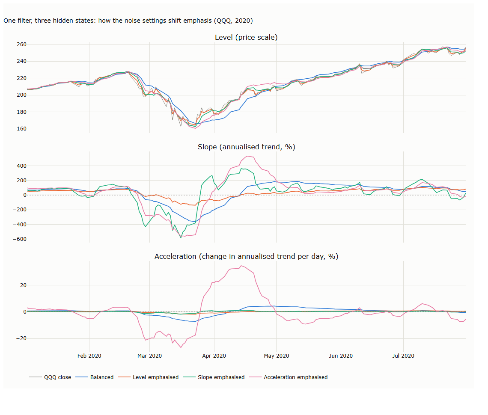

# Lecture 4: Tracking Hidden States: the Kalman Filter

*Systematic Trading: Lecture Notes (MSc) · Oct 10, 2026 · Max Gnesi*

> **Draft outline for review.** Sections below state what each part will contain; the text is not written yet. The two charts in the appendix are prototypes, reproduced by [prototypes.py](prototypes.py); their numbers are illustrations on one asset, not results. The Kalman material still in [Lecture 2](../02-ohlcv-and-price-smoothing/lecture.md) moves here when this lecture is written.

Lecture 2's methods smooth the data from the bottom up; the Kalman filter works from the top down, by modelling what is hidden behind prices and updating that model with each new bar. This lecture builds the linear filter step by step, from a single level to slope and acceleration, shows that each hidden state carries its own trading signal, then covers extensions and the nonlinear extended and unscented filters.

**Purpose.** A trend filter should find structural, long-horizon trends that are robust to daily noise. It is not judged on predicting tomorrow's price.

## Planned sections

1. **Bottom-up versus top-down.** Smoothing averages the data; a state-space model says what is hidden, how it moves, and how prices relate to it. The predict, compare, correct loop in plain words.
2. **One hidden state (level only).** The recursion with named variables (*level*, *q_level*, *r_price*, *uncertainty*, *gain*, *surprise*), worked by hand on the toy series. Why it settles into exactly an EMA. Why only the ratio $q/R$ matters (same estimates at any common scale, only the uncertainty bands rescale).
3. **Adding a slope: the core model.** Level + slope on log price, with a diagonal $Q$ so the level may jump by itself (prices gap); the alternative $Q$ derived from one noise level, compared on a price jump. Holt's method in steady state; zero lag on steady trends, overshoot after jumps. Unlike any positive-weight average, its level can sit above price while the market is still rising, because it extrapolates the slope.
4. **Adding acceleration.** Over one bar the level moves by slope $+\tfrac12\,$acceleration, so acceleration moves both the slope and the level, changing where the filter sits relative to price. Acceleration as a candidate early warning of regime change, judged on lead time against false alarms; the noise each extra derivative brings.
5. **The dials $Q$ and $R$.** What each means; the diagonal entries *q_level*, *q_slope*, *q_acceleration* set how much each state may change per bar ([chart C.6](#c6-the-dials)); matching a Kalman filter to an EMA on variance reduction.
6. **Starting the filter.** The starting uncertainty $P_0$, the diffuse start, warm-up length, and what to store to run it live.
7. **Extensions, evaluated not assumed.** A robust update for fat-tailed surprises; $R$ per bar from the bar's range; a damped slope. Each judged with the criteria of §9; early single-asset results are preliminary.
8. **Nonlinear models: the extended and unscented filters, in depth.** On a case where the nonlinearity is real: hidden volatility estimated from daily ranges (range $\approx \sqrt{8/\pi}\,\sigma$, Lecture 3). Linearisation versus sigma points; taking logs makes the model nearly linear (Alizadeh, Brandt and Diebold, 2002), so transform first and use the UKF only when you cannot; what neither fixes (fat tails, regime breaks).
9. **Evaluating trend filters for what trend systems need.** Delay at mechanically defined structural turning points; whipsaws; slope stability within trends; relation of the slope to returns over the next one to six months; acceleration's lead time against false alarms; across SPY, QQQ, GLD, AGG and a grid of settings. Plus a time-varying hedge ratio as a bridge to stat arb (Chan, 2013).
10. **Side by side.** The three models and their three signal families: position (price versus level), slope (direction), acceleration (strengthening or fading) ([chart C.5](#c5-three-models-states-and-signals)); comparison with the Lecture 2 methods; practical notes and common mistakes.
11. **Summary, exercises and reading.** References verified before citing.

## Preliminary observations (prototype, QQQ)

Three models matched on memory to EMA(20) (variance reduction 1/20), so that differences come from structure, not from smoothing more or less. How often each pair of long/short signals agrees, QQQ 1999–2026:

| | Position signals | Slope signals | Acceleration |
|---|---|---|---|
| **Position signals** | 78–91% | 45–68% | 50–58% |
| **Slope signals** | 45–68% | 89% | 70–75% |

Signals from the same state largely agree; signals from different states agree only about half to two-thirds of the time, i.e. three distinct signal families. This is agreement, not performance: whether any of them, or a combination, earns money is tested in Part II.

## Appendix: main charts (prototypes)

### C.5 Three models: states and signals

The level-only filter lags price; the level + slope and three-state levels lead it, falling below price earlier in the 2022 decline and rising above it in rebounds. Acceleration turned negative before the November 2021 peak and positive ahead of the slope in mid-2022, but also wobbled around zero at other times: the false alarms the evaluation must count.

### C.6 The dials

Each setting raises one entry of $Q$ a hundredfold from the balanced case. Emphasising the slope makes it turn within days at the 2020 turning points but flip sign far more often; emphasising acceleration makes the slope and level overshoot. The settings are illustrative, not estimated.
