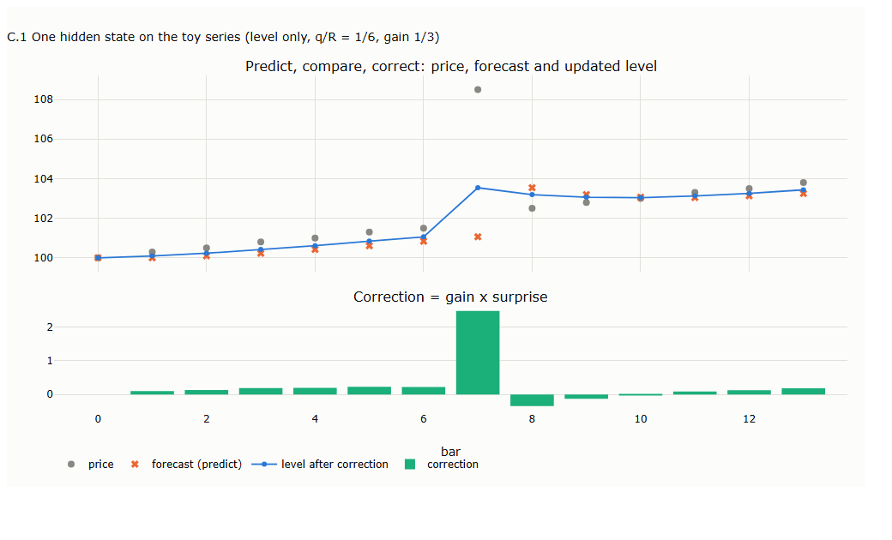
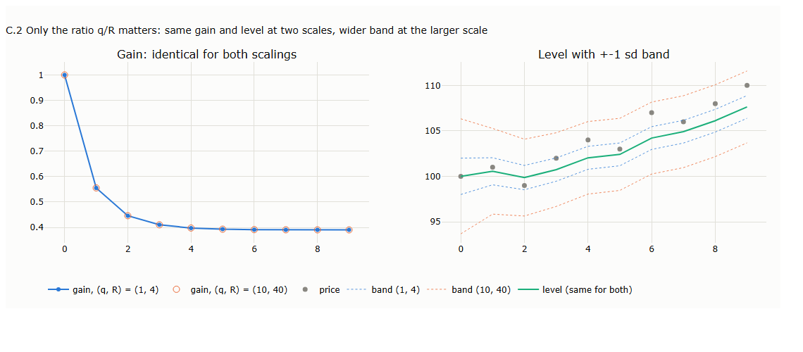
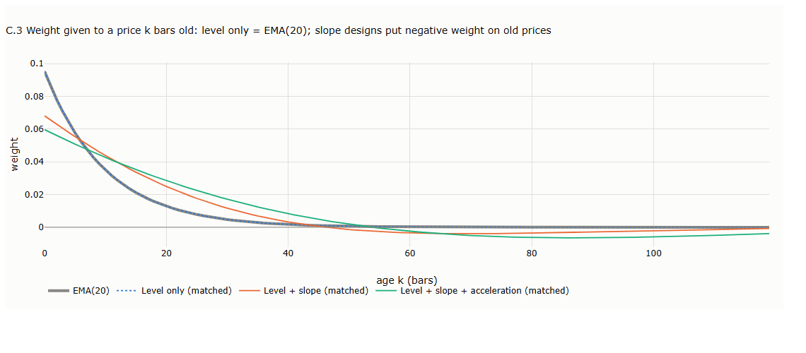
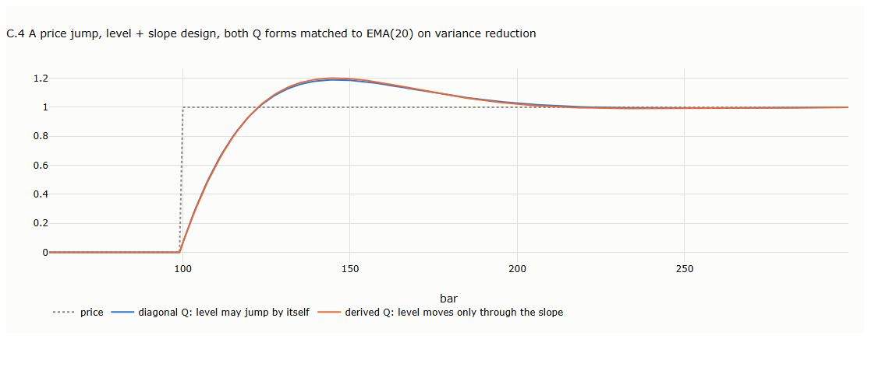
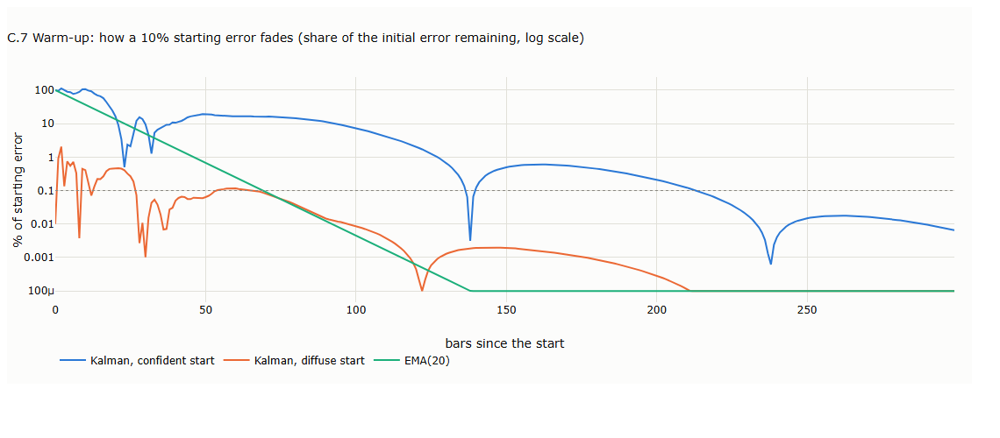
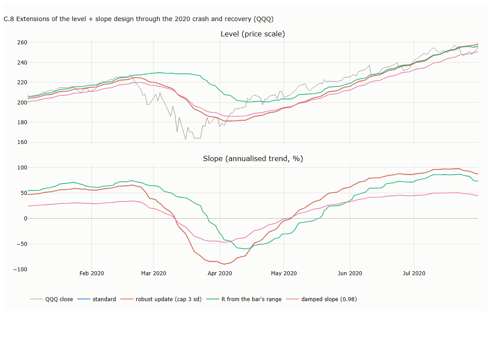
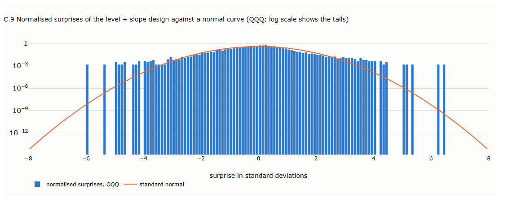
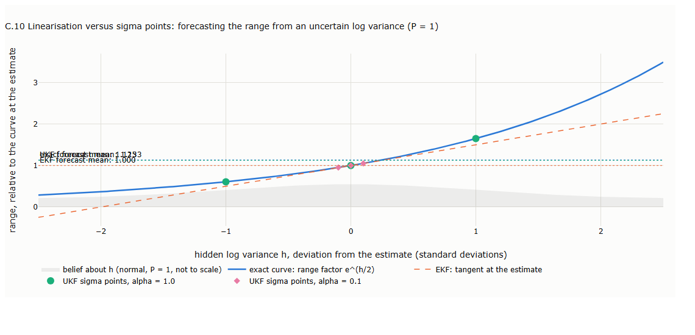
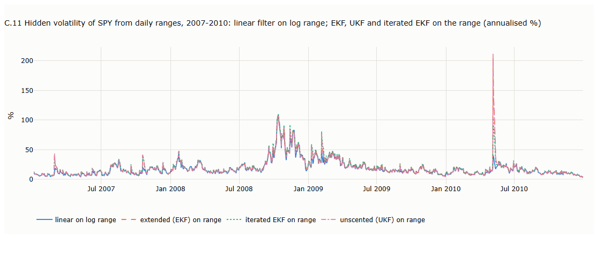
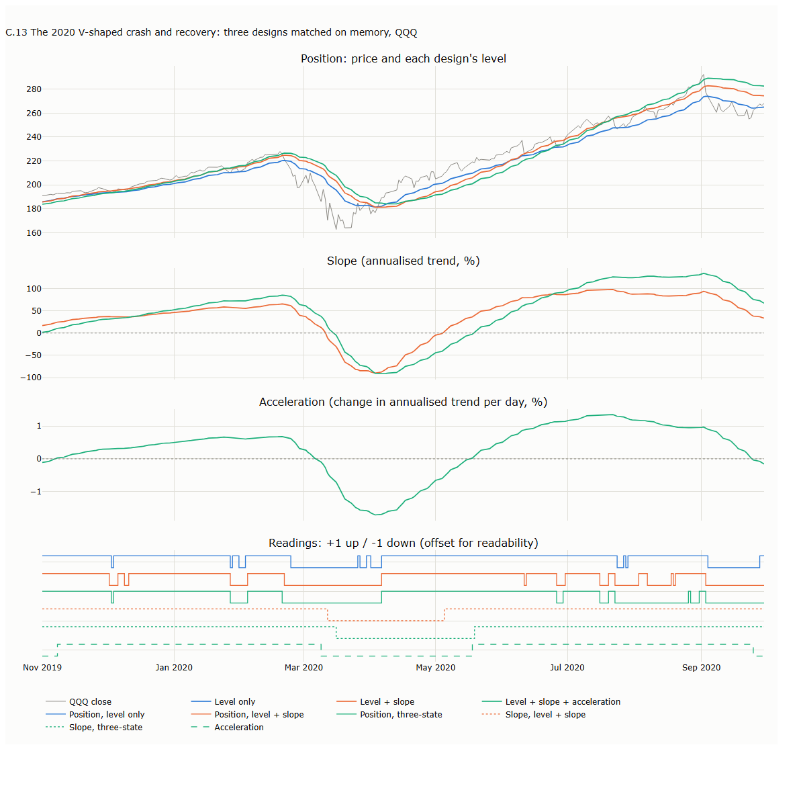

# Lecture 4: Tracking Hidden States: the Kalman Filter

*Systematic Trading: Lecture Notes (MSc) · Oct 10, 2026 · Max Gnesi*

Lecture 2 smoothed prices from the bottom up, by averaging past bars. The Kalman filter works from the top down: it keeps an explicit model of the hidden quantities behind prices and revises it as each new bar arrives. This lecture builds the linear filter from a single level up to trend speed and acceleration, examines the information each hidden state carries, and covers the nonlinear extensions, the extended and unscented filters, for tracking unobserved volatility. Companion notebook: [04_tracking_hidden_states.ipynb](04_tracking_hidden_states.ipynb).

## 1. Bottom-up versus top-down

Lecture 2's methods build a smooth line from the bottom up, as weighted averages of past bars. The Kalman filter works from the top down. It first states what is hidden behind prices, then revises its estimate of those hidden quantities as each bar arrives.

**Bottom-up** (SMA, EMA, VWAP, KAMA). The estimate is a weighted average of past prices, and nothing more. Such an average has no notion of a trend. Nothing in it says which way prices are heading or how fast, and its forecast for the next bar is just its current value: a flat line. When the market rises, the average follows only once enough higher prices have piled up in its window. That delay is its lag.

**Top-down.** A *state-space model* is specified by three elements:

| Element | What it specifies | Example: the level + slope model of §3 |
|---|---|---|
| State | The hidden quantities the model tracks; how many is a modelling choice | The underlying price (*level*) and the trend (*slope*) |
| Transition | How the state moves from one bar to the next, apart from random changes | Next level = level + slope; next slope = slope |
| Measurement | How the observed price relates to the state | Price = level + noise |

**Why such a model has a notion of trend.** When the state includes a slope, the trend is a quantity the model holds, uses and tests. It holds it: the slope is an explicit number, for instance +20% a year. It uses it: through the transition, tomorrow's expected level is today's level plus the slope, so the forecast is a sloping line rather than a flat one. It tests it: when prices keep arriving above the forecast, the surprises are persistently positive and the filter raises the slope; when they arrive below, it lowers it. A rising market is therefore represented directly, as a positive slope, rather than inferred after the fact from accumulated past prices. With a level alone the model has no such quantity and reduces exactly to an EMA (§2); the slope enters in §3.

| Dimension | Bottom-up (SMA, EMA, VWAP, KAMA) | Top-down (Kalman filter) |
|---|---|---|
| Core view | The trend is whatever the average of past prices shows | Prices are driven by hidden quantities (a level, a trend speed, an acceleration), which the model tracks explicitly |
| What the modeller chooses | The window length and the weighting scheme | Which hidden states to track (level; level + slope; level + slope + acceleration) and their noise variances: each choice is a different model (§5) |
| Forecast of the next bar | The current average: a flat line | The level plus the slope: a continuation of the current trend |
| Lag | Always lags a trend: every weight on past prices is positive, so the average moves only as new prices pull it | With a slope state, no lasting lag on a steady trend, because the trend is projected forward; the cost is overshoot after jumps (§5). With a level alone, it lags like an EMA |
| Handling a new price | Dilutes it into the past prices with a fixed weight | Compares it with the forecast, measures the surprise, and revises each hidden state by its gain |
| Uncertainty | None: the average does not know how reliable it is | A variance for every hidden state. It sets the gain (§2.2), allows a start without a long run-in (§6), and gives a band around each state, for instance whether the slope differs from zero |

The filter applies the same three steps to every bar:

| Step | What the filter does |
|---|---|
| Predict | Projects the state one bar ahead, using the transition |
| Compare | Computes the *surprise*: the observed price minus the forecast |
| Correct | Revises the state by *gain* × *surprise*. The gain is large when the filter's uncertainty about its state is large relative to the price noise, and small otherwise (Kalman, 1960) |

**Example: navigation.** A navigator estimates the ship's position from its speed and heading (the model), then corrects the estimate when a landmark comes into view (the observation). How far to correct depends on which is more reliable, the reckoning or the sighting. The Kalman filter does the same, with prices as the landmarks.

The two approaches are not ranked. They embody different assumptions about the data, and the appropriate choice depends on what the analysis is meant to capture. The distinctive feature of the top-down approach is that a single model delivers several quantities at once: a level, a trend and its rate of change, and the uncertainty around each (§10). Throughout this lecture each hidden state yields a *reading*, up or down; the use of readings as trading signals is treated in Part II.

## 2. One hidden state: the level

With a single hidden state, the Kalman filter is an EMA whose smoothing constant is set by the ratio of two noise variances.

### 2.1 The model

The hidden level moves at random from bar to bar, and each price equals the level plus noise:

```math
\text{level}_t = \text{level}_{t-1} + \text{level change}_t, \qquad \text{level change}_t \sim N(0,\ q_{\text{level}})
```

```math
\text{price}_t = \text{level}_t + \text{price noise}_t, \qquad \text{price noise}_t \sim N(0,\ r_{\text{price}})
```

The model has one hidden quantity and two variances:

| Model quantity | Financial meaning |
|---|---|
| *level* | The underlying price: where the market is, net of noise. Never observed directly |
| $`q_{\text{level}}`$ | Variance of the level change: the part of each price move that persists into later prices |
| $`r_{\text{price}}`$ | Variance of the price noise: the part of each price that does not persist |

**What the two variances represent.** The model defines both statistically, by persistence, and does not identify their causes; examples such as news for the level change are interpretations, not established components. For the price noise, two transitory sources are documented. At high frequency, trades alternate between bid and ask prices, which makes successive price changes negatively correlated (Roll, 1984). Over horizons of months to years, part of the variation in stock prices has been found to revert, a temporary component that is weak at daily and weekly horizons (Fama and French, 1988; Poterba and Summers, 1988). Neither maps neatly onto the noise of daily closes. The first is negligible for liquid ETFs: a one-cent spread on SPY is below 0.01% of its price, against typical daily moves near 1% (our calculation, approximate). The second is slow, not bar-to-bar noise. Moreover, in this lecture $`r_{\text{price}}`$ is set by matching memory (§4.2), so it acts as a smoothing choice rather than a measurement: §7 shows that the matched value lies far above the noise actually present in daily data.

The filter estimates the level from the prices. To do so it computes four quantities of its own on every bar, which appear in the steps below:

| Filter quantity | Financial meaning |
|---|---|
| *forecast* | The filter's estimate of today's underlying price before seeing today's price |
| *uncertainty* | How unsure the filter is about the underlying price: the variance of its own error |
| *surprise* | Today's unexpected move: the price minus the forecast |
| *gain* | The share of the surprise treated as genuine information rather than noise |

### 2.2 The recursion, step by step

| Step | Calculation | Financial interpretation |
|---|---|---|
| 1. Predict the level | $`\text{forecast}_t = \text{level}_{t-1}`$ | With no new trades, the best estimate of today's underlying price is yesterday's |
| 2. Predict the uncertainty | $`\text{forecast uncertainty}_t = \text{uncertainty}_{t-1} + q_{\text{level}}`$ | Overnight, news may have moved the underlying price, so the estimate becomes less certain by $`q_{\text{level}}`$ |
| 3. Compute the gain | $`\text{gain}_t = \dfrac{\text{forecast uncertainty}_t}{\text{forecast uncertainty}_t + r_{\text{price}}}`$ | How much of today's move to believe: near 1 when genuine changes dominate (a fast-moving market), near 0 when noise dominates (a market that mostly jitters around its value) |
| 4. Compare | $`\text{surprise}_t = \text{price}_t - \text{forecast}_t`$ | Today's unexpected move |
| 5. Correct the level | $`\text{level}_t = \text{forecast}_t + \text{gain}_t \cdot \text{surprise}_t`$ | Accept the believed part of the move, discard the rest as noise |
| 6. Update the uncertainty | $`\text{uncertainty}_t = (1 - \text{gain}_t)\cdot\text{forecast uncertainty}_t`$ | Having seen today's price, the filter is more certain where the underlying price is |

### 2.3 Equivalence to the EMA

Substituting step 1 into step 5 gives $`\text{level}_t = \text{gain}\cdot\text{price}_t + (1-\text{gain})\cdot\text{level}_{t-1}`$, an EMA whose $`\alpha`$ is the gain. After a few bars the gain converges to a constant: the steady forecast uncertainty $`u`$ solves $`u^2 - q_{\text{level}}\,u - q_{\text{level}}\,r_{\text{price}} = 0`$, and the steady gain is $`u/(u + r_{\text{price}})`$. With $`q_{\text{level}}/r_{\text{price}} = 1/6`$ the steady gain is exactly $`1/3`$, the $`\alpha`$ of EMA(5). The same fixed-point equation appears in the lifeboat example of Bocquet and Farchi (2025, §2.2).

On Lecture 2's toy series, with $`q_{\text{level}}/r_{\text{price}} = 1/6`$ and the filter started at its steady uncertainty, the level reproduces EMA(5) on every bar, including the 103.54 after the spike ([chart C.1](#c1-predict-compare-correct-2)). Started instead from a wide uncertainty, the gain begins close to 1, so the first prices are accepted almost in full, and converges within a few bars ([chart C.2](#c2-only-the-ratio-matters-24)).

### 2.4 Only the ratio of the noise variances matters

Scaling both noise variances by the same constant leaves the estimates unchanged, because the gain depends only on $`q_{\text{level}}/r_{\text{price}}`$. The same ten prices, filtered at two scales:

| Bar | Price | Level, $`(q_{\text{level}}, r_{\text{price}}) = (1, 4)`$ | Level, $`(10, 40)`$ | Gain, both | Uncertainty band ±1 sd, $`(1, 4)`$ | Band, $`(10, 40)`$ |
|---|---|---|---|---|---|---|
| 1 | 101 | 100.556 | 100.556 | 0.556 | 1.49 | 4.71 |
| 4 | 104 | 102.036 | 102.036 | 0.398 | 1.26 | 3.99 |
| 9 | 110 | 107.633 | 107.633 | 0.390 | 1.25 | 3.95 |

Only the uncertainty band changes, by a factor of $`\sqrt{10}`$. The equivalence is exact when the starting uncertainty is scaled by the same factor; with an unscaled start it is approximate during the warm-up and exact once the start has been forgotten ([chart C.2](#c2-only-the-ratio-matters-24)).

**Example: a thermometer.** Let one variance describe how far the room temperature can drift in an hour and the other how noisy the thermometer is. Scaling both by the same factor leaves the relative reliability of model and instrument unchanged, so the estimate is unchanged; only the stated uncertainty increases.

## 3. Adding a slope: the core model

A slope state gives the filter an explicit trend: a number it carries from bar to bar and uses to project the level forward. In steady state this filter is Holt's linear exponential smoothing (Harvey, 1989).

### 3.1 The one-bar transition

The model borrows the equations of motion from physics, with the level as position and the slope as velocity. Over one bar of length $`\Delta t`$:

- next level = level + slope × $`\Delta t`$
- next slope = slope, apart from a random change

In matrix form, with the price as the only observation:

```math
\begin{pmatrix}\text{level}_t\\ \text{slope}_t\end{pmatrix} = \underbrace{\begin{pmatrix}1 & \Delta t\\ 0 & 1\end{pmatrix}}_{F}\begin{pmatrix}\text{level}_{t-1}\\ \text{slope}_{t-1}\end{pmatrix} + \begin{pmatrix}\text{level change}_t\\ \text{slope change}_t\end{pmatrix}, \qquad \text{price}_t = \underbrace{\begin{pmatrix}1 & 0\end{pmatrix}}_{H}\begin{pmatrix}\text{level}_t\\ \text{slope}_t\end{pmatrix} + \text{price noise}_t
```

With one bar as the unit of time ($`\Delta t = 1`$) and the random changes summarised by their variances:

```math
F = \begin{pmatrix}1 & 1\\ 0 & 1\end{pmatrix}, \qquad H = \begin{pmatrix}1 & 0\end{pmatrix}, \qquad Q = \begin{pmatrix}q_{\text{level}} & 0\\ 0 & q_{\text{slope}}\end{pmatrix}, \qquad R = r_{\text{price}}
```

Each entry is a design assumption built into the model, not a law of the market:

| Entry | Mathematical role | Financial meaning |
|---|---|---|
| $`F`$, first row $`(1, 1)`$ | The level moves by the slope over one bar | **Trend projection.** The underlying price drifts by the current trend |
| $`F`$, second row $`(0, 1)`$ | The slope carries over unchanged | **The trend follower's hypothesis.** Today's trend is the best guess for tomorrow's |
| $`H = (1, 0)`$ | Only the level is observed | **Unobserved trend.** Prices reveal the level; the trend is never observed directly, only inferred from how levels change |
| $`q_{\text{level}}`$ | Variance of random changes in the level | **Dial for gaps.** One-off revaluations: gaps and news that shift the price without changing the trend |
| $`q_{\text{slope}}`$ | Variance of random changes in the slope | **Dial for momentum.** How quickly the trend itself may strengthen or fade |
| $`r_{\text{price}}`$ | Variance of the price noise | **Dial for jitter.** The part of each price that does not persist (§2.1); the larger it is, the less weight each new price receives |

The filter runs on log prices, so the slope is a daily log trend, shown annualised (×252) in the charts. The equations of motion are an analogy, not a law: prices have no inertia that guarantees a trend persists. The model assumes persistence and the surprises measure, bar by bar, how far the data disagree.

### 3.2 What the slope changes

In steady state the filter is a fixed linear smoother, like the methods of Lecture 2, with one decisive difference in its weights: recent prices get positive weights, older prices small negative ones ([chart C.3](#c3-weights-on-past-prices-32)). Negative weights are what extrapolation looks like inside a weighted average. They let the filter keep up with a steady trend, with no lasting gap, and they make it overshoot after a jump (§5).

The same extrapolation lets the level run ahead of price while the market is still rising, something no average with positive weights can do. In the strongest advances (63-day returns in each asset's top 5%, median over SPY, QQQ, GLD and AGG), price sits above the level-only design's level on 91% of days, but above the level + slope design's level on only 65%: the slope design has projected its level ahead of price.

### 3.3 Two ways to specify Q

The diagonal $`Q`$ above lets the level and the slope change independently, so the level can jump on its own, as prices do when they gap. The alternative derives $`Q`$ from a single setting $`q`$. It assumes that only the slope receives random kicks, and that the level moves only because the slope moved during the bar:

```math
Q_{\text{derived}} = q\begin{pmatrix}1/3 & 1/2\\ 1/2 & 1\end{pmatrix}
```

The off-diagonal terms tie the two changes together (correlation 0.87): a kick to the slope always drags the level with it. Matched to EMA(20) on variance reduction, the two forms react similarly to a price jump. Both cover half the jump in 8 bars; the derived form then overshoots slightly more (20.1% against 18.9%), because it can explain the jump only as a faster trend ([chart C.4](#c4-a-price-jump-two-forms-of-q-33)). The difference is modest, and the diagonal form is the more natural choice for prices, which gap.

## 4. Adding acceleration

An acceleration state models changes in the speed of the trend, and because it also enters the level, it changes where the filter sits relative to price.

### 4.1 The one-bar transition

Continuing the analogy, acceleration is the rate of change of the slope. Over one bar of length $`\Delta t`$:

- next level = level + slope × $`\Delta t`$ + ½ × acceleration × $`\Delta t^2`$
- next slope = slope + acceleration × $`\Delta t`$
- next acceleration = acceleration, apart from a random change

```math
\begin{pmatrix}\text{level}_t\\ \text{slope}_t\\ \text{acceleration}_t\end{pmatrix} = \underbrace{\begin{pmatrix}1 & \Delta t & \tfrac12\Delta t^2\\ 0 & 1 & \Delta t\\ 0 & 0 & 1\end{pmatrix}}_{F}\begin{pmatrix}\text{level}_{t-1}\\ \text{slope}_{t-1}\\ \text{acceleration}_{t-1}\end{pmatrix} + \text{random changes}_t
```

With $`\Delta t = 1`$ bar:

```math
F = \begin{pmatrix}1 & 1 & 0.5\\ 0 & 1 & 1\\ 0 & 0 & 1\end{pmatrix}, \qquad H = \begin{pmatrix}1 & 0 & 0\end{pmatrix}, \qquad Q = \begin{pmatrix}q_{\text{level}} & 0 & 0\\ 0 & q_{\text{slope}} & 0\\ 0 & 0 & q_{\text{acceleration}}\end{pmatrix}
```

| Entry | Financial meaning |
|---|---|
| $`F`$, first row $`(1, 1, 0.5)`$ | The underlying price drifts by the trend plus half the change in the trend: an accelerating rise pushes the projected level up, a decelerating rise pulls it down |
| $`F`$, second row $`(0, 1, 1)`$ | The trend itself strengthens or fades by the acceleration |
| $`F`$, third row $`(0, 0, 1)`$ | The change in trend speed carries over: a market that is speeding up is assumed to keep speeding up |
| $`q_{\text{acceleration}}`$ | How quickly the change in trend speed may itself change |

The first row is the reason acceleration matters beyond the slope: through the ½ entry it moves the level directly, so a decelerating rise lowers the projected level and brings it towards, or below, price earlier.

### 4.2 Three designs, six readings

Sections 2 to 4.1 built three *designs*. A design is the set of hidden states the model tracks, together with how they move from bar to bar; it is not a parameter setting. The settings (the noise variances, or dials) are a separate choice, made within a design and discussed in §5.3. The rest of the lecture compares the three designs, and short labels are used from here on.

**Table 4.1. Designs and the readings they provide**

| Label | Design | Hidden states | One-bar transition | Built in | Readings |
|---|---|---|---|---|---|
| L | Level only | level | level stays where it was | §2 | P-L |
| LS | Level + slope | level, slope | level moves by the slope | §3 | P-LS, S-LS |
| LSA | Level + slope + acceleration | level, slope, acceleration | level moves by slope + ½ acceleration; slope moves by acceleration | §4.1 | P-LSA, S-LSA, A-LSA |

On every bar each design produces its hidden states, after the update with that bar's price. Each state is then condensed into a *reading*: the direction in which it points on that day, up (+1) or down (−1). A reading discards the size of the state and keeps only its direction, which puts states measured on different scales (a price level, a trend in % a year, a change in that trend) on a common footing: on any day one can ask whether they point the same way. A reading's label names the state first and the design second: P-LS is the position reading of the level + slope design, S-LSA the slope reading of the level + slope + acceleration design.

**Table 4.2. Definition of the readings** (log prices; states after the update with day $`t`$'s price)

| Reading | Calculation | Points up when | What it measures |
|---|---|---|---|
| Position: P-L, P-LS, P-LSA | $`\mathrm{sign}(\text{price}_t - \text{level}_t)`$, using that design's level | Price is above the design's level | Where price stands relative to the design's estimate (§4.3) |
| Slope: S-LS, S-LSA | $`\mathrm{sign}(\text{slope}_t)`$ | The slope is positive | Which way the trend points |
| Acceleration: A-LSA | $`\mathrm{sign}(\text{acceleration}_t)`$ | The acceleration is positive | Whether the trend is strengthening or fading |

**A fair comparison: matching memory.** A design that smooths less reacts faster for that reason alone. So that differences come from structure rather than from smoothing more or less, every design is matched to the same memory, that of EMA(20). The criterion is the variance reduction factor $`\sum_k w_k^2 = 1/20`$ (Lecture 2, §6), where $`w_k`$ is the steady-state weight on a price $`k`$ bars old; with $`q_{\text{level}} = 10^{-4}`$, $`q_{\text{slope}} = 10^{-6}`$ and $`q_{\text{acceleration}}`$ = $`10^{-8}`$ fixed, the price noise $`r_{\text{price}}`$ is solved for. Average age cannot serve as the criterion: the slope designs follow a steady trend with no lag, so their average age is zero or negative.

**Table 4.3. Designs matched to EMA(20)**

| Design | Price noise $`r_{\text{price}}`$, matched | Average age of the weights (bars) | Variance reduction $`\sum_k w_k^2`$ | Smallest weight |
|---|---|---|---|---|
| L | 0.0100 | 9.5 | 0.050 | 0 |
| LS | 0.200 | 0.0 | 0.050 | −0.0039 |
| LSA | 12.5 | −0.8 | 0.050 | −0.0065 |
| EMA(20), for reference | — | 9.5 | 0.050 | 0 |

L matched this way is EMA(20) exactly. A design used at default settings, without matching, can carry a very different memory: Lecture 2 found that the default of the `trading_models` package smooths like a 4.5-bar average. Unless stated otherwise, every result below uses the matched designs of Table 4.3. Matching on the level is the fair way to compare designs at one smoothing level; a long-horizon trend filter is built differently, with separate speeds for level and slope (§6.2).

### 4.3 What a position reading measures

In classical trend following, price below a moving average is read as a downtrend, because the average lags. In a Kalman filter the same comparison has a precise meaning. After each update the level equals the forecast plus gain × surprise, so price minus level equals (1 − gain) × surprise: in every design, the position reading is the sign of today's surprise (our derivation). What differs between designs is the forecast.

**Table 4.4. Meaning of the position reading by design**

| Design | Forecast the price is compared with | Meaning of "price below the level" | Strong advances: share of days pointing up |
|---|---|---|---|
| L | Yesterday's level, a lagging average | The classical trend reading: the market has turned down | 91% |
| LS | Yesterday's level plus the slope | Price rose less than the projected trend: a pullback or deceleration reading, closer to contrarian | 65% |
| LSA | Level plus slope plus half the acceleration | As LS | 59% |

Strong advances are days whose 63-day return lies in the asset's top 5%; the shares are medians over SPY, QQQ, GLD and AGG, with the designs of Table 4.3 (notebook §12). In the same advances the slope readings point up on 99.9% of days: in the slope designs, the trend reading is the slope. The readings are therefore building blocks rather than an off-the-shelf signal. Requiring position and slope to agree, or reading a positive acceleration inside a negative slope as a fading decline, are design choices that belong to Part II and must be tested there. Practitioners use this comparison in the projected sense. Benhamou (2018) goes long when the filter's prediction lies above the previous close, the opposite of the classical moving-average rule, and Chan (2013) uses the surprise scaled by its standard deviation as a mean-reversion signal on a spread.

### 4.4 How far the readings agree

**Experiment 4.1.** Data: QQQ daily closes, 1999–2026, in logs. Designs: L, LS and LSA with the settings of Table 4.3. Each day, the six readings of Table 4.2 are computed; the first 300 bars are dropped as warm-up. Measured: for each pair of readings, the share of days on which they have the same sign. Notebook §7; the states and readings over 2021–2023 are plotted in [chart C.5](#c5-three-designs-states-and-readings-44).

**Table 4.5. Share of days on which two readings point the same way** (QQQ, 1999–2026, matched designs, first 300 bars excluded)

| | P-L | P-LS | P-LSA | S-LS | S-LSA | A-LSA |
|---|---|---|---|---|---|---|
| P-L | — | 83% | 78% | 68% | 63% | 58% |
| P-LS | | — | 91% | 53% | 48% | 52% |
| P-LSA | | | — | 52% | 45% | 51% |
| S-LS | | | | — | 89% | 70% |
| S-LSA | | | | | — | 74% |

Two unrelated readings that each point up half the time would agree on about half the days. Readings of the same state agree on 78–91% of days; readings of different states on 45–74%. The states therefore capture three distinct layers of the same price: where it stands relative to the estimate, which way the trend points, and whether the trend is strengthening or fading ([chart C.5](#c5-three-designs-states-and-readings-44)). Comparisons are fair within a state. Across states, note that a slope measures change, which needs more data than a level, so slope readings move on a longer timescale by nature.

### 4.5 Acceleration as an early warning

**Experiment 4.2.** Data: SPY, QQQ, GLD and AGG daily closes, in logs, plus QQQ around the 2020 crash. Designs: LS and LSA with the settings of Table 4.3. Turning points are alternating highs and lows separated by a move of at least one year of the asset's typical volatility; choppy markets are days whose 63-day efficiency ratio lies in the asset's bottom third (both as in §9). Measured: days from each turning point until the reading points the new way (median over the four assets), and sign changes per year in choppy markets. Notebook §12 and §13.

**Table 4.6. Trend readings at turning points**

| Reading | Median delay after turning points, four ETFs (days) | Sign changes per year, choppy markets | 2020: days after the 19 Feb peak until pointing down | 2020: days after the 23 Mar low until pointing up |
|---|---|---|---|---|
| S-LS | 30 | 7.4 | 16 | 30 |
| S-LSA | 36 | 5.3 | 18 | 40 |
| A-LSA | 23 | 4.4 | 13 | 39 |

On average A-LSA turns about a week before the slope readings and changes sign less often in choppy markets. It does not lead at every turn: in 2020 it turned down before the slopes after the peak, but turned up no earlier than them after the low. Its value is as an additional layer of information, not as a reliable leading indicator.

## 5. Design versus tuning

Two choices shape a Kalman filter, and they do different things. The *design*, which states the model has, decides what kind of motion the filter can follow with no lasting gap, and whether it overshoots a jump, at every setting. The *tuning*, the noise variances (of which only the ratios matter), decides only how fast it does so. Synthetic price paths separate the two, because they contain no noise and no market history.

### 5.1 What the design decides

**Table 5.1. Synthetic tests: design** (3,000 bars, no noise; $`r_{\text{price}} = 1`$; slow setting $`q = (10^{-4}, 10^{-6}, 10^{-8})`$, fast setting $`q = (10^{-2}, 10^{-3}, 10^{-4})`$ for level, slope and acceleration)

| Test | Price path | Measured |
|---|---|---|
| Jump | 0 until bar 100, then 1 | Overshoot: highest level after the jump minus 1, as a % of the jump |
| Steady trend | Rises by 0.01 a bar | Gap: price minus level, at bars 1,500 and 2,999 |
| Parabolic move | $`10^{-5}\,t^2`$ | Gap, as above |

**Table 5.2. Results, slow / fast setting**

| Design | Jump: overshoot | Steady trend: gap | Parabolic move: gap at bar 1,500 → 2,999 |
|---|---|---|---|
| L | 0% / 0% | 0.99 / 0.095, constant | 2.8 → 5.8 / 0.28 → 0.57, growing |
| LS | 20% / 17% | 0 / 0 | 0.02 / 0.0006, constant |
| LSA | 29% / 23% | 0 / 0 | 0 / 0 |

Three rules follow. Tuning shrinks a gap but never removes it; only adding a state does. Each additional state lets the filter follow one more kind of motion exactly: a flat price, a steady trend, a steady acceleration. And overshoot follows from the weights: positive weights on past prices can never overshoot a jump, while any negative weight forces one, because the cumulative weights must exceed one before settling back to one. Each design is therefore a different bet about what the market is doing, and none is best.

### 5.2 How each design follows price after a jump

**Table 5.3. Synthetic tests: after a jump** (400 bars, no noise, same settings as Table 5.1)

| Test | Price path | Measured |
|---|---|---|
| Jump, then flat | 0 until bar 100, then 1 | First bar after the jump on which each reading points down |
| Jump in a continuing uptrend | Rises by 0.005 a bar throughout, with a jump of 1 at bar 100 | Number of the 300 bars after the jump on which each reading points down |

**Table 5.4. Results, slow / fast setting**

| Reading | Jump, then flat: first bar pointing down | Jump in an uptrend: bars pointing down |
|---|---|---|
| P-L | never / never | 0 / 0 |
| P-LS | +34 / +6 | 144 / 148 |
| P-LSA | +15 / +3 | 136 / 149 |
| S-LS | +143 / +27 | 0 / 0 |
| S-LSA | +61 / +13 | 48 / 16 |
| A-LSA | +43 / +9 | 168 / 148 |

When price stalls after a jump, the slope designs turn against the move on their own, simply by correcting their own overshoot, much like a tightening stop; L waits for price to come to it. When the uptrend continues, only P-L and S-LS stay with it throughout. The position readings of the slope designs point down for about half of the bars, because price keeps falling short of a projection inflated by the jump (§4.3).

### 5.3 The dials

Choosing the dials is part of modelling, as much as choosing the design. The design fixes which motions the filter can follow; the dials decide how each surprise is shared between level, slope and acceleration, and therefore how the filter behaves at a turn, in chop and after a jump. Within a design, the diagonal of $`Q`$ sets how much each state may change per bar, relative to the price noise; raising one entry shifts the filter's attention towards that state. Four settings of LSA illustrate this, each raising one entry a hundredfold from a balanced case ([chart C.6](#c6-the-dials-53)).

**Table 5.5. Dial settings** (LSA, $`r_{\text{price}} = 10^{-4}`$)

| Setting | $`q_{\text{level}}`$ | $`q_{\text{slope}}`$ | $`q_{\text{acceleration}}`$ | Intended effect |
|---|---|---|---|---|
| Balanced | $`10^{-6}`$ | $`10^{-8}`$ | $`10^{-11}`$ | Reference |
| Level emphasised | $`10^{-4}`$ | $`10^{-8}`$ | $`10^{-11}`$ | Follow price closely |
| Slope emphasised | $`10^{-6}`$ | $`10^{-6}`$ | $`10^{-11}`$ | Turn faster at trend changes |
| Acceleration emphasised | $`10^{-6}`$ | $`10^{-8}`$ | $`10^{-9}`$ | React to changes in trend speed |

**Table 5.6. Effect of each setting** (QQQ, 1999–2026 unless stated)

| Setting | Level gap to price, RMS (%) | Slope sign changes per year | 2020: days until slope down after the peak / up after the low | Apr–Jun 2020: peak slope (% a year) | Apr–Jun 2020: largest level above price (%) |
|---|---|---|---|---|---|
| Balanced | 2.24 | 8.0 | 6 / 15 | 186 | 4.1 |
| Level emphasised | 0.64 | 9.5 | 6 / 15 | 87 | 1.9 |
| Slope emphasised | 1.28 | 24.7 | 3 / 3 | 362 | 4.3 |
| Acceleration emphasised | 1.79 | 14.9 | 4 / 6 | 532 | 7.0 |

Each dial buys something and pays for it. Emphasising the level makes it hug price, but the slope then barely moves: the level absorbs every move and the design collapses towards an EMA. Emphasising the slope makes it turn within three days at both 2020 turns, at the cost of three times as many sign changes. Emphasising acceleration makes the filter overshoot. Its slope peaked at +532% a year on 17 April 2020, against a fastest 20-day pace for QQQ of 285%; had it persisted, it implied a 56% rise over the following month, while QQQ rose 5.6%. A slope running ahead of the pace price actually achieves projects the level ahead of price, which ran up to 7% above it.

Only the ratios to $`r_{\text{price}}`$ matter (§2.4), so "raise $`q_{\text{slope}}`$" and "lower everything else" are the same instruction. Raising $`r_{\text{price}}`$ relative to all of them smooths every state and adds lag everywhere. The settings above are illustrative; in practice the ratios can be estimated by maximum likelihood (Harvey, 1989; Durbin and Koopman, 2012) or set by matching memory, as in Table 4.3.

## 6. Starting and running the filter

A filter must be started from a guess, and how long the guess takes to be forgotten depends on the design and on the starting uncertainty $`P_0`$, not on a universal number of bars.

### 6.1 Warm-up by design

**Table 6.1. Warm-up by design** (matched to EMA(20); starting error 10% in the level, zero slope)

| Design | Gain settles within 1% | Memory horizon (older prices < 0.1% of weight) | Level error < 0.1%: diffuse start / confident start | Slope within 1%/yr for good: diffuse / confident |
|---|---|---|---|---|
| L | 26 bars | 70 bars | 0 / 73 bars | — |
| LS | 86 bars | 197 bars | 0 / 137 bars | 24 / 163 bars |
| LSA | 184 bars | 436 bars | 23 / 145 bars | 174 / 346 bars |

The *diffuse start*, a very large $`P_0`$, tells the filter that its starting guess is worthless. The gain then begins close to one, the first prices overwrite the guess almost at once, and the level error vanishes within a bar ([chart C.7](#c7-warm-up-61)). A confident start with a wrong guess takes 137 bars to forget the same error in the level + slope design, longer than EMA(20) (70 bars). Each extra state lengthens everything: the three-state design needs about 350 bars before its slope can be trusted after a confident start, and its memory reaches back over 400 bars. Unlike KAMA (Lecture 2, §9.1), these numbers are fixed by the design and its settings, so they can be computed in advance.

### 6.2 Long horizons: putting the trend memory on the slope

Structural trends are measured over a year or more, so a trend filter needs the memory of EMA(252) or EMA(500), not of EMA(20). The matched designs of §4.2 tie every speed to a single dial: the noise ratios are fixed and the price noise is solved to match the level's smoothing. That is the fair way to compare designs at one smoothing level, but it is the wrong way to build a long-horizon trend filter. To make the level of LS as smooth as EMA(252), the price noise must be so large that the slope slows down as well, and the whole filter stretches over many years: matched this way, LS puts 36% of its weight on prices more than a year old (our calculation).

Practitioners set the speeds separately. Holt's method has one smoothing constant for the level and another for the trend, and state-space applications estimate the level and slope noise, and even the starting uncertainty, from data (Harvey, 1989; Benhamou, 2018). The level then tracks price closely, and the long memory sits where it belongs, in the slope.

**Table 6.2. Building a long-horizon level + slope filter**

| Step | What to do | Why |
|---|---|---|
| 1. Fix the scale | Set $`r_{\text{price}} = 1`$ | Only the ratios matter (§2.4) |
| 2. Make the level fast | Set $`q_{\text{level}} = 0.1`$ | The level's job is to track price, not to carry the trend |
| 3. Choose the trend horizon | For example $`N = 252`$ or $`500`$ bars | The horizon over which the trend should be measured |
| 4. Solve for $`q_{\text{slope}}`$ | Choose $`q_{\text{slope}}`$ so that the slope's steady-state weights on past prices reach back as far as those of EMA(N), to 0.1% of the total weight; a bisection on the steady-state gain finds it ($`5.3 \times 10^{-6}`$ for $`N = 252`$, $`1.3 \times 10^{-6}`$ for $`N = 500`$) | The long memory goes into the slope only |
| 5. Start diffuse | Use a large $`P_0`$ | With an exact diffuse start, the start is typically absorbed within as many bars as there are diffuse states, two here (Durbin and Koopman, 2012, ch. 5) |
| 6. Burn in | Load $`N`$ to $`2N`$ bars before the evaluation starts | Table 6.4 |

**Table 6.3. Burn-in test: setup**

| Item | Setting |
|---|---|
| Design | LS built as in Table 6.2, for $`N = 252`$ and $`N = 500`$ |
| Start | Diffuse, at 22 dates across SPY, QQQ, GLD and AGG (every 500 bars from bar 1,500) |
| Burn-in | $`N`$ or $`2N`$ bars, followed by one year of comparison |
| Benchmark | The same filter run on the asset's full history |
| Measured | Share of days in that year on which each reading agrees with the benchmark, and the mean gap in the slope; medians over the 22 starts |

**Table 6.4. Burn-in test: results**

| Trend horizon $`N`$ | Burn-in | S-LS agrees | Slope gap (% a year) | P-LS agrees |
|---|---|---|---|---|
| 252 | 252 bars | 99% | 1.0 | 99% |
| 252 | 504 bars | 100% | 0.16 | 100% |
| 500 | 500 bars | 100% | 1.3 | 99% |
| 500 | 1,000 bars | 100% | 0.18 | 100% |

A burn-in of one to two trend horizons is enough, the same as for an EMA of that horizon: built this way, the Kalman filter needs no more history than the moving average it replaces. A slower level ($`q_{\text{level}} = 0.01`$) gives the same results.

The early bars are not wasted either. With a diffuse start, each estimate is the best the model can give from the data available since the start, with no look-ahead: it is exactly what a trader starting on that day would compute, and it simply rests on less data. When history is short, the burn-in can come from a longer related series that is not used for evaluation: the index an ETF tracks, before the ETF existed (the S&P 500 for SPY, the Nasdaq-100 for QQQ), or back-adjusted futures. A price index without dividends is adequate for warm-up, not for evaluation.

### 6.3 Practice

| Practice | Why |
|---|---|
| Load a burn-in of one to two trend horizons before the evaluation start, from a longer related series if necessary (§6.2) | Until then the states differ from those of a run on longer history |
| Use a diffuse start (large $`P_0`$) | The first prices overwrite the guess, instead of a guess biasing the states for months |
| Store data, configuration and state, including $`P_0`$, $`Q`$ and $`R`$ (Lecture 2, §9.2) | A restart from different data or settings changes the states until warm-up passes |
| Compare designs only at matched memory | Otherwise the comparison measures smoothing, not design |
| Work on log prices | A slope then means the same percentage trend at any price level |
| Monitor the normalised surprises | If the model fits, surprise ÷ its standard deviation should look like standard normal noise; persistent departures signal a misfit (§7) |
| Re-estimate the noise ratios occasionally | Markets change; the ratios that fitted a calm decade may not fit a volatile one (Mehra, 1970) |

## 7. Extensions and what each changes

The normalised surprises show where the basic model is wrong: they are fat-tailed. Standardised to unit variance, the share beyond ±3 is far above the 0.27% a normal distribution gives ([chart C.9](#c9-fat-tailed-surprises-7)):

| | Share of surprises beyond ±3 | Excess kurtosis | Skewness |
|---|---|---|---|
| SPY | 1.26% | 5.9 | −0.64 |
| QQQ | 1.69% | 3.3 | 0.10 |
| GLD | 1.17% | 2.1 | −0.23 |
| AGG | 1.77% | 12.0 | −0.48 |

Three extensions of the level + slope design express different beliefs about the data ([chart C.8](#c8-extensions-through-the-2020-crash-7)):

- **Robust update.** A surprise larger than three times the recent typical surprise (a running estimate using past data only) is capped before the correction, a simple version of the approach of Masreliez and Martin (1977). The cap is relative to recent surprises rather than to the model's own surprise variance, because matching memory sets the model's price noise far above the actual daily noise, and a cap on that scale would almost never bind.
- **Price noise from the bar's range.** $`r_{\text{price}}`$ changes every bar in proportion to the bar's Parkinson variance (Lecture 3), at the same average.
- **Damped slope.** The slope fades by 2% a bar unless renewed by the data.

Profiled under the market conditions of §9, median across the four assets:

| Variant (level + slope) | Position sign changes/yr, choppy / trending | Strong advances: position pointing up | Median delay after turning points: position / slope |
|---|---|---|---|
| Standard | 26.8 / 32.1 | 65% | 4.2 / 29.5 days |
| Robust update | 26.7 / 31.8 | 66% | 4.2 / 29.5 days |
| Price noise from the range | 30.6 / 37.3 | 62% | 5.0 / 26.5 days |
| Damped slope | 29.3 / 21.1 | 89% | 6.0 / 29.5 days |

Each extension changes something different. The robust update acts only on the rare days with extreme surprises, so it barely moves aggregate statistics, but it softens the reaction to those days: in March 2020 its slope bottomed near −70% annualised against about −90% for the standard filter. Making the price noise follow the bar's range adds sign changes: a wide range is mostly genuine movement rather than noise, so treating it as noise makes the filter discount real moves on volatile days and chase small ones on quiet days. The damped slope pulls the level back towards price in strong trends (the position reading points up on 89% of strong-advance days, close to the level-only design) and cuts position sign changes in trends by about a third, at the cost of slightly more in choppy markets. None is an improvement in general; each suits a different view of the market.

## 8. Nonlinear models: the extended and unscented filters

The linear filter requires the state to enter the model linearly. When it does not, two extensions exist: the extended Kalman filter (EKF), which linearises the model around the current estimate, and the unscented Kalman filter (UKF), which propagates a small set of sample points through the nonlinear function instead (Julier and Uhlmann, 1997, 2004). Neither is needed for the price models of §2–4, which are linear. Both are needed when the hidden quantity enters nonlinearly, as hidden volatility does.

### 8.1 Hidden volatility from daily ranges

Let the hidden state be the log daily variance $`h_t`$, following a random walk. For a driftless Brownian motion with variance $`e^{h_t}`$ over the day, the high-low range in log terms is $`e^{h_t/2}\,\rho`$, where $`\rho`$ is the range of a standard Brownian motion over unit time. Simulated on a fine grid, $`\rho`$ has mean 1.572, 1.6% below $`\sqrt{8/\pi} = 1.596`$, which is the discrete-sampling shortfall of Lecture 3, §4.4 for 2,000 steps. Two routes follow:

**Table 8.1. Two routes to hidden volatility from the range**

| Route | Measurement equation | Filter |
|---|---|---|
| Nonlinear | $`\text{range}_t = e^{h_t/2}\,\mathbb{E}[\rho] + \text{noise}`$ | EKF or UKF |
| Transform first | $`\ln \text{range}_t = h_t/2 + \mathbb{E}[\ln \rho] + \varepsilon_t`$ | Ordinary Kalman filter |

The second route works because the log range is close to normal: simulated, $`\ln\rho`$ has mean 0.409, variance 0.085, skewness 0.16 and excess kurtosis −0.25, consistent with the finding of Alizadeh, Brandt and Diebold (2002) that range-based volatility proxies are approximately Gaussian. The noise variance of the log-variance random walk, estimated by maximum likelihood on the linear model, is 0.126 per day.

### 8.2 Linearisation versus sigma points

Both filters face the same problem. The filter's belief about the hidden log variance is a normal distribution, with a mean (the estimate) and a variance (its uncertainty). To forecast the next range it must pass this whole distribution through the curve $`e^{h/2}`$, and a curved function of a normal variable is no longer normal: its mean is not the function of the mean. Because the exponential bends upward, an uncertain estimate implies a higher expected range than the estimate alone suggests (Jensen's inequality). The two filters differ in how they handle this bend:

**Table 8.2. How the two filters handle the curve**

| Filter | How it forecasts the range | What it misses |
|---|---|---|
| EKF | Replaces the curve by its tangent at the current estimate, then applies the linear filter to the tangent | The bend: the forecast mean is the curve evaluated at the estimate, with no allowance for uncertainty |
| UKF | Places $`2n+1`$ sample points (*sigma points*) around the estimate, three for one state (the estimate and one point either side), passes each through the exact curve, and recombines them with weights into a forecast mean and variance | Only features of the distribution beyond its mean and variance |

The difference can be checked exactly, because the forecast of a lognormal quantity has a known mean and variance ([chart C.10](#c10-linearisation-versus-sigma-points-82); our calculation). Table 8.3 compares them:

**Table 8.3. Forecast of the range, relative to the curve at the estimate** (our calculation)

| Uncertainty about the log variance | Exact forecast mean | EKF | UKF ($`\alpha = 0.1`$) | UKF ($`\alpha = 1`$) |
|---|---|---|---|---|
| Typical for the filter of §8.1 ($`P = 0.28`$) | 1.036 | 1.000 (3.4% low) | 1.035 | 1.035 |
| High, as early in a warm-up ($`P = 1`$) | 1.133 | 1.000 (12% low) | 1.125 | 1.128 |

The EKF systematically under-forecasts the range, and more so the less certain it is; the UKF recovers almost all of the bend without computing any derivative. Both comparisons assume that the state moves little relative to its uncertainty; a single extreme observation is a different matter (§8.3). The same three steps apply whatever the curve, which is why the UKF generalises to models where the tangent is hard to derive. Its three parameters are often misunderstood:

**Table 8.4. The parameters of the unscented filter**

| Parameter | What it controls | Usual value |
|---|---|---|
| $`\alpha`$ | How far the sigma points spread around the current estimate. In this model the forecast barely depends on it: points 0.05 or 0.5 standard deviations from the estimate give forecast means within 0.02% of each other | Small and positive, typically between 0.0001 and 1 (0.1 here) |
| $`\beta`$ | A correction for the shape of the state's distribution in the variance weights | 2, optimal when the state is normally distributed |
| $`\kappa`$ | A secondary scaling of the spread | 0, or 3 minus the number of states |

None of them reaches into fat tails: the UKF still assumes normally distributed noise, and its sigma points describe the mean and variance of the state, not extreme events.

### 8.3 Results on SPY, and what neither fixes

Most of the time the filters agree closely: the EKF, the UKF and the iterated EKF introduced below correlate 0.95, 0.94 and 0.97 with the linear filter on log range, with mean absolute differences of about one volatility point (chart C.11). The exception is instructive.

**Table 8.5. The flash crash, 6 May 2010** (SPY, annualised volatility; that day's range of 10.8% implies 103% on its own, by Parkinson's estimator of Lecture 3)

| Filter | 5 May | 6 May, after the update | 7 May |
|---|---|---|---|
| Linear filter on log range | 16% | 39% | 40% |
| EKF on range | 16% | 206% | 145% |
| UKF on range | 15% | 212% | 146% |
| Iterated EKF on range | 16% | 103% | 89% |

The EKF and UKF report twice the volatility the day itself implies. That is not a market fact but a failure of the update. Both approximate the curve $`e^{h/2}`$ around the estimate held before the crash, where the curve is flat. To explain a range seven times larger than expected along that flat approximation, the update pushes the log variance far past what the observation supports. The UKF fails in the same way: its sigma points are spread by the prior uncertainty, about ±0.5 in log variance, and never reach the region the observation points to, whatever $`\alpha`$.

The remedy is to re-linearise at the updated estimate and repeat until it settles. This *iterated EKF* is a Gauss–Newton search for the most likely state given the prior and the observation (Bell and Cathey, 1993), and it gives 103%, consistent with the day's range. The linear filter on log range reacts least (39%): in logs, a range seven times larger than expected is a surprise of ln 7 ≈ 1.9, and its normal noise model treats part of that as noise, so volatility rises about 2.4-fold.

Two rules follow. Transform first where a transformation makes the model linear. Where none does, iterate the update whenever a single observation can move the state far from where the approximation was made. Neither filter fixes fat tails or regime breaks; those require a different noise model, not a different way of propagating a normal one.

## 9. What each design captures

The designs are profiled, not ranked: each captures different behaviour, and the useful question is which behaviour, in which market. Conditions are defined mechanically for each of SPY, QQQ, GLD and AGG (they describe a period after the fact; the readings themselves use only past data):

- **Choppy** and **trending**: 63-day efficiency ratio in the asset's bottom or top third.
- **Strong advance**: 63-day log return in the asset's top 5%.
- **Turning points**: alternating highs and lows separated by a move of at least one year of the asset's typical volatility.

### 9.1 The profile

Median across the four assets, all designs matched to EMA(20):

| Reading | Sign changes/yr, choppy | Sign changes/yr, trending | Strong advances: pointing up | Median delay after turning points |
|---|---|---|---|---|
| Position, level only | 38.3 | 23.0 | 91% | 5 days |
| Position, level + slope | 26.8 | 32.1 | 65% | 4 days |
| Position, three-state | 22.1 | 26.1 | 59% | 4 days |
| Slope, level + slope | 7.4 | 0.1 | 99.9% | 30 days |
| Slope, three-state | 5.3 | 0.4 | 99.9% | 36 days |
| Acceleration | 4.4 | 1.9 | 97% | 23 days |

Three behaviours stand out. Position readings react within days but change sign often (and in the slope designs measure deviation from the projected trend rather than its direction, §4.3), in choppy markets most of all for the level-only design. Slope readings hold a trend almost without interruption and ignore most chop, but turn about a month after a turning point. Acceleration sits between them. The relation to the following 63 days' returns is weak and mixed: the median difference between days when a slope reading points up and days when it points down is about 1 percentage point, and close to zero or slightly negative for position readings. Persistence of this kind is a question for Part II, not a property any reading delivers on its own. Position should be compared with position and slope with slope: a slope measures change and moves on a longer timescale by nature, and matching the designs on the slope's own smoothing, rather than the level's, is an alternative the notebook can apply.

### 9.2 The 2000 top: violent counter-trend rallies

QQQ peaked in March 2000 and fell until October 2002, interrupted by five rallies of 22% to 52% off a low, identified mechanically as rises of at least 20% ended by a 20% fall ([chart C.12](#c12-the-2000-top-92)). The warm-up is complete by the peak: the starting choices change the three-state level by at most 0.17% from then on.

| Reading | Sign changes, Mar 2000 – Oct 2002 | Rallies followed | Days from each rally low until pointing up / rally length |
|---|---|---|---|
| Position, level only | 83 | 5 of 5 | 4/72, 1/15, 5/33, 9/54, 3/14 |
| Position, level + slope | 79 | 5 of 5 | 4/72, 1/15, 4/33, 8/54, 1/14 |
| Position, three-state | 67 | 5 of 5 | 4/72, 1/15, 4/33, 10/54, 1/14 |
| Slope, level + slope | 9 | 2 of 5 | 34/72, never/15, never/33, 38/54, never/14 |
| Slope, three-state | 7 | 2 of 5 | 69/72, never/15, never/33, 44/54, never/14 |
| Acceleration | 8 | 3 of 5 | 61/72, never/15, 18/33, 34/54, never/14 |

In a market of wide mean reversion, position readings follow every swing and pay for it in sign changes; slope readings hold the major downtrend and ignore most rallies; acceleration notices three of the five.

### 9.3 The 2020 V-shaped crash and recovery

| Reading | Days after the 19 Feb peak until pointing down | Days after the 23 Mar low until pointing up | Sign changes, Feb–Jun 2020 |
|---|---|---|---|
| Position, level only | 3 | 3 | 6 |
| Position, level + slope | 2 | 10 | 7 |
| Position, three-state | 1 | 10 | 5 |
| Slope, level + slope | 16 | 30 | 2 |
| Slope, three-state | 18 | 40 | 2 |
| Acceleration | 13 | 39 | 2 |

Two sharp turns a month apart favour readings that react quickly; the slope readings, which ignore noise, were still pointing down weeks into the recovery ([chart C.13](#c13-the-2020-v-shaped-crash-and-recovery-93)). The 2000–2002 and 2020 episodes reward opposite behaviours, which is the point: the right design depends on the market one expects.

### 9.4 A time-varying hedge ratio

The same machinery estimates a regression whose coefficients drift. QQQ's daily log return is regressed on SPY's, with the intercept and the hedge ratio (beta) as hidden states following random walks, the approach Chan (2013) applies to a pair of ETFs. The Kalman beta correlates 0.85 with a rolling 63-day least-squares beta, but its day-to-day changes are about a sixth as large (standard deviation 0.0034 against 0.0193), because it updates smoothly rather than dropping old observations off a window edge ([chart C.14](#c14-a-time-varying-hedge-ratio-94)). This is the bridge to the relative-value strategies of Part II.

## 10. Side by side, and the Swiss army knife

One model, level + slope + acceleration, gives in one coherent piece:

- a smoothed level (Lecture 2);
- a trend and its change (overlapping Lecture 3's trend-strength measures);
- uncertainty bands, and surprises whose size tracks volatility.

The same machinery with a different hidden state gives volatility (§8, from Lecture 3's ranges) and a time-varying beta (§9.4, Lecture 3's relationship measures). It does not cover order flow, which needs volume, or distribution shape, which a Gaussian filter assumes away; its surprises reveal fat tails (§7) but do not model them. The Kalman filter is therefore a Swiss army knife: one consistent tool for most of what Lectures 2 and 3 measure separately. Lecture 3's dedicated measures remain the more granular instruments for any single job.

| | Level only | Level + slope | Level + slope + acceleration |
|---|---|---|---|
| Follows with no lasting gap | A flat price | A steady trend | A steady acceleration |
| Overshoots a jump | Never | Always | Always, most |
| Equivalent bottom-up method | EMA | Holt's linear exponential smoothing | — |
| Readings | Position | Position, slope | Position, slope, acceleration |
| Typical behaviour | Calm level, frequent position changes in chop, late at turns | Slope holds trends and ignores chop, about a month late at turns | Earliest change-of-trend reading on average, most noise and overshoot |
| Warm-up, matched to EMA(20) | Short (70-bar memory) | About 200 bars | About 450 bars |

**Common mistakes.** Comparing designs at unmatched memory; judging a design at its default settings; trusting slope and acceleration readings during the warm-up; treating the uncertainty bands as reliable when the surprises are fat-tailed; reading a design's behaviour in one episode as a general property.

## 11. Summary, exercises and reading

### 11.1 Takeaways

1. Bottom-up methods average bars; a state-space model states what is hidden and checks each bar against it. With a slope state the trend becomes an explicit quantity, projected forward.
2. With one hidden state the Kalman filter is an EMA, with $`\alpha`$ set by the ratio of the noise variances; only ratios matter.
3. The design decides which motion is followed with no lasting gap and whether jumps are overshot, at every setting; tuning sets the speed.
4. Each state gives its own reading: position, slope, acceleration. They capture different layers of the same price and agree only about half to three-quarters of the time across states.
5. Warm-up is fixed by design and settings and can be computed in advance. A diffuse start removes the starting guess at once. With the trend memory placed on the slope, a burn-in of one to two trend horizons is enough, as for an EMA.
6. The extended and unscented filters are for genuinely nonlinear models. Transform first where possible; otherwise iterate the update when one observation can move the state far.
7. No design is best. Each is a bet about what the market is doing; the 2000–2002 and 2020 episodes reward opposite designs.

### 11.2 Exercises

- [ ] Derive the steady gain of the level-only filter from $`u^2 - q\,u - q\,R = 0`$ and show that the filter equals an EMA with $`\alpha`$ equal to that gain.
- [ ] Show that any linear smoother with a negative weight on some past price must overshoot a unit jump.
- [ ] Re-run the profile of §9.1 with the designs matched on the slope's variance reduction rather than the level's. Which conclusions change?
- [ ] Estimate the noise ratios of the level + slope design for QQQ by maximum likelihood and compare them with the values matched to EMA(20).
- [ ] Replace the robust update's cap of 3 by 2 and by 5. On which days does the level change, and by how much?
- [ ] Repeat the comparison of [chart C.10](#c10-linearisation-versus-sigma-points-82) at $`P = 4`$, a very uncertain start. How far do the EKF and UKF forecasts fall from the exact values?
- [ ] Repeat the case studies of §9.2–9.3 for SPY and GLD.

### 11.3 Reading list

- Alizadeh, S., Brandt, M. and Diebold, F. (2002). Range-based estimation of stochastic volatility models. *Journal of Finance* 57(3), 1047–1091. — range-based volatility and the near-normality of the log range (§8).
- Benhamou, E. (2018). Kalman filter demystified: from intuition to probabilistic graphical model to real case in financial markets. arXiv:1811.11618. — level + slope model with estimated noise and starting uncertainty; prediction above the close read as an up-trend (§4.3, §6.2).
- Bocquet, M. and Farchi, A. (2025). *Introduction to the principles and methods of data assimilation in the geosciences.* Lecture notes, École des Ponts ParisTech, revision 0.52. — the Kalman filter from the data-assimilation side; the steady-state uncertainty of a random walk (§2.3).
- Bell, B.M. and Cathey, F.W. (1993). The iterated Kalman filter update as a Gauss-Newton method. *IEEE Transactions on Automatic Control* 38(2), 294–297. — the iterated EKF (§8.3).
- Chan, E. (2013). *Algorithmic Trading: Winning Strategies and Their Rationale.* Wiley. — a Kalman-filter hedge ratio for an ETF pair, traded on the forecast error scaled by its standard deviation (§4.3, §9.4).
- Durbin, J. and Koopman, S.J. (2012). *Time Series Analysis by State Space Methods* (2nd ed.). Oxford University Press. — ch. 5, starting a filter, including the diffuse start (§6).
- Fama, E. and French, K. (1988). Permanent and temporary components of stock prices. *Journal of Political Economy* 96(2), 246–273. — a slowly reverting component of prices (§2.1).
- Harvey, A. (1989). *Forecasting, Structural Time Series Models and the Kalman Filter.* Cambridge University Press. — local level and local linear trend models; Holt's method as a steady-state filter (§3).
- Julier, S. and Uhlmann, J. (1997). A new extension of the Kalman filter to nonlinear systems. *Proc. SPIE* 3068, 182–193. — the unscented filter (§8).
- Julier, S. and Uhlmann, J. (2004). Unscented filtering and nonlinear estimation. *Proceedings of the IEEE* 92(3), 401–422. — review of the unscented transform (§8).
- Kalman, R.E. (1960). A new approach to linear filtering and prediction problems. *Journal of Basic Engineering* 82(1), 35–45. — the original filter (§1).
- Masreliez, C. and Martin, R.D. (1977). Robust Bayesian estimation for the linear model and robustifying the Kalman filter. *IEEE Transactions on Automatic Control* 22(3), 361–371. — robust updates (§7).
- Mehra, R. (1970). On the identification of variances and adaptive Kalman filtering. *IEEE Transactions on Automatic Control* 15(2), 175–184. — estimating the noise variances from the surprises (§6).
- Poterba, J. and Summers, L. (1988). Mean reversion in stock prices: evidence and implications. *Journal of Financial Economics* 22(1), 27–59. — transitory components in stock prices (§2.1).
- Roll, R. (1984). A simple implicit measure of the effective bid-ask spread in an efficient market. *Journal of Finance* 39(4), 1127–1139. — bid-ask bounce and the negative correlation of successive price changes (§2.1).

*Harvey (1989) is given from memory and should be checked before circulation; the other references were checked against publisher or library records.*

## Appendix: main charts

From the companion notebook, [04_tracking_hidden_states.ipynb](04_tracking_hidden_states.ipynb), where every number in this lecture is computed and each formula is checked against the code.

### C.1 Predict, compare, correct (§2)



Each bar the forecast is the previous level; the correction is the gain (1/3) times the surprise. On the spike at bar 7 the level moves a third of the way to the price, exactly as EMA(5) does.

### C.2 Only the ratio matters (§2.4)



The gain starts near 1 and settles within a few bars; it is the same at both scales, and so is the level. Only the uncertainty band is wider at the larger scale.

### C.3 Weights on past prices (§3.2)



The level-only design reproduces EMA(20) exactly. The slope designs put more weight on the middle of the window and small negative weights on old prices, which is how a weighted average extrapolates.

### C.4 A price jump: two forms of Q (§3.3)



Both forms cover half the jump in 8 bars and then overshoot; the derived form, which can only explain the jump through the slope, overshoots slightly more.

### C.5 Three designs: states and readings (§4.4)


The level-only design lags price; the slope designs lead it, falling below price earlier in the 2022 decline and rising above it in rebounds. Acceleration turned negative before the November 2021 peak and positive ahead of the slope in mid-2022, but also wobbled around zero at other times.

### C.6 The dials (§5.3)


Each setting raises one entry of $`Q`$ a hundredfold from the balanced case. Emphasising the slope makes it turn within days at both 2020 turning points but change sign far more often; emphasising acceleration makes the slope and level overshoot.

### C.7 Warm-up (§6.1)



With a diffuse start the error vanishes within a bar; with a confident wrong start the level + slope design needs 137 bars to forget it, EMA(20) 70.

### C.8 Extensions through the 2020 crash (§7)



The robust update softens the reaction to the extreme crash days; price noise from the range keeps the level far above price during the crash, because it discounts the volatile days; the damped slope stays closest to price in level and smallest in slope.

### C.9 Fat-tailed surprises (§7)



On a log scale the tails stand out: surprises beyond four standard deviations, which a normal distribution would almost never produce, occur repeatedly.

### C.10 Linearisation versus sigma points (§8.2)



With an uncertain estimate (shaded), the exact forecast of the range lies above the curve at the estimate, because the curve bends upward. The EKF's tangent misses this and forecasts 1.000; the three sigma points, passed through the exact curve, give 1.125 to 1.128 against the exact 1.133, whether they sit 0.1 or one standard deviation from the estimate.

### C.11 Hidden volatility from daily ranges (§8.3)



The estimates move together through the financial crisis. On 6 May 2010 the EKF and UKF spike to about 210%, twice what that day's range implies, because a single linearisation at the pre-crash estimate overshoots; the iterated EKF, which re-linearises at the updated estimate, reads 103%, and the linear filter on log range 39% (Table 8.5).

### C.12 The 2000 top (§9.2)


Shaded: the five rallies of 20% or more. Position readings follow each rally within days; slope readings hold the downtrend through most of them.

### C.13 The 2020 V-shaped crash and recovery (§9.3)



Position readings turn within days at both turns; slope readings turn weeks later and were still pointing down well into the recovery.

### C.14 A time-varying hedge ratio (§9.4)


Both estimates track the same changes in the relationship; the Kalman beta does so smoothly, without the jumps a rolling window produces when old observations drop off its edge.
