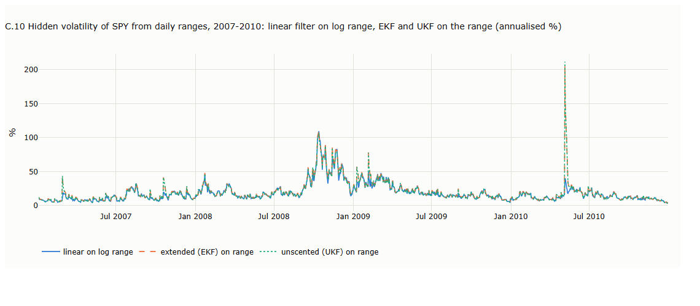
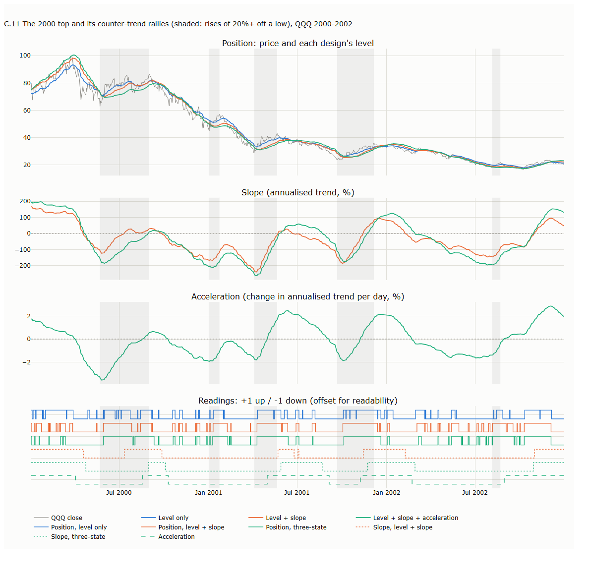
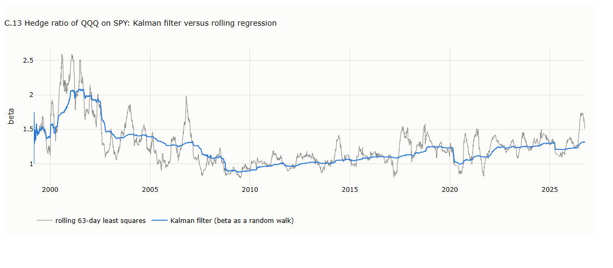

# Lecture 4: Tracking Hidden States: the Kalman Filter

*Systematic Trading: Lecture Notes (MSc) · Oct 10, 2026 · Max Gnesi*

Lecture 2's methods smooth the data from the bottom up; the Kalman filter works from the top down, by modelling what is hidden behind prices and updating that model with each new bar. This lecture builds the linear filter step by step, from a single level to slope and acceleration, describes what each hidden state captures, then covers extensions and the nonlinear extended and unscented filters. Companion notebook: [13_tracking_hidden_states.ipynb](13_tracking_hidden_states.ipynb).

## 1. Bottom-up versus top-down

The methods of Lecture 2 construct a smooth line from the bottom up, as weighted averages of past bars. The Kalman filter proceeds from the top down: it specifies a model of the quantities hidden behind prices and revises its estimate of them as each bar arrives.

- **Bottom-up** (SMA, EMA, VWAP, KAMA). The estimate is a weighted average of past prices and nothing more. These methods contain no explicit representation of a trend: a rise appears in the average only once rising prices have accumulated in its window, which is the source of their lag.
- **Top-down.** A *state-space model* specifies three elements: the hidden quantities (the *state*), how the state evolves from one bar to the next, and how observed prices relate to it. When the state includes a slope, the trend becomes an explicit quantity: the model carries it from bar to bar and uses it to project the level forward. A rising market is then represented directly, as a positive slope, rather than inferred from accumulated past prices. With a level alone the model has no such component and reduces exactly to an EMA (§2); the slope enters in §3.

| Dimension | Bottom-up (SMA, EMA, VWAP, KAMA) | Top-down (Kalman filter) |
|---|---|---|
| Core idea | Average past prices; the trend is whatever the average shows | Model the hidden level, slope and acceleration; check each bar against the model |
| What it knows | Past prices (and volume, for VWAP); no notion of trend speed | An explicit model of how level, slope and acceleration move from bar to bar |
| How it treats a bar | An ingredient, weighted and added to the average | Evidence, compared with the forecast and accepted in proportion to the gain |
| How it reacts | Follows: moves only as new prices pull the average | Projects the current trend one bar ahead, then corrects by the surprise |
| Weights on past prices | All positive: never overshoots, always lags a trend | Slope designs put negative weight on old prices: no lag on a steady trend, overshoot after jumps |
| Uncertainty | None | An uncertainty for every hidden state |

The filter applies the same three steps to every bar:

| Step | What the filter does |
|---|---|
| Predict | Projects the state one bar ahead, using the model of how it evolves |
| Compare | Computes the *surprise*: the observed price minus the forecast |
| Correct | Revises the state by *gain* × *surprise*. The gain is large when the filter's uncertainty about its state is large relative to the price noise, and small otherwise (Kalman, 1960) |

**Example: navigation.** A navigator estimates position from known speed and heading (the model) and adjusts that estimate when a landmark is sighted (the observation). The size of the adjustment depends on the relative reliability of the reckoning and the sighting. The Kalman filter applies the same principle, with prices as the observations.

The two approaches are not ranked. They embody different assumptions about the data, and the appropriate choice depends on what the analysis is meant to capture. The distinctive feature of the top-down approach is that a single model delivers several quantities at once: a level, a trend and its rate of change, and the uncertainty around each (§10). Throughout this lecture each hidden state yields a *reading*, up or down; the use of readings as trading signals is treated in Part II.

## 2. One hidden state: the level

With a single hidden state, the Kalman filter is an EMA whose smoothing constant is set by the ratio of two noise variances.

### 2.1 The model

The hidden level moves at random from bar to bar, and each price equals the level plus noise:

```math
\text{level}_t = \text{level}_{t-1} + \text{level change}_t, \qquad \text{level change}_t \sim N(0,\ q_{\text{level}})
```

```math
\text{price}_t = \text{level}_t + \text{price noise}_t, \qquad \text{price noise}_t \sim N(0,\ r_{\text{price}})
```

The model has one hidden quantity and two variances:

| Model quantity | Financial meaning |
|---|---|
| *level* | The underlying price: where the market is, net of noise. Never observed directly |
| $`q_{\text{level}}`$ | Variance of the level change: genuine changes in the underlying price per bar, from news, revaluation and persistent shifts in demand |
| $`r_{\text{price}}`$ | Variance of the price noise: bid-ask bounce, temporary order-flow pressure, overshoots that reverse |

The filter estimates the level from the prices. To do so it computes four quantities of its own on every bar, which appear in the steps below:

| Filter quantity | Financial meaning |
|---|---|
| *forecast* | The filter's estimate of today's underlying price before seeing today's price |
| *uncertainty* | How unsure the filter is about the underlying price: the variance of its own error |
| *surprise* | Today's unexpected move: the price minus the forecast |
| *gain* | The share of the surprise treated as genuine information rather than noise |

### 2.2 The recursion, step by step

| Step | Calculation | Financial interpretation |
|---|---|---|
| 1. Predict the level | $`\text{forecast}_t = \text{level}_{t-1}`$ | With no new trades, the best estimate of today's underlying price is yesterday's |
| 2. Predict the uncertainty | $`\text{forecast uncertainty}_t = \text{uncertainty}_{t-1} + q_{\text{level}}`$ | Overnight, news may have moved the underlying price, so the estimate becomes less certain by $`q_{\text{level}}`$ |
| 3. Compute the gain | $`\text{gain}_t = \dfrac{\text{forecast uncertainty}_t}{\text{forecast uncertainty}_t + r_{\text{price}}}`$ | How much of today's move to believe: near 1 when genuine changes dominate (a fast-moving market), near 0 when noise dominates (a market that mostly jitters around its value) |
| 4. Compare | $`\text{surprise}_t = \text{price}_t - \text{forecast}_t`$ | Today's unexpected move |
| 5. Correct the level | $`\text{level}_t = \text{forecast}_t + \text{gain}_t \cdot \text{surprise}_t`$ | Accept the believed part of the move, discard the rest as noise |
| 6. Update the uncertainty | $`\text{uncertainty}_t = (1 - \text{gain}_t)\cdot\text{forecast uncertainty}_t`$ | Having seen today's price, the filter is more certain where the underlying price is |

### 2.3 Equivalence to the EMA

Substituting step 1 into step 5 gives $`\text{level}_t = \text{gain}\cdot\text{price}_t + (1-\text{gain})\cdot\text{level}_{t-1}`$, an EMA whose $`\alpha`$ is the gain. After a few bars the gain converges to a constant: the steady forecast uncertainty $`u`$ solves $`u^2 - q_{\text{level}}\,u - q_{\text{level}}\,r_{\text{price}} = 0`$, and the steady gain is $`u/(u + r_{\text{price}})`$. With $`q_{\text{level}}/r_{\text{price}} = 1/6`$ the steady gain is exactly $`1/3`$, the $`\alpha`$ of EMA(5).

On Lecture 2's toy series, with $`q_{\text{level}}/r_{\text{price}} = 1/6`$ and the filter started at its steady uncertainty, the level reproduces EMA(5) on every bar, including the 103.54 after the spike ([chart C.1](#c1-predict-compare-correct-2)). Started instead from a wide uncertainty, the gain begins close to 1, so the first prices are accepted almost in full, and converges within a few bars ([chart C.2](#c2-only-the-ratio-matters-24)).

### 2.4 Only the ratio of the noise variances matters

Scaling both noise variances by the same constant leaves the estimates unchanged, because the gain depends only on $`q_{\text{level}}/r_{\text{price}}`$. The same ten prices, filtered at two scales:

| Bar | Price | Level, $`(q_{\text{level}}, r_{\text{price}}) = (1, 4)`$ | Level, $`(10, 40)`$ | Gain, both | Uncertainty band ±1 sd, $`(1, 4)`$ | Band, $`(10, 40)`$ |
|---|---|---|---|---|---|---|
| 1 | 101 | 100.556 | 100.556 | 0.556 | 1.49 | 4.71 |
| 4 | 104 | 102.036 | 102.036 | 0.398 | 1.26 | 3.99 |
| 9 | 110 | 107.633 | 107.633 | 0.390 | 1.25 | 3.95 |

Only the uncertainty band changes, by a factor of $`\sqrt{10}`$. The equivalence is exact when the starting uncertainty is scaled by the same factor; with an unscaled start it is approximate during the warm-up and exact once the start has been forgotten ([chart C.2](#c2-only-the-ratio-matters-24)).

**Example: a thermometer.** Let one variance describe how far the room temperature can drift in an hour and the other how noisy the thermometer is. Scaling both by the same factor leaves the relative reliability of model and instrument unchanged, so the estimate is unchanged; only the stated uncertainty increases.

## 3. Adding a slope: the core model

A slope state gives the filter an explicit trend, which it carries from bar to bar and projects forward; in steady state the filter is Holt's linear exponential smoothing (Harvey, 1989).

### 3.1 The one-bar transition

The model borrows the equations of motion: the level plays the role of position and the slope that of velocity. Over one bar of length $`\Delta t`$:

- next level = level + slope × $`\Delta t`$
- next slope = slope, apart from a random change

In matrix form, with the price as the only observation:

```math
\begin{pmatrix}\text{level}_t\\ \text{slope}_t\end{pmatrix} = \underbrace{\begin{pmatrix}1 & \Delta t\\ 0 & 1\end{pmatrix}}_{F}\begin{pmatrix}\text{level}_{t-1}\\ \text{slope}_{t-1}\end{pmatrix} + \begin{pmatrix}\text{level change}_t\\ \text{slope change}_t\end{pmatrix}, \qquad \text{price}_t = \underbrace{\begin{pmatrix}1 & 0\end{pmatrix}}_{H}\begin{pmatrix}\text{level}_t\\ \text{slope}_t\end{pmatrix} + \text{price noise}_t
```

With one bar as the unit of time ($`\Delta t = 1`$) and the random changes summarised by their variances:

```math
F = \begin{pmatrix}1 & 1\\ 0 & 1\end{pmatrix}, \qquad H = \begin{pmatrix}1 & 0\end{pmatrix}, \qquad Q = \begin{pmatrix}q_{\text{level}} & 0\\ 0 & q_{\text{slope}}\end{pmatrix}, \qquad R = r_{\text{price}}
```

| Entry | Mathematical role | Financial meaning |
|---|---|---|
| $`F`$, first row $`(1, 1)`$ | The level moves by the slope over one bar | The underlying price drifts by the current trend |
| $`F`$, second row $`(0, 1)`$ | The slope carries over unchanged | Today's trend is the best guess for tomorrow's: the trend follower's hypothesis |
| $`H = (1, 0)`$ | Only the level is observed | Prices reveal the level; the trend is never observed directly, only inferred from how levels change |
| $`q_{\text{level}}`$ | Variance of random changes in the level | One-off revaluations: gaps and news that shift the price without changing the trend |
| $`q_{\text{slope}}`$ | Variance of random changes in the slope | How quickly the trend itself may change: shifts in momentum |
| $`r_{\text{price}}`$ | Variance of the price noise | Bid-ask bounce, temporary order-flow pressure, overshoots that reverse |

The filter runs on log prices, so the slope is a daily log trend, shown annualised (×252) in the charts. The equations of motion are an analogy, not a law: prices have no inertia that guarantees a trend persists. The model assumes persistence and the surprises measure, bar by bar, how far the data disagree.

### 3.2 What the slope changes

In steady state the filter is a fixed linear smoother, like the methods of Lecture 2, but its weights differ in one decisive way: recent prices receive positive weights and older prices small negative ones ([chart C.3](#c3-weights-on-past-prices-32)). The negative weights are what extrapolation looks like in a weighted average. They let the filter follow a steady trend with no lasting gap, and they make it overshoot after a jump (§5).

The same extrapolation lets the level sit above price while the market is still rising, which no positive-weight average can do. In the strongest advances (63-day returns in each asset's top 5%, median over SPY, QQQ, GLD and AGG), price is above the level-only design's level on 91% of days, but above the level + slope design's level on only 65%: its level has been projected ahead of price.

### 3.3 Two ways to specify Q

The diagonal $`Q`$ above lets the level and the slope change independently, so the level can jump by itself, as prices gap. The alternative derives $`Q`$ from a single setting $`q`$ by assuming that only the slope receives random kicks and the level moves because the slope moved during the bar:

```math
Q_{\text{derived}} = q\begin{pmatrix}1/3 & 1/2\\ 1/2 & 1\end{pmatrix}
```

The off-diagonal terms link the two changes (correlation 0.87): a kick to the slope always drags the level with it. Matched to EMA(20) on variance reduction, the two forms behave similarly on a price jump: both cover half the jump in 8 bars, and the derived form overshoots slightly more (20.1% against 18.9%), because it must explain the jump as a faster trend ([chart C.4](#c4-a-price-jump-two-forms-of-q-33)). The difference is modest; the diagonal form is the more natural choice for prices, which gap.

## 4. Adding acceleration

An acceleration state models changes in the speed of the trend, and because it also enters the level, it changes where the filter sits relative to price.

### 4.1 The one-bar transition

Continuing the analogy, acceleration is the rate of change of the slope. Over one bar of length $`\Delta t`$:

- next level = level + slope × $`\Delta t`$ + ½ × acceleration × $`\Delta t^2`$
- next slope = slope + acceleration × $`\Delta t`$
- next acceleration = acceleration, apart from a random change

```math
\begin{pmatrix}\text{level}_t\\ \text{slope}_t\\ \text{acceleration}_t\end{pmatrix} = \underbrace{\begin{pmatrix}1 & \Delta t & \tfrac12\Delta t^2\\ 0 & 1 & \Delta t\\ 0 & 0 & 1\end{pmatrix}}_{F}\begin{pmatrix}\text{level}_{t-1}\\ \text{slope}_{t-1}\\ \text{acceleration}_{t-1}\end{pmatrix} + \text{random changes}_t
```

With $`\Delta t = 1`$ bar:

```math
F = \begin{pmatrix}1 & 1 & 0.5\\ 0 & 1 & 1\\ 0 & 0 & 1\end{pmatrix}, \qquad H = \begin{pmatrix}1 & 0 & 0\end{pmatrix}, \qquad Q = \begin{pmatrix}q_{\text{level}} & 0 & 0\\ 0 & q_{\text{slope}} & 0\\ 0 & 0 & q_{\text{acceleration}}\end{pmatrix}
```

| Entry | Financial meaning |
|---|---|
| $`F`$, first row $`(1, 1, 0.5)`$ | The underlying price drifts by the trend plus half the change in the trend: an accelerating rise pushes the projected level up, a decelerating rise pulls it down |
| $`F`$, second row $`(0, 1, 1)`$ | The trend itself strengthens or fades by the acceleration |
| $`F`$, third row $`(0, 0, 1)`$ | The change in trend speed carries over: a market that is speeding up is assumed to keep speeding up |
| $`q_{\text{acceleration}}`$ | How quickly the change in trend speed may itself change |

The first row is the reason acceleration matters beyond the slope: through the ½ entry it moves the level directly, so a decelerating rise lowers the projected level and brings it towards, or below, price earlier.

### 4.2 Three designs, three readings

The three designs, matched to EMA(20) on variance reduction so that differences come from structure rather than from smoothing more or less, give six readings: position (price above or below the level) for each design, the slope of the two slope designs, and the acceleration ([chart C.5](#c5-three-designs-states-and-readings)). On QQQ, 1999–2026, readings from the same state largely agree, while readings from different states agree only about half to three-quarters of the time:

| Agreement of readings | Position | Slope | Acceleration |
|---|---|---|---|
| Position (across designs) | 78–91% | 45–68% | 51–58% |
| Slope (across designs) | 45–68% | 89% | 70–74% |

The states therefore capture three distinct layers of the same price: where it is relative to the estimate, which way the trend points, and whether the trend is strengthening or fading. The comparison is fair within each state; across states, note that a slope measures change, which needs more data than a level, so slope readings move on a longer timescale than position readings by nature.

### 4.3 Acceleration as an early warning

Acceleration turns before the slope on average, but not at every turning point. Across SPY, QQQ, GLD and AGG, the median delay after a turning point is 23 days for the acceleration reading against 30–36 days for the slope readings, and the acceleration reading changes sign less often in choppy markets (4.4 times a year against 5–7). In 2020 it turned down 13 days after the February peak, ahead of the slopes (16–18 days), but turned up 39 days after the March low, no earlier than the slopes (30–40 days). Its value is as an additional layer of information, not a reliable leading indicator; §9 profiles it by market condition.

## 5. Design versus tuning

Two choices shape a Kalman filter, and they do different things. The *design* (which states the model has) decides, for every parameter setting, which kind of motion the filter follows with no lasting gap and whether it overshoots a jump. The *tuning* (the noise variances, of which only the ratios matter) decides only how fast it does so.

### 5.1 What the design decides

Each design at a slow and a very fast setting, on a price jump, a steady trend and a parabolic move ($`r_{\text{price}} = 1`$):

| Design | Price jump: overshoot | Steady trend: gap behind price | Parabolic move: gap behind price |
|---|---|---|---|
| Level only | None (0% at both speeds) | Fixed gap (0.99 slow, 0.095 fast) | Growing gap (2.8 → 5.8 slow, 0.28 → 0.57 fast) |
| Level + slope | Always (20% slow, 17% fast) | None | Fixed gap (0.02 slow, 0.0006 fast) |
| Level + slope + acceleration | Always, larger (29% slow, 23% fast) | None | None |

Tuning shrinks a gap but never removes it; only adding a state does. Each additional state lets the filter follow one more kind of motion exactly: a flat price, a steady trend, a steady acceleration. Overshoot follows from the weights. Positive weights on past prices can never overshoot a jump; any negative weight forces an overshoot, because the cumulative weights must exceed one before settling back to one. Each design is therefore a different bet about what the market is doing, and none is best.

### 5.2 How each design follows price after a jump

Because the slope designs overshoot, they turn against a move on their own when price stalls, simply by correcting their own overshoot, as if tightening a stop; the level-only design waits for price to come to it. Days on which each state points against the move, same pattern at both speeds:

| State | After a jump, then flat | After a jump inside a continuing uptrend |
|---|---|---|
| Position, level only | Never against the move | Never against the move |
| Position, level + slope | Turns against it early (from bar +6 to +34) | Points against it for about 150 bars |
| Slope, level + slope | Turns against it late (from +27 to +143) | Never against the move |
| Position, three-state | Turns first (from +3 to +15) | Points against it for about 140 bars |
| Slope, three-state | Turns (from +13 to +61) | Points against it for 16–47 bars |
| Acceleration | Turns early (from +9 to +43) | Points against it for about 160 bars |

Only the slope of the level + slope design stayed with a trend that continued after a jump, yet still turned once the move stopped.

### 5.3 The dials

Within a design, the diagonal of $`Q`$ sets how much each state may change per bar, relative to the price noise. Raising one entry shifts the filter's attention towards that state (chart C.6). Measured on QQQ with the three-state design, each setting raising one entry a hundredfold from a balanced case:

| To make the filter… | Raise | Effect on how it follows price | Measured cost (QQQ) |
|---|---|---|---|
| Follow price closely | $`q_{\text{level}}`$ | The level hugs price (gap to price 0.64% against 2.24%) | The slope barely moves: the level absorbs every move, and the design collapses towards an EMA |
| Turn faster at trend changes | $`q_{\text{slope}}`$ | The slope turned 3 days after the 2020 peak and 3 days after the low (balanced: 6 and 15) | 24.7 slope sign changes a year against 8.0 |
| React to changes in trend speed | $`q_{\text{acceleration}}`$ | Acceleration responds within days | Slope and level overshoot: in April 2020 the slope rose above +500% annualised |
| Ignore daily noise | $`r_{\text{price}}`$, relative to all of the above | Smoother states | More lag everywhere |

Only the ratios to $`r_{\text{price}}`$ matter (§2.4), so "raise $`q_{\text{slope}}`$" and "lower everything else" are the same instruction. The settings above are illustrative; in practice the ratios can be estimated by maximum likelihood (Harvey, 1989; Durbin and Koopman, 2012) or set by matching memory.

### 5.4 Matching memory to an EMA

To compare designs fairly, each is matched to EMA(20) on the variance reduction factor $`\sum_k w_k^2 = 1/20`$ (Lecture 2, §6), by solving for its price noise. Average age cannot be used: the slope designs follow a steady trend with no lag, so their average age is zero or negative.

| Design | Price noise matched | Average age (bars) | Variance reduction | Smallest weight |
|---|---|---|---|---|
| Level only | 0.0100 | 9.5 | 0.050 | 0 |
| Level + slope | 0.200 | 0.0 | 0.050 | −0.0039 |
| Level + slope + acceleration | 12.5 | −0.8 | 0.050 | −0.0065 |
| EMA(20) | — | 9.5 | 0.050 | 0 |

The level-only design matched this way is EMA(20) exactly. A design used at its default settings without matching can carry a very different memory; Lecture 2 found that the default of the `trading_models` package smooths like a 4.5-bar average.

## 6. Starting and running the filter

A filter must be started from a guess, and how long the guess takes to be forgotten depends on the design and on the starting uncertainty $`P_0`$, not on a universal number of bars.

### 6.1 Warm-up by design

Matched to EMA(20); the starting error is 10% in the level and zero slope:

| Design | Gain settles within 1% | Memory horizon (older prices < 0.1% of weight) | Level error < 0.1%: diffuse start / confident start | Slope within 1%/yr for good: diffuse / confident |
|---|---|---|---|---|
| Level only | 26 bars | 70 bars | 0 / 73 bars | — |
| Level + slope | 86 bars | 197 bars | 0 / 137 bars | 24 / 163 bars |
| Level + slope + acceleration | 184 bars | 436 bars | 23 / 145 bars | 174 / 346 bars |

The *diffuse start*, a very large $`P_0`$, tells the filter that its starting guess is worthless. The gain then begins close to one, the first prices overwrite the guess almost at once, and the level error vanishes within a bar (chart C.7). A confident start with a wrong guess takes 137 bars to forget the same error in the level + slope design, longer than EMA(20) (70 bars). Each extra state lengthens everything: the three-state design needs about 350 bars before its slope can be trusted after a confident start, and its memory reaches back over 400 bars. Unlike KAMA (Lecture 2, §9.1), these numbers are fixed by the design and its settings, so they can be computed in advance.

### 6.2 Practice

| Practice | Why |
|---|---|
| Load at least the memory horizon of the slowest design before the evaluation start, and discard it | The states are unreliable until the start is forgotten |
| Use a diffuse start (large $`P_0`$) | The first prices overwrite the guess, instead of a guess biasing the states for months |
| Store data, configuration and state, including $`P_0`$, $`Q`$ and $`R`$ (Lecture 2, §9.2) | A restart from different data or settings changes the states until warm-up passes |
| Compare designs only at matched memory | Otherwise the comparison measures smoothing, not design |
| Work on log prices | A slope then means the same percentage trend at any price level |
| Monitor the normalised surprises | If the model fits, surprise ÷ its standard deviation should look like standard normal noise; persistent departures signal a misfit (§7) |
| Re-estimate the noise ratios occasionally | Markets change; the ratios that fitted a calm decade may not fit a volatile one (Mehra, 1970) |

## 7. Extensions and what each changes

The normalised surprises show where the basic model is wrong: they are fat-tailed. Standardised to unit variance, the share beyond ±3 is far above the 0.27% a normal distribution gives (chart C.9):

| | Share of surprises beyond ±3 | Excess kurtosis | Skewness |
|---|---|---|---|
| SPY | 1.26% | 5.9 | −0.64 |
| QQQ | 1.69% | 3.3 | 0.10 |
| GLD | 1.17% | 2.1 | −0.23 |
| AGG | 1.77% | 12.0 | −0.48 |

Three extensions of the level + slope design express different beliefs about the data (chart C.8):

- **Robust update.** A surprise larger than three times the recent typical surprise (a running estimate using past data only) is capped before the correction, a simple version of the approach of Masreliez and Martin (1977). The cap is relative to recent surprises rather than to the model's own surprise variance, because matching memory sets the model's price noise far above the actual daily noise, and a cap on that scale would almost never bind.
- **Price noise from the bar's range.** $`r_{\text{price}}`$ changes every bar in proportion to the bar's Parkinson variance (Lecture 3), at the same average.
- **Damped slope.** The slope fades by 2% a bar unless renewed by the data.

Profiled under the market conditions of §9, median across the four assets:

| Variant (level + slope) | Position sign changes/yr, choppy / trending | Strong advances: position pointing up | Median delay after turning points: position / slope |
|---|---|---|---|
| Standard | 26.8 / 32.1 | 65% | 4.2 / 29.5 days |
| Robust update | 26.7 / 31.8 | 66% | 4.2 / 29.5 days |
| Price noise from the range | 30.6 / 37.3 | 62% | 5.0 / 26.5 days |
| Damped slope | 29.3 / 21.1 | 89% | 6.0 / 29.5 days |

Each extension changes something different. The robust update acts only on the rare days with extreme surprises, so it barely moves aggregate statistics, but it softens the reaction to those days: in March 2020 its slope bottomed near −70% annualised against about −90% for the standard filter. Making the price noise follow the bar's range adds sign changes: a wide range is mostly genuine movement rather than noise, so treating it as noise makes the filter discount real moves on volatile days and chase small ones on quiet days. The damped slope pulls the level back towards price in strong trends (the position reading points up on 89% of strong-advance days, close to the level-only design) and cuts position sign changes in trends by about a third, at the cost of slightly more in choppy markets. None is an improvement in general; each suits a different view of the market.

## 8. Nonlinear models: the extended and unscented filters

The linear filter requires the state to enter the model linearly. When it does not, two extensions exist: the extended Kalman filter (EKF), which linearises the model around the current estimate, and the unscented Kalman filter (UKF), which propagates a small set of sample points through the nonlinear function instead (Julier and Uhlmann, 1997, 2004). Neither is needed for the price models of §2–4, which are linear. Both are needed when the hidden quantity enters nonlinearly, as hidden volatility does.

### 8.1 Hidden volatility from daily ranges

Let the hidden state be the log daily variance $`h_t`$, following a random walk. For a driftless Brownian motion with variance $`e^{h_t}`$ over the day, the high-low range in log terms is $`e^{h_t/2}\,\rho`$, where $`\rho`$ is the range of a standard Brownian motion over unit time. Simulated on a fine grid, $`\rho`$ has mean 1.572, 1.6% below $`\sqrt{8/\pi} = 1.596`$, which is the discrete-sampling shortfall of Lecture 3, §4.4 for 2,000 steps. Two routes follow:

| Route | Measurement equation | Filter |
|---|---|---|
| Nonlinear | $`\text{range}_t = e^{h_t/2}\,\mathbb{E}[\rho] + \text{noise}`$ | EKF or UKF |
| Transform first | $`\ln \text{range}_t = h_t/2 + \mathbb{E}[\ln \rho] + \varepsilon_t`$ | Ordinary Kalman filter |

The second route works because the log range is close to normal: simulated, $`\ln\rho`$ has mean 0.409, variance 0.085, skewness 0.16 and excess kurtosis −0.25, consistent with the finding of Alizadeh, Brandt and Diebold (2002) that range-based volatility proxies are approximately Gaussian. The noise variance of the log-variance random walk, estimated by maximum likelihood on the linear model, is 0.126 per day.

### 8.2 Linearisation versus sigma points

The EKF replaces the measurement function by its tangent at the current estimate. The UKF instead places $`2n+1`$ sample points (sigma points) around the estimate, three for a single state, passes each through the exact nonlinear function, and recombines them with weights to obtain the forecast and its variance. It needs no derivatives and captures curvature that the tangent misses. Its three parameters are often misunderstood:

| Parameter | What it controls | Usual value |
|---|---|---|
| $`\alpha`$ | How far the sigma points spread around the current estimate | Small and positive, typically between 0.0001 and 1 (0.1 here) |
| $`\beta`$ | A correction for the shape of the state's distribution in the variance weights | 2, optimal when the state is normally distributed |
| $`\kappa`$ | A secondary scaling of the spread | 0, or 3 minus the number of states |

None of them reaches into fat tails: the UKF still assumes normally distributed noise, and its sigma points describe the mean and variance of the state, not extreme events.

### 8.3 Results on SPY, and what neither fixes

The three filters agree closely: the EKF and UKF estimates correlate 0.95 and 0.94 with the linear filter on log range, with mean absolute differences of about one volatility point (chart C.10). The exception is instructive. On 6 May 2010, the flash crash, the EKF and UKF, which read the raw range, spike to about 210% annualised volatility for a day, while the linear filter on the log range barely moves, because the logarithm compresses extremes. Transforming first therefore made the model linear and also robust to an outlier. The rule is to transform first and to use the UKF only when no transformation linearises the model. Neither filter fixes fat tails or regime breaks; those require a different noise model, not a different way of propagating a normal one.

## 9. What each design captures

The designs are profiled, not ranked: each captures different behaviour, and the useful question is which behaviour, in which market. Conditions are defined mechanically for each of SPY, QQQ, GLD and AGG (they describe a period after the fact; the readings themselves use only past data):

- **Choppy** and **trending**: 63-day efficiency ratio in the asset's bottom or top third.
- **Strong advance**: 63-day log return in the asset's top 5%.
- **Turning points**: alternating highs and lows separated by a move of at least one year of the asset's typical volatility.

### 9.1 The profile

Median across the four assets, all designs matched to EMA(20):

| Reading | Sign changes/yr, choppy | Sign changes/yr, trending | Strong advances: pointing up | Median delay after turning points |
|---|---|---|---|---|
| Position, level only | 38.3 | 23.0 | 91% | 5 days |
| Position, level + slope | 26.8 | 32.1 | 65% | 4 days |
| Position, three-state | 22.1 | 26.1 | 59% | 4 days |
| Slope, level + slope | 7.4 | 0.1 | 99.9% | 30 days |
| Slope, three-state | 5.3 | 0.4 | 99.9% | 36 days |
| Acceleration | 4.4 | 1.9 | 97% | 23 days |

Three behaviours stand out. Position readings react within days but change sign often, in choppy markets most of all for the level-only design. Slope readings hold a trend almost without interruption and ignore most chop, but turn about a month after a turning point. Acceleration sits between them. The relation to the following 63 days' returns is weak and mixed: the median difference between days when a slope reading points up and days when it points down is about 1 percentage point, and close to zero or slightly negative for position readings. Persistence of this kind is a question for Part II, not a property any reading delivers on its own. Position should be compared with position and slope with slope: a slope measures change and moves on a longer timescale by nature, and matching the designs on the slope's own smoothing, rather than the level's, is an alternative the notebook can apply.

### 9.2 The 2000 top: violent counter-trend rallies

QQQ peaked in March 2000 and fell until October 2002, interrupted by five rallies of 22% to 52% off a low, identified mechanically as rises of at least 20% ended by a 20% fall (chart C.11). The warm-up is complete by the peak: the starting choices change the three-state level by at most 0.17% from then on.

| Reading | Sign changes, Mar 2000 – Oct 2002 | Rallies followed | Days from each rally low until pointing up / rally length |
|---|---|---|---|
| Position, level only | 83 | 5 of 5 | 4/72, 1/15, 5/33, 9/54, 3/14 |
| Position, level + slope | 79 | 5 of 5 | 4/72, 1/15, 4/33, 8/54, 1/14 |
| Position, three-state | 67 | 5 of 5 | 4/72, 1/15, 4/33, 10/54, 1/14 |
| Slope, level + slope | 9 | 2 of 5 | 34/72, never/15, never/33, 38/54, never/14 |
| Slope, three-state | 7 | 2 of 5 | 69/72, never/15, never/33, 44/54, never/14 |
| Acceleration | 8 | 3 of 5 | 61/72, never/15, 18/33, 34/54, never/14 |

In a market of wide mean reversion, position readings follow every swing and pay for it in sign changes; slope readings hold the major downtrend and ignore most rallies; acceleration notices three of the five.

### 9.3 The 2020 V-shaped crash and recovery

| Reading | Days after the 19 Feb peak until pointing down | Days after the 23 Mar low until pointing up | Sign changes, Feb–Jun 2020 |
|---|---|---|---|
| Position, level only | 3 | 3 | 6 |
| Position, level + slope | 2 | 10 | 7 |
| Position, three-state | 1 | 10 | 5 |
| Slope, level + slope | 16 | 30 | 2 |
| Slope, three-state | 18 | 40 | 2 |
| Acceleration | 13 | 39 | 2 |

Two sharp turns a month apart favour readings that react quickly; the slope readings, which ignore noise, were still pointing down weeks into the recovery (chart C.12). The 2000–2002 and 2020 episodes reward opposite behaviours, which is the point: the right design depends on the market one expects.

### 9.4 A time-varying hedge ratio

The same machinery estimates a regression whose coefficients drift. QQQ's daily log return is regressed on SPY's, with the intercept and the hedge ratio (beta) as hidden states following random walks, the approach Chan (2013) applies to a pair of ETFs. The Kalman beta correlates 0.85 with a rolling 63-day least-squares beta, but its day-to-day changes are about a sixth as large (standard deviation 0.0034 against 0.0193), because it updates smoothly rather than dropping old observations off a window edge (chart C.13). This is the bridge to the relative-value strategies of Part II.

## 10. Side by side, and the Swiss army knife

One model, level + slope + acceleration, gives in one coherent piece:

- a smoothed level (Lecture 2);
- a trend and its change (overlapping Lecture 3's trend-strength measures);
- uncertainty bands, and surprises whose size tracks volatility.

The same machinery with a different hidden state gives volatility (§8, from Lecture 3's ranges) and a time-varying beta (§9.4, Lecture 3's relationship measures). It does not cover order flow, which needs volume, or distribution shape, which a Gaussian filter assumes away; its surprises reveal fat tails (§7) but do not model them. The Kalman filter is therefore a Swiss army knife: one consistent tool for most of what Lectures 2 and 3 measure separately. Lecture 3's dedicated measures remain the more granular instruments for any single job.

| | Level only | Level + slope | Level + slope + acceleration |
|---|---|---|---|
| Follows with no lasting gap | A flat price | A steady trend | A steady acceleration |
| Overshoots a jump | Never | Always | Always, most |
| Equivalent bottom-up method | EMA | Holt's linear exponential smoothing | — |
| Readings | Position | Position, slope | Position, slope, acceleration |
| Typical behaviour | Calm level, frequent position changes in chop, late at turns | Slope holds trends and ignores chop, about a month late at turns | Earliest change-of-trend reading on average, most noise and overshoot |
| Warm-up, matched to EMA(20) | Short (70-bar memory) | About 200 bars | About 450 bars |

**Common mistakes.** Comparing designs at unmatched memory; judging a design at its default settings; trusting slope and acceleration readings during the warm-up; treating the uncertainty bands as reliable when the surprises are fat-tailed; reading a design's behaviour in one episode as a general property.

## 11. Summary, exercises and reading

### 11.1 Takeaways

1. Bottom-up methods average bars; a state-space model states what is hidden and checks each bar against it. With a slope state the trend becomes an explicit quantity, projected forward.
2. With one hidden state the Kalman filter is an EMA, with $`\alpha`$ set by the ratio of the noise variances; only ratios matter.
3. The design decides which motion is followed with no lasting gap and whether jumps are overshot, at every setting; tuning sets the speed.
4. Each state gives its own reading: position, slope, acceleration. They capture different layers of the same price and agree only about half to three-quarters of the time across states.
5. Warm-up is fixed by design and settings, can be computed in advance, and is shortened drastically by a diffuse start.
6. The extended and unscented filters are for genuinely nonlinear models; transform first where possible.
7. No design is best. Each is a bet about what the market is doing; the 2000–2002 and 2020 episodes reward opposite designs.

### 11.2 Exercises

- [ ] Derive the steady gain of the level-only filter from $`u^2 - q\,u - q\,R = 0`$ and show that the filter equals an EMA with $`\alpha`$ equal to that gain.
- [ ] Show that any linear smoother with a negative weight on some past price must overshoot a unit jump.
- [ ] Re-run the profile of §9.1 with the designs matched on the slope's variance reduction rather than the level's. Which conclusions change?
- [ ] Estimate the noise ratios of the level + slope design for QQQ by maximum likelihood and compare them with the values matched to EMA(20).
- [ ] Replace the robust update's cap of 3 by 2 and by 5. On which days does the level change, and by how much?
- [ ] Implement the UKF for the volatility model with $`\alpha`$ of 0.01, 0.1 and 1. Does the estimate change?
- [ ] Repeat the case studies of §9.2–9.3 for SPY and GLD.

### 11.3 Reading list

- Alizadeh, S., Brandt, M. and Diebold, F. (2002). Range-based estimation of stochastic volatility models. *Journal of Finance* 57(3), 1047–1091. — range-based volatility and the near-normality of the log range (§8).
- Chan, E. (2013). *Algorithmic Trading: Winning Strategies and Their Rationale.* Wiley. — a Kalman-filter hedge ratio for an ETF pair (§9.4).
- Durbin, J. and Koopman, S.J. (2012). *Time Series Analysis by State Space Methods* (2nd ed.). Oxford University Press. — ch. 5, starting a filter, including the diffuse start (§6).
- Harvey, A. (1989). *Forecasting, Structural Time Series Models and the Kalman Filter.* Cambridge University Press. — local level and local linear trend models; Holt's method as a steady-state filter (§3).
- Julier, S. and Uhlmann, J. (1997). A new extension of the Kalman filter to nonlinear systems. *Proc. SPIE* 3068, 182–193. — the unscented filter (§8).
- Julier, S. and Uhlmann, J. (2004). Unscented filtering and nonlinear estimation. *Proceedings of the IEEE* 92(3), 401–422. — review of the unscented transform (§8).
- Kalman, R.E. (1960). A new approach to linear filtering and prediction problems. *Journal of Basic Engineering* 82(1), 35–45. — the original filter (§1).
- Masreliez, C. and Martin, R.D. (1977). Robust Bayesian estimation for the linear model and robustifying the Kalman filter. *IEEE Transactions on Automatic Control* 22(3), 361–371. — robust updates (§7).
- Mehra, R. (1970). On the identification of variances and adaptive Kalman filtering. *IEEE Transactions on Automatic Control* 15(2), 175–184. — estimating the noise variances from the surprises (§6).

*Harvey (1989) is given from memory and should be checked before circulation; the other references were checked against publisher or library records.*

## Appendix: main charts

From the companion notebook, [13_tracking_hidden_states.ipynb](13_tracking_hidden_states.ipynb), where every number in this lecture is computed and each formula is checked against the code.

### C.1 Predict, compare, correct (§2)


Each bar the forecast is the previous level; the correction is the gain (1/3) times the surprise. On the spike at bar 7 the level moves a third of the way to the price, exactly as EMA(5) does.

### C.2 Only the ratio matters (§2.4)


The gain starts near 1 and settles within a few bars; it is the same at both scales, and so is the level. Only the uncertainty band is wider at the larger scale.

### C.3 Weights on past prices (§3.2)


The level-only design reproduces EMA(20) exactly. The slope designs put more weight on the middle of the window and small negative weights on old prices, which is how a weighted average extrapolates.

### C.4 A price jump: two forms of Q (§3.3)


Both forms cover half the jump in 8 bars and then overshoot; the derived form, which can only explain the jump through the slope, overshoots slightly more.

### C.5 Three designs: states and readings (§4.2)


The level-only design lags price; the slope designs lead it, falling below price earlier in the 2022 decline and rising above it in rebounds. Acceleration turned negative before the November 2021 peak and positive ahead of the slope in mid-2022, but also wobbled around zero at other times.

### C.6 The dials (§5.3)


Each setting raises one entry of $`Q`$ a hundredfold from the balanced case. Emphasising the slope makes it turn within days at both 2020 turning points but change sign far more often; emphasising acceleration makes the slope and level overshoot.

### C.7 Warm-up (§6.1)


With a diffuse start the error vanishes within a bar; with a confident wrong start the level + slope design needs 137 bars to forget it, EMA(20) 70.

### C.8 Extensions through the 2020 crash (§7)


The robust update softens the reaction to the extreme crash days; price noise from the range keeps the level far above price during the crash, because it discounts the volatile days; the damped slope stays closest to price in level and smallest in slope.

### C.9 Fat-tailed surprises (§7)


On a log scale the tails stand out: surprises beyond four standard deviations, which a normal distribution would almost never produce, occur repeatedly.

### C.10 Hidden volatility from daily ranges (§8.3)



The three estimates move together through the financial crisis. On 6 May 2010 the EKF and UKF spike to about 210% while the linear filter on log range does not.

### C.11 The 2000 top (§9.2)



Shaded: the five rallies of 20% or more. Position readings follow each rally within days; slope readings hold the downtrend through most of them.

### C.12 The 2020 V-shaped crash and recovery (§9.3)


Position readings turn within days at both turns; slope readings turn weeks later and were still pointing down well into the recovery.

### C.13 A time-varying hedge ratio (§9.4)



Both estimates track the same changes in the relationship; the Kalman beta does so smoothly, without the jumps a rolling window produces when old observations drop off its edge.
